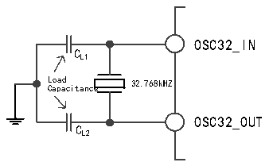
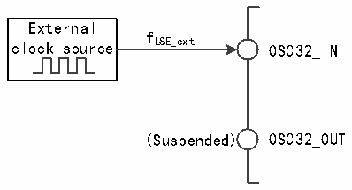

<!-- source-page: 19 -->

[← p.18](0018.md) · [index](../README.md) · [PDF p.19](https://ch32-riscv-ug.github.io/CH32H417/datasheet_zh/CH32H417RM.PDF#page=19) · [p.20 →](0020.md)

<!-- header: CH32H417系列应用手册 https://wch.cn -->

图3-6 低速外部晶体电路  
 <!-- rendered from the PDF; verify at https://ch32-riscv-ug.github.io/CH32H417/datasheet_zh/CH32H417RM.PDF#page=19 -->

🖼 Text parsed from the figure above

OSC32_IN  
C  
L1  
L C o a a p d a citance 32.768kHZ  
OSC32_OUT  
C  
L2  

● 外部低速时钟源（LSE旁路）：此模式从外部直接送入时钟源到OSC32_IN引脚，OSC32_OUT引脚  
悬空。应用程序需在 LSEON 位为 0 情况下，置位 LSEBYP 位，打开 LSE 旁路功能，然后再置位 LSEON  
位。  

图3-7 低速时钟源电路  
 <!-- rendered from the PDF; verify at https://ch32-riscv-ug.github.io/CH32H417/datasheet_zh/CH32H417RM.PDF#page=19 -->

🖼 Text parsed from the figure above

External  
f  
clock source LSE_ext OSC32_IN  
(Suspended) OSC32_OUT  

### 3.3.4 PLL时钟

通过配置RCC_CFGR0寄存器和RCC_PLLCFGR寄存器，内部PLL时钟可以选择6种时钟来源和倍频  
系数，这些设置必须在每个PLL被开启前完成，一旦PLL被启动，这些参数就不能被改动。  
设置 RCC_CTLR 寄存器中的 PLLON 位被启动和关闭，PLLRDY 位指示 PLL 时钟是否稳定，硬件在  
PLLRDY位置1后才将时钟送入系统。  
设置RCC_CTLR寄存器中的USBHS_PLLON位被启动和关闭，USBHS_PLLRDY位指示USBHS_PLL时钟  
是否稳定，硬件在USBHS_PLLRDY位置1后才将时钟送入系统。  
设置RCC_CTLR寄存器中的USBSS_PLLON位被启动和关闭，USBSS_PLLRDY位指示USBSS_PLL时钟  
是否稳定，硬件在USBSS_PLLRDY位置1后才将时钟送入系统。  
设置RCC_CTLR寄存器中的ETH_PLLON位被启动和关闭，ETH_PLLRDY位指示ETH_PLL时钟是否稳  
定，硬件在ETH_PLLRDY位置1后才将时钟送入系统。  
设置RCC_CTLR寄存器中的SERDES_PLLON位被启动和关闭，SERDES_PLLRDY位指示SERDES_PLL时  
钟是否稳定，硬件在SERDES_PLLRDY位置1后才将时钟送入系统。  
如果设置了 RCC_INTR 寄存器的 PLLRDYIE 位、ETHPLLRDYIE 位或 SERDESPLLRDYIE 位，将产生相  
应中断。  
PLL时钟来源：  
● HSI时钟送入  
● HSE时钟送入  
● USBHS_PLL（480MHz）时钟送入  
● ETH_PLL（500MHz）时钟送入  
● USBSS_PLL（125MHz）时钟送入  
● SERDES_PLL时钟2分频送入  

### 3.3.5 总线/外设时钟

#### 3.3.5.1 系统时钟（SYSCLK）

通过配置RCC_CFGR0寄存器SW[1:0]位配置系统时钟来源，SWS[1:0]指示当前的系统时钟源。  
● HSI作为系统时钟  
<!-- image: p19-draw-image-00001 bbox=[500.4, 786.24, 520.56, 796.68] -->
<!-- footer: V1.7 15 -->
