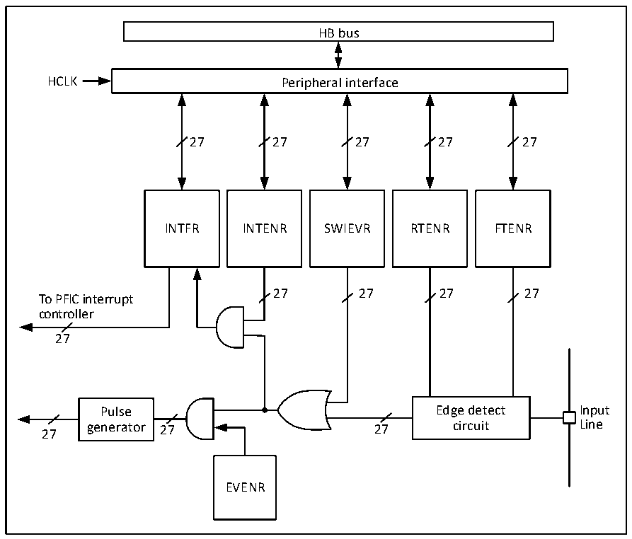

<!-- source-page: 84 -->

[← p.83](0083.md) · [index](../README.md) · [PDF p.84](https://ch32-riscv-ug.github.io/CH32H417/datasheet_zh/CH32H417RM.PDF#page=84) · [p.85 →](0085.md)

<!-- header: CH32H417系列应用手册 https://wch.cn -->

### 4.7.3 外部中断和事件控制器（EXTI）

#### 4.7.3.1 概述

图4-1 外部中断（EXTI）接口框图  
 <!-- rendered from the PDF; verify at https://ch32-riscv-ug.github.io/CH32H417/datasheet_zh/CH32H417RM.PDF#page=84 -->

🖼 Text parsed from the figure above

HB bus  
HCLK Peripheral interface  
27 27 27 27 27  
INTFR INTENR SWIEVR RTENR FTENR  
27 27 27 27  
To PFIC interrupt  
controller  
27  
Pulse Edge detect Input  
27 generator 27 27 circuit Line  
EVENR  

由图4-1可以看出，外部中断的触发源既可以是软件中断（SWIEVR）也可以是实际的外部中断通  
道，外部中断通道的信号会先经过边沿检测电路（edge detect circuit）的筛选。只要产生软件中  
断或外部中断信号其一，就会通过图中的或门电路输出给事件使能和中断使能两个与门电路，只要有  
中断被使能或事件被使能，就会产生中断或事件。EXTI的六个寄存器由处理器通过HB接口访问。  

#### 4.7.3.2 唤醒事件说明

系统可以通过唤醒事件来唤醒由WFE指令引起的睡眠模式。唤醒事件通过以下三种配置产生：  
● 在外设的寄存器里使能一个中断，但不在内核的 PFIC 里使能这个中断，同时在内核里使能  
SEVONPEND位。体现在EXTI中，就是使能EXTI中断，但不在PFIC中使能EXTI中断，同时使能  
SEVONPEND位。当CPU从WFE中唤醒后，需要清除EXTI的中断标志位和PFIC挂起位。  
● 使能一个 EXTI 通道为事件通道，CPU 从 WFE 唤醒后无需清除中断标志位和 PFIC 挂起位的操作。  
● 由另一处于运行状态的内核写SENDEVENT寄存器产生一次写事件。  

#### 4.7.3.3 说明

使用外部中断需要配置相应外部中断通道，即选择相应触发沿，使能相应中断。当外部中断通道  
上出现了设定的触发沿时，将产生一个中断请求，对应的中断标志位也会被置位。对标志位写1可以  
清除该标志位。  
使用外部硬件中断步骤：  
1） 配置GPIO操作；  
<!-- image: p84-draw-image-00001 bbox=[500.4, 786.24, 520.56, 796.68] -->
<!-- footer: V1.7 80 -->
