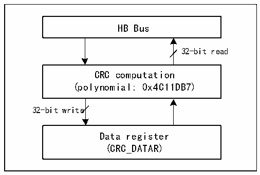

<!-- source-page: 115 -->

[← p.114](0114.md) · [index](../README.md) · [PDF p.115](https://ch32-riscv-ug.github.io/CH32H417/datasheet_zh/CH32H417RM.PDF#page=115) · [p.116 →](0116.md)

<!-- header: CH32H417系列应用手册 https://wch.cn -->

# 第 5 章 循环冗余校验（CRC）

循环冗余校验（CRC）计算单元是根据固定的生成多项式得到任一32位数据的CRC计算结果。一  
般用于数据存储和数据通讯领域用来核实数据的正确性。系统提供硬件 CRC 计算单元可以大大节省  
CPU和RAM资源提高效率。  

图5-1 CRC结构框图  
 <!-- rendered from the PDF; verify at https://ch32-riscv-ug.github.io/CH32H417/datasheet_zh/CH32H417RM.PDF#page=115 -->

🖼 Text parsed from the figure above

HB Bus  
32-bit read  
CRC computation  
(polynomial: 0x4C11DB7)  
32-bit write  
Data register  
(CRC_DATAR)  

## 5.1 主要特征

● 使用CRC32多项式（0x4C11DB7）：X32+X26+X23+X22+X16+X12+X11+X10+X8+X7+X5+X4+X2+X+1；  
● 同一个32位寄存器作为数据的输入和CRC32计算输出  
● 单次转换时间：4个HB时钟周期（HCLK）  

## 5.2 功能描述

● CRC单元复位  
如果要开始一次新数据组的 CRC 计算，需要复位 CRC 计算单元。向控制寄存器 CRC_CTLR 的 RST  
位写1，硬件将复位数据寄存器，恢复初始值0xFFFFFFFF。  
● CRC计算  
CRC单元的计算是前一次CRC计算结果和新参与的数据的CRC结果。CRC_DATAR数据寄存器，对  
其执行写操作将送入新数据到硬件计算单元；执行读取操作，将得到最新一轮的CRC计算值。硬件计  
算时会中断系统的写操作，因此可以连续写入新的值。  
注：CRC单元是对整个32位数据进行计算，而不是逐字节计算。  
● 独立数据缓冲区  
CRC单元提供了一个8位独立数据寄存器CRC_IDATAR，用于应用代码临时存放1字节的数据，不  
受CRC单元复位影响。  

## 5.3 寄存器描述

<!-- p115-table-001 (table-5-1@1) -->
<table><caption>表5-1 CRC相关寄存器列表</caption><tr><th>名称</th><th>访问地址</th><th>描述</th><th>复位值</th></tr><tr><td>R32_CRC_DATAR</td><td>0x40023000</td><td>数据寄存器</td><td>0xFFFFFFFF</td></tr><tr><td>R8_CRC_IDATAR</td><td>0x40023004</td><td>独立数据缓冲</td><td>0x00</td></tr><tr><td>R32_CRC_CTLR</td><td>0x40023008</td><td>控制寄存器</td><td>0x00000000</td></tr></table>

<!-- image: p115-draw-image-00001 bbox=[504.72, 786.24, 525.24, 796.68] -->
<!-- footer: V1.7 111 -->
