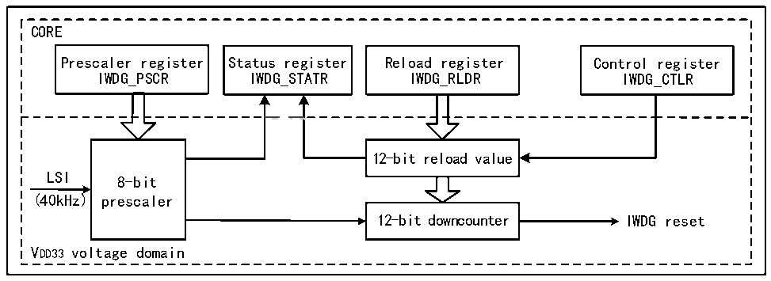

<!-- source-page: 122 -->

[← p.121](0121.md) · [index](../README.md) · [PDF p.122](https://ch32-riscv-ug.github.io/CH32H417/datasheet_zh/CH32H417RM.PDF#page=122) · [p.123 →](0123.md)

<!-- header: CH32H417系列应用手册 https://wch.cn -->

# 第 7 章 独立看门狗（IWDG）

系统设有独立看门狗（IWDG）用来检测逻辑错误和外部环境干扰引起的软件故障。IWDG时钟源  
来自于LSI，可独立于主程序之外运行，适用于对精度要求低的场合。  

## 7.1 主要特征

● 12位自减型计数器  
● 时钟来源LSI分频，可以在低功耗模式下运行  
● 复位条件：计数器值减到0  

## 7.2 功能说明

### 7.2.1 原理和用法

独立看门狗的时钟来源LSI时钟，其功能在停止模式时仍能正常工作。当看门狗计数器自减到0  
时，将会产生系统复位，所以超时时间为（重装载值+1）个时钟。  

图7-1 独立看门狗的结构框图  
 <!-- rendered from the PDF; verify at https://ch32-riscv-ug.github.io/CH32H417/datasheet_zh/CH32H417RM.PDF#page=122 -->

🖼 Text parsed from the figure above

CORE  
Prescaler register Status register Reload register Control register  
IWDG_PSCR IWDG_STATR IWDG_RLDR IWDG_CTLR  
<!-- image: p122-draw-image-00002 inside the figure -->
12-bit reload value  
LSI  
8-bit  
(40kHz) prescaler  
12-bit downcounter IWDG reset  
VDD33 voltage domain  

● 启动独立看门狗  
系统复位后，看门狗处于关闭状态，向 IWDG_CTLR 寄存器写 0xCCCC 开启看门狗，随后它不能再  
被关闭，除非发生复位。  
如果在用户选择字开启了硬件独立看门狗使能位（IWDG_SW），在微控制器复位后将固定开启IWDG。  
● 看门狗配置  
看门狗内部是一个递减运行的12位计数器，当计数器的值减为0时，将发生系统复位。开启IWDG  
功能，需要执行下面几点操作：  
1) 计数时基：IWDG时钟来源LSI，通过IWDG_PSCR寄存器设置LSI分频值时钟作为IWDG的计数时  
基。操作方法先向IWDG_CTLR寄存器写0x5555，再修改IWDG_PSCR寄存器中的分频值。IWDG_STATR  
寄存器中的 PVU 位指示了分频值更新状态，在更新完成的情况下才可以进行分频值的修改和读  
出。  
2) 重装载值：用于更新独立看门狗中计数器当前值，并且计数器由此值进行递减。操作方法先向  
IWDG_CTLR 寄存器写 0x5555，再修改 IWDG_RLDR 寄存器设置目标重装载值。IWDG_STATR 寄存器  
中的RVU位指示了重装载值更新状态，在更新完成的情况下才可以进行IWDG_RLDR寄存器的修改  
和读出。  
3) 看门狗使能：向IWDG_CTLR寄存器写0xCCCC，即可开启看门狗功能。  
<!-- image: p122-draw-image-00001 bbox=[504.72, 786.24, 525.24, 796.68] -->
<!-- footer: V1.7 118 -->
