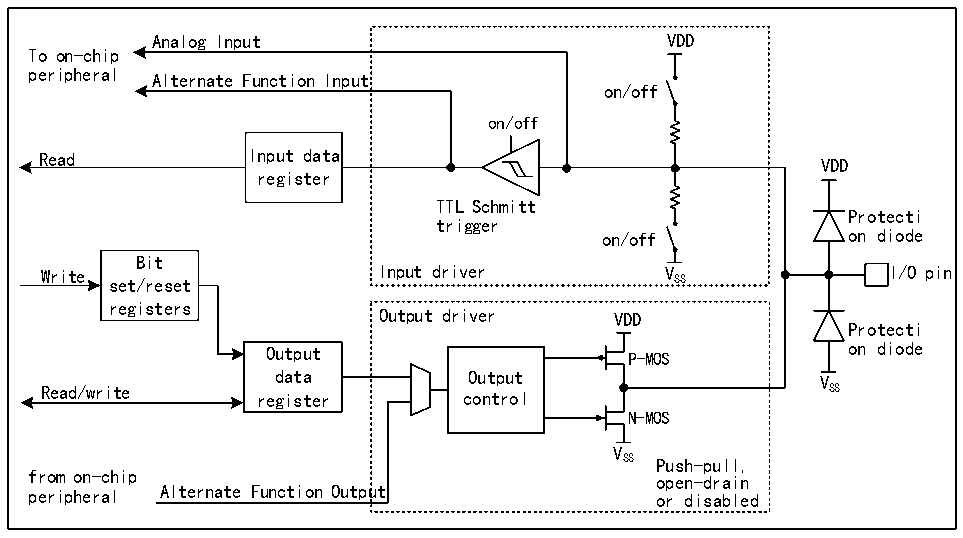

<!-- source-page: 128 -->

[← p.127](0127.md) · [index](../README.md) · [PDF p.128](https://ch32-riscv-ug.github.io/CH32H417/datasheet_zh/CH32H417RM.PDF#page=128) · [p.129 →](0129.md)

<!-- header: CH32H417系列应用手册 https://wch.cn -->

# 第 9 章 GPIO 及其复用功能（GPIO/AFIO）

芯片内置 6 组 GPIO 端口（PA0～PA15、PB0～PB15、PC0～PC15、PD0～PD15、PE0～PE15、PF0～  
PF14），共 95 个 GPIO 引脚。多数引脚都可以由软件配置成输出（推挽或开漏）、输入(带或不带上  
拉或下拉)或复用的外设功能端口。  
引脚PA9～PA12、PC13～PC15、PE3～PE6由VDD33 供电，额定3.3V供电。其中，在VDD33 掉电时，引  
脚PC13～PC15自动切换到由VBAT 供电。  
引脚 PA0～PA8、PB2～PB7、PB15、PC4～PC5、PD8、PE2、PF6～PF10 由 VDDIO 供电，额定 3.3V 供  
电，支持1.8V、2.5V、3.3V电源。  
高速引脚PA13～PA15、PB0～PB1、PB10～PB14、PC0～PC3、PC6～PC12、PD0～PD7、PD9～PD15、  
PE0～PE1、PE7～PE15、PF0～PF5、PF11～PF14 由 VIO18 供电，内置 I/O 引脚电压调节器，支持 1.2V、  
1.8V、2.5V、3.3V电压并支持动态电源电压切换，支持XO引脚配置上电后的默认电压，具体配置信  
息请参考PWR_CTLR寄存器的[12:9]字段。  

## 9.1 主要特征

端口的每个引脚可以配置成以下的多种模式之一：  
● 浮空输入 ● 开漏输出  
● 上拉输入 ● 推挽输出  
● 下拉输入 ● 复用功能的输入和输出  
● 模拟输入  
许多引脚拥有复用功能，很多其他的外设把自己的输出和输入通道映射到这些引脚上，这些复用  
引脚具体用法需要参照各个外设，而对这些引脚是否复用和是否重映射的内容由本章说明。  

## 9.2 功能描述

### 9.2.1 概述

图9-1 GPIO模块基本结构框图  
 <!-- rendered from the PDF; verify at https://ch32-riscv-ug.github.io/CH32H417/datasheet_zh/CH32H417RM.PDF#page=128 -->

🖼 Text parsed from the figure above

Analog Input VDD  
To on-chip  
peripheral Alternate Function Input  
on/off  
on/off  
Read Input data  
VDD  
register  
TTL Schmitt  
Protecti  
trigger  
on/off on diode  
Bit  
Write set/reset Input driver V SS I/O pin  
registers  
Output driver VDD  
Protecti  
Output P-MOS on diode  
data Output V  
Read/write register control SS  
N-MOS  
V  
SS Push-pull,  
from on-chip open-drain  
peripheral Alternate Function Output or disabled  

注：VDD为供电电压，电压类型由具体引脚而定，详情请参考第9章。  
<!-- image: p128-draw-image-00001 bbox=[504.72, 786.24, 525.24, 796.68] -->
<!-- footer: V1.7 124 -->
