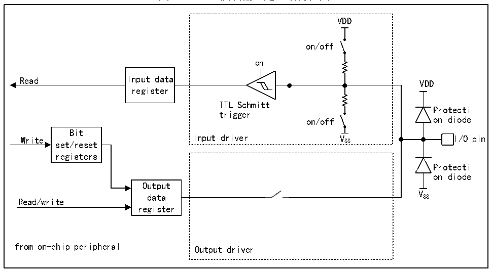
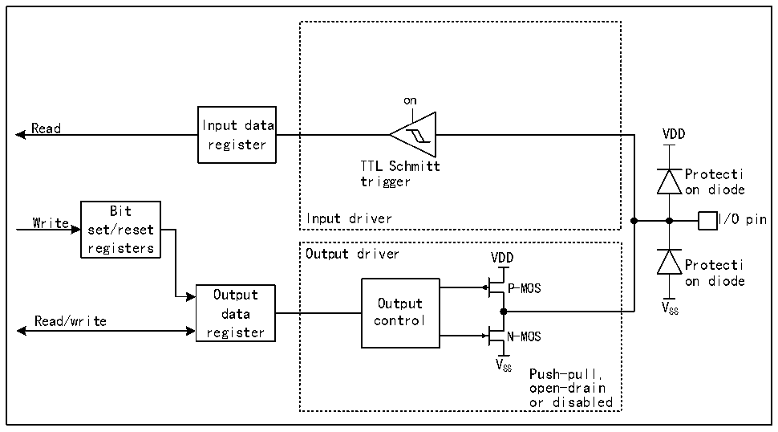

<!-- source-page: 130 -->

[← p.129](0129.md) · [index](../README.md) · [PDF p.130](https://ch32-riscv-ug.github.io/CH32H417/datasheet_zh/CH32H417RM.PDF#page=130) · [p.131 →](0131.md)

<!-- header: CH32H417系列应用手册 https://wch.cn -->

### 9.2.6 输入配置

图9-2 GPIO模块输入配置结构框图  
 <!-- rendered from the PDF; verify at https://ch32-riscv-ug.github.io/CH32H417/datasheet_zh/CH32H417RM.PDF#page=130 -->

🖼 Text parsed from the figure above

VDD  
on/off  
on  
Read Input data VDD  
register  
TTL Schmitt  
Protecti  
trigger  
on/off on diode  
Bit  
Write set/reset Input driver V SS I/O pin  
registers  
Protecti  
on diode  
Output  
V  
data SS  
Read/write  
register  
from on-chip peripheral Output driver  

注：VDD为供电电压，电压类型由具体引脚而定，详情请参考第9章。  
当 IO 口配置成输入模式时，输出驱动断开，输入上下拉可选，不连接复用功能和模拟输入。在  
每个IO口上的数据在每个HB时钟被采样到输入数据寄存器，读取输入数据寄存器对应位即获取了对  
应引脚的电平状态。  

### 9.2.7 输出配置

图9-3 GPIO模块输出配置结构框图  
 <!-- rendered from the PDF; verify at https://ch32-riscv-ug.github.io/CH32H417/datasheet_zh/CH32H417RM.PDF#page=130 -->

🖼 Text parsed from the figure above

on  
Read Input data  
VDD  
register  
TTL Schmitt  
Protecti  
trigger  
on diode  
Bit  
Write Input driver I/O pin  
set/reset  
registers  
Output driver VDD  
Protecti  
on diode  
P-MOS  
Output  
Output V  
data SS  
Read/write control  
register N-MOS  
V  
SS Push-pull,  
open-drain  
or disabled  

注：VDD为供电电压，电压类型由具体引脚而定，详情请参考第9章。  
<!-- image: p130-draw-image-00001 bbox=[504.72, 786.24, 525.24, 796.68] -->
<!-- footer: V1.7 126 -->
