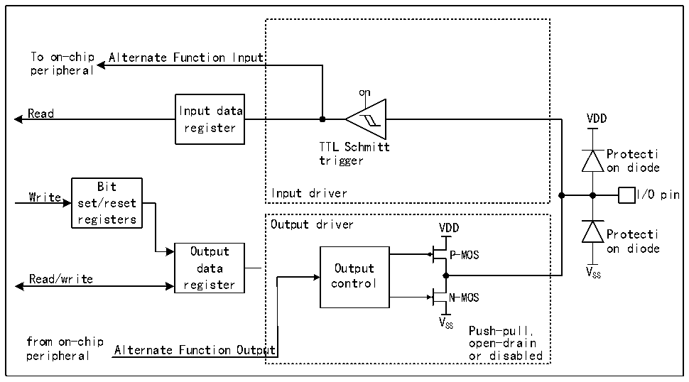

<!-- source-page: 131 -->

[← p.130](0130.md) · [index](../README.md) · [PDF p.131](https://ch32-riscv-ug.github.io/CH32H417/datasheet_zh/CH32H417RM.PDF#page=131) · [p.132 →](0132.md)

<!-- header: CH32H417系列应用手册 https://wch.cn -->
当 IO 口配置成输出模式时，输出驱动器中的一对 MOS 可根据需要被配置成推挽或开漏模式，不  
使用复用功能。输入驱动的上下拉电阻被禁用，TTL施密特触发器被激活，出现在IO引脚上的电平将  
会在每个HB时钟被采样到输入数据寄存器，所以读取输入数据寄存器将会得到IO状态，在推挽输出  
模式时，对输出数据寄存器的访问就会得到最后一次写入的值。  

### 9.2.8 复用功能配置

图9-4 GPIO模块被其他外设复用时的结构框图  
 <!-- rendered from the PDF; verify at https://ch32-riscv-ug.github.io/CH32H417/datasheet_zh/CH32H417RM.PDF#page=131 -->

🖼 Text parsed from the figure above

To on-chip Alternate Function Input  
peripheral  
on  
Read Input data  
VDD  
register  
TTL Schmitt  
Protecti  
trigger  
on diode  
Bit  
Write Input driver I/O pin  
set/reset  
registers  
Output driver VDD  
Protecti  
Output P-MOS on diode  
data Output V  
Read/write register control SS  
N-MOS  
V  
SS Push-pull,  
from on-chip open-drain  
Alternate Function Output  
peripheral or disabled  

注：VDD为供电电压，电压类型由具体引脚而定，详情请参考第9章。  
在启用复用功能时，输出驱动器被使能，可以按需要被配置成开漏或推挽模式，施密特触发器也  
被打开，复用功能的输入和输出线都被连接，但是输出数据寄存器被断开，出现在 IO 引脚上的电平  
将会在每个HB时钟被采样到输入数据寄存器，在开漏模式下，读取输入数据寄存器将会得到IO口当  
前状态；在推挽模式下，读取输出数据寄存器将会得到最后一次写入的值。  
<!-- image: p131-draw-image-00001 bbox=[504.72, 786.24, 525.24, 796.68] -->
<!-- footer: V1.7 127 -->
