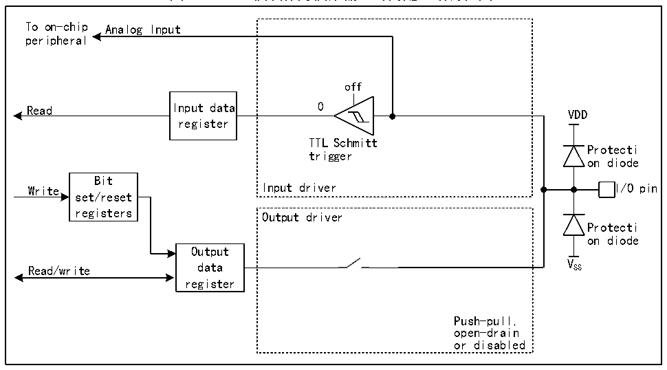

<!-- source-page: 132 -->

[← p.131](0131.md) · [index](../README.md) · [PDF p.132](https://ch32-riscv-ug.github.io/CH32H417/datasheet_zh/CH32H417RM.PDF#page=132) · [p.133 →](0133.md)

<!-- header: CH32H417系列应用手册 https://wch.cn -->

### 9.2.9 模拟输入配置

图9-5 GPIO模块作为模拟输入时的配置结构框图  
 <!-- rendered from the PDF; verify at https://ch32-riscv-ug.github.io/CH32H417/datasheet_zh/CH32H417RM.PDF#page=132 -->

🖼 Text parsed from the figure above

To on-chip Analog Input  
peripheral  
off  
Read Input data 0  
VDD  
register  
TTL Schmitt  
Protecti  
trigger  
on diode  
Bit  
Write Input driver I/O pin  
set/reset  
registers  
Output driver  
Protecti  
on diode  
Output  
Read/write data V SS  
register  
Push-pull,  
open-drain  
or disabled  

注：VDD为供电电压，电压类型由具体引脚而定，详情请参考第9章。  
在启用模拟输入时，输出缓冲器被断开，输入驱动中施密特触发器的输入被禁止以防止产生 IO  
口上的消耗，上下拉电阻被禁止，读取输入数据寄存器将一直为0。  

### 9.2.10 外设的GPIO设置

下列表格推荐了各个外设的引脚相应的GPIO口配置。  

<!-- p132-table-001 (table-9-1@1) -->
<table><caption>表9-1 高级定时器（TIM1/8）</caption><tr><th>TIMx</th><th>配置</th><th>GPIO配置</th></tr><tr><td rowspan="2">TIMx_CHx</td><td>输入捕获通道x</td><td>浮空输入</td></tr><tr><td>输出比较通道x</td><td>推挽复用输出</td></tr><tr><td>TIMx_CHxN</td><td>互补输出通道x</td><td>推挽复用输出</td></tr><tr><td>TIMx_BKIN</td><td>刹车输入</td><td>浮空输入</td></tr><tr><td>TIMx_BKIN2</td><td>刹车输入</td><td>浮空输入</td></tr><tr><td>TIMx_ETR</td><td>外部触发时钟输入</td><td>浮空输入</td></tr></table>

<!-- p132-table-002 (table-9-2@1) -->
<table><caption>表9-2 通用定时器（TIM2/3/4/5/9/10/11/12）</caption><tr><th>TIMx引脚</th><th>配置</th><th>GPIO配置</th></tr><tr><td rowspan="2">TIMx_CHx</td><td>输入捕获通道x</td><td>浮空输入</td></tr><tr><td>输出比较通道x</td><td>推挽复用输出</td></tr><tr><td>TIMx_ETR</td><td>外部触发时钟输入</td><td>浮空输入</td></tr></table>

<!-- p132-table-003 (table-9-3@1) pages 132-133 -->
<table><caption>表9-3 低功耗定时器（LPTIM1/2）</caption><tr><th>LPTIMx引脚</th><th>配置</th><th>GPIO配置</th></tr><tr><td rowspan="2">LPTIMx_CHx</td><td>输入捕获通道x</td><td>浮空输入</td></tr><tr><td>输出比较通道x</td><td>推挽复用输出</td></tr><tr><td>LPTIMx_ETR</td><td>外部触发时钟输入</td><td>浮空输入</td></tr><tr><td>LPTIMx_OC</td><td>PWM输出</td><td>推挽复用输出</td></tr></table>

<!-- image: p132-draw-image-00001 bbox=[504.72, 786.24, 525.24, 796.68] -->
<!-- footer: V1.7 128 -->
