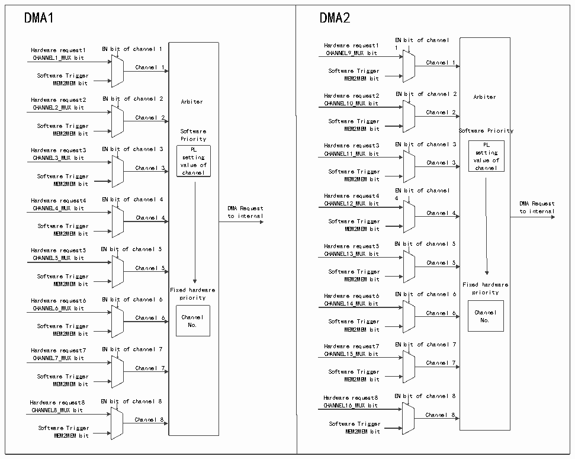

<!-- source-page: 150 -->

[← p.149](0149.md) · [index](../README.md) · [PDF p.150](https://ch32-riscv-ug.github.io/CH32H417/datasheet_zh/CH32H417RM.PDF#page=150) · [p.151 →](0151.md)

<!-- header: CH32H417系列应用手册 https://wch.cn -->

# 第 10 章 直接存储器访问控制（DMA）

直接存储器访问控制器（DMA）提供在外设和存储器之间或存储器和存储器之间的高速数据传输  
方式，无须CPU干预，数据可以通过DMA快速地移动，以节省CPU的资源来做其他操作。  
DMA控制器支持外设与DMA之间重新配置DMA请求线。还有一个仲裁器来协调各通道之间的优先  
级。  

## 10.1 主要特性

● 多个独立可配置通道  
● 支持外设与DMA之间重新配置DMA请求线，并支持软件触发  
● 支持循环的缓冲器管理  
● 多个通道之间的请求优先权可以通过软件编程设置（最高、高、中和低），优先权设置相等时  
由通道号决定（通道号越低优先级越高）  
● 支持外设到存储器、存储器到外设、存储器到存储器之间的传输  
● 闪存、SRAM、外设的SRAM、HB外设均可作为访问的源和目标  
● 可编程的数据传输数目：最大为65535  

## 10.2 功能描述

图10-1 DMA通道工作示意图  
 <!-- rendered from the PDF; verify at https://ch32-riscv-ug.github.io/CH32H417/datasheet_zh/CH32H417RM.PDF#page=150 -->

🖼 Text parsed from the figure above

DMA1 Hardware request1 EN bit of channel 1 CHANNEL1_MUX bit Channel 1 Software Trigger MEM2MEM bit Hardware request2 EN bit of channel 2 Arbiter CHANNEL2_MUX bit Channel 2 Software Trigger MEM2MEM bit Software Priority Hardware request3 EN bit of channel 3 PL CHANNEL3_MUX bit setting Channel 3 value of Software Trigger channel MEM2MEM bit Hardware request4 EN bit of channel 4 CHANNEL4_MUX bit DMA Request Channel 4 to internal Software Trigger MEM2MEM bit Hardware request5 EN bit of channel 5 CHANNEL5_MUX bit Channel 5 Software Trigger MEM2MEM bit Fixed hardware Hardware request6 EN bit of channel 6 priority CHANNEL6_MUX bit Channel 6 Channel Software Trigger No. MEM2MEM bit Hardware request7 EN bit of channel 7 CHANNEL7_MUX bit Channel 7 Software Trigger MEM2MEM bit Hardware request8 EN bit of channel 8 CHANNEL8_MUX bit Channel 8 Software Trigger MEM2MEM bit  DMA2 EN bit of channel Hardware request1 1 CHANNEL9_MUX bit Channel 1 Software Trigger MEM2MEM bit Hardware request2 EN bit of channel 2 Arbiter CHANNEL10_MUX bit Channel 2 Software Trigger MEM2MEM bit Software Priority Hardware request3 EN bit of channel 3 PL CHANNEL11_MUX bit setting Channel 3 value of Software Trigger channel MEM2MEM bit EN bit of channel Hardware request4 4 CHANNEL12_MUX bit DMA Request Channel 4 to internal Software Trigger MEM2MEM bit Hardware request5 EN bit of channel 5 CHANNEL13_MUX bit Channel 5 Software Trigger MEM2MEM bit Fixed hardware Hardware request6 EN bit of channel 6 priority CHANNEL14_MUX bit Channel 6 Channel Software Trigger No. MEM2MEM bit Hardware request7 EN bit of channel 7 CHANNEL15_MUX bit Channel 7 Software Trigger MEM2MEM bit Hardware request8 EN bit of channel 8 CHANNEL16_MUX bit Channel 8 Software Trigger MEM2MEM bit  
<!-- image: p150-draw-image-00018 inside the figure -->
<!-- image: p150-draw-image-00009 inside the figure -->
<!-- image: p150-draw-image-00011 inside the figure -->
<!-- image: p150-draw-image-00002 inside the figure -->
<!-- image: p150-draw-image-00012 inside the figure -->
<!-- image: p150-draw-image-00003 inside the figure -->
<!-- image: p150-draw-image-00013 inside the figure -->
<!-- image: p150-draw-image-00004 inside the figure -->
<!-- image: p150-draw-image-00014 inside the figure -->
<!-- image: p150-draw-image-00005 inside the figure -->
<!-- image: p150-draw-image-00015 inside the figure -->
<!-- image: p150-draw-image-00006 inside the figure -->
<!-- image: p150-draw-image-00016 inside the figure -->
<!-- image: p150-draw-image-00007 inside the figure -->
<!-- image: p150-draw-image-00017 inside the figure -->
<!-- image: p150-draw-image-00008 inside the figure -->
<!-- image: p150-draw-image-00019 inside the figure -->
<!-- image: p150-draw-image-00010 inside the figure -->

<!-- image: p150-draw-image-00001 bbox=[504.72, 786.24, 525.24, 796.68] -->
<!-- footer: V1.7 146 -->
