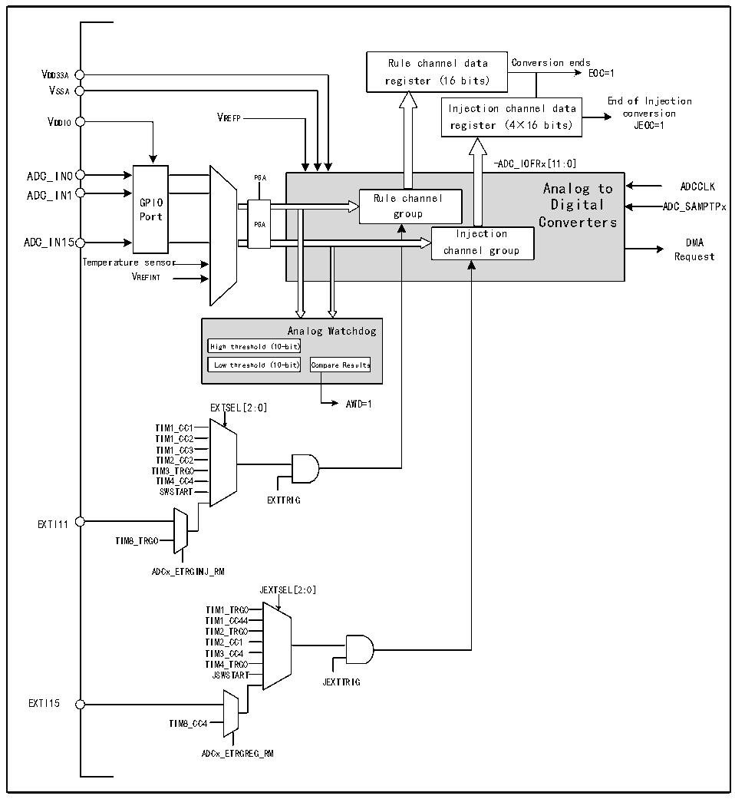

<!-- source-page: 165 -->

[← p.164](0164.md) · [index](../README.md) · [PDF p.165](https://ch32-riscv-ug.github.io/CH32H417/datasheet_zh/CH32H417RM.PDF#page=165) · [p.166 →](0166.md)

<!-- header: CH32H417系列应用手册 https://wch.cn -->

## 11.2 功能描述

### 11.2.1 模块结构

图11-1 ADC模块框图  
 <!-- rendered from the PDF; verify at https://ch32-riscv-ug.github.io/CH32H417/datasheet_zh/CH32H417RM.PDF#page=165 -->

🖼 Text parsed from the figure above

Rule channel data Conversion ends  
VDD33A  
EOC=1  
register (16 bits)  
VSSA  
End of Injection  
Injection channel data  
VDDIO VREFP register (4×16 bits) co J n E ve OC r = si 1 on  
-ADC_IOFRx[11:0]  
GPIOPort  
-ADC_IOFRx[11:0] Analog to Rule channel Digital group Converters Injection channel group  PGA  
Analog to ADCCLK  
ADC_IN15 DMA  
Request  
Temperature sensor  
VREFINT  
Analog Watchdog  
High threshold (10-bit)  Low threshold (10-bit)  
EXTSEL[2:0] AWD=1  
TIM11_CC11  
TIM1_CC2  
TIM1_CC3  
TIM2_CC2  
TIM3_TRG0  
TIM4_CC4  
SWSTART  
EXTTRIG  
EXTI11  
TIM8_TRGO  
ADCx_ETRGINJ_RM  
JEXTSEL[2:0]  
TIM1_TRG0  
TIM1_CC44  
TIM2_TRG0  
TIM2_CC1  
TIM3_CC4  
TIM4_TRG0  
JSWSTART  
JEXTTRIG  
EXTI15  
TIM8_CC4  
ADCx_ETRGREG_RM  

### 11.2.2 ADC配置

1）模块上电  
ADCx_CTLR2寄存器的ADON位为1表示ADC模块上电。当ADC模块从断电模式（ADON=0）下进入  
上电状态（ADON=1）后，需要延迟一段时间tSTAB 用于模块稳定时间。之后再次写入ADON位为1，用于  
作为软件启动 ADC 转换的启动信号。通过清除 ADON 位为 0，可以终止当前转换并将 ADC 模块置于断  
电模式，这个状态下，ADC几乎不耗电。  
2）采样时钟  
模块的寄存器操作基于HCLK（HB总线）时钟，其转换单元的时钟基准ADCCLK与HCLK同步，由  
<!-- image: p165-draw-image-00001 bbox=[504.72, 786.24, 525.24, 796.68] -->
<!-- footer: V1.7 161 -->
