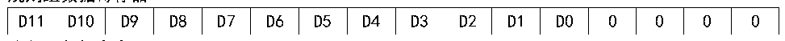
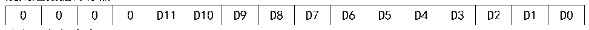

<!-- source-page: 167 -->

[← p.166](0166.md) · [index](../README.md) · [PDF p.167](https://ch32-riscv-ug.github.io/CH32H417/datasheet_zh/CH32H417RM.PDF#page=167) · [p.168 →](0168.md)

<!-- header: CH32H417系列应用手册 https://wch.cn -->

图11-2 数据左对齐  
 <!-- rendered from the PDF; verify at https://ch32-riscv-ug.github.io/CH32H417/datasheet_zh/CH32H417RM.PDF#page=167 -->

规则组数据寄存器  

🖼 Text parsed from the figure above

D11  D10  D9  D8  D7  D6  D5  D4  D3  D2  D1  D0  0  0  0  0  

注入组数据寄存器  

<!-- p167-table-002 (table-10-6@1) -->
<table><tr><th>SIGNB</th><th>D11</th><th>D10</th><th>D9</th><th>D8</th><th>D7</th><th>D6</th><th>D5</th><th>D4</th><th>D3</th><th>D2</th><th>D1</th><th>D0</th><th>0</th><th>0</th><th>0</th></tr></table>

图11-3 数据右对齐  
 <!-- rendered from the PDF; verify at https://ch32-riscv-ug.github.io/CH32H417/datasheet_zh/CH32H417RM.PDF#page=167 -->

规则组数据寄存器  

🖼 Text parsed from the figure above

0  0  0  0  D11  D10  D9  D8  D7  D6  D5  D4  D3  D2  D1  D0  

注入组数据寄存器  

<!-- p167-table-004 (table-10-6@1) -->
<table><tr><th>SIGNB</th><th>SIGNB</th><th>SIGNB</th><th>SIGNB</th><th>D11</th><th>D10</th><th>D9</th><th>D8</th><th>D7</th><th>D6</th><th>D5</th><th>D4</th><th>D3</th><th>D2</th><th>D1</th><th>D0</th></tr></table>

### 11.2.3 外部触发源

ADC转换的启动事件可以由外部事件触发。如果设置了ADCx_CTLR2寄存器的EXTTRIG或JEXTTRIG  
位，则可分别通过外部事件触发规则组或注入组通道的转换。此时，EXTSEL[2:0]和JEXTSEL[2:0]位  
的配置决定规则组和注入组的外部事件源。  
注：当外部触发信号被选为ADC规则或注入转换时，只有它的上升沿可以启动转换。  

<!-- p167-table-005 (table-11-1@1) -->
<table><caption>表11-1 规则组通道的外部触发源</caption><tr><th>EXTSEL[2:0]</th><th>触发源</th><th>类型</th></tr><tr><td>000</td><td>定时器1的CC1事件</td><td rowspan="6">来自片上定时器的内部信号</td></tr><tr><td>001</td><td>定时器1的CC2事件</td></tr><tr><td>010</td><td>定时器1的CC3事件</td></tr><tr><td>011</td><td>定时器2的CC2事件</td></tr><tr><td>100</td><td>定时器3的TRGO事件</td></tr><tr><td>101</td><td>定时器4的CC4事件</td></tr><tr><td>110</td><td>EXTI线11/TIM8_TRGO</td><td>来自外部引脚/内部定时器信号</td></tr><tr><td>111</td><td>SWSTART位置1软件触发</td><td>软件控制位</td></tr></table>

<!-- p167-table-006 (table-11-2@1) -->
<table><caption>表11-2注入组通道的外部触发源</caption><tr><th>JEXTSEL[2:0]</th><th>触发源</th><th>类型</th></tr><tr><td>000</td><td>定时器1的TRGO事件</td><td rowspan="6">来自片上定时器的内部信号</td></tr><tr><td>001</td><td>定时器1的CC4事件</td></tr><tr><td>010</td><td>定时器2的TRGO事件</td></tr><tr><td>011</td><td>定时器2的CC1事件</td></tr><tr><td>100</td><td>定时器3的CC4事件</td></tr><tr><td>101</td><td>定时器4的TRGO事件</td></tr><tr><td>110</td><td>EXTI线15/TIM8_CC4</td><td>来自外部引脚/内部定时器信号</td></tr><tr><td>111</td><td>JSWSTART位置1软件触发</td><td>软件控制位</td></tr></table>

### 11.2.4 转换模式

<!-- p167-table-007 (table-11-3@1) pages 167-168 -->
<table><caption>表11-3 转换模式组合</caption><tr><th colspan="5">ADCx_CTLR1和ADCx_CTLR2寄存器控制位</th><th rowspan="2">ADC转换模式</th></tr><tr><td>CONT</td><td>SCAN</td><td>DISCEN/JDISCEN</td><td>JAUTO</td><td>启动事件</td></tr><tr><td>0</td><td>0</td><td>0</td><td>0</td><td style="text-align:left">ADON位置1</td><td style="text-align:left">单次单通道模式：某一规则通道执行单次转换。</td></tr><tr><td rowspan="6"></td><td></td><td></td><td></td><td style="text-align:left">外部触发方式</td><td style="text-align:left">单次单通道模式：规则通道或注入通道的某一通道执行单次转换。</td></tr><tr><td rowspan="2">1</td><td rowspan="2">0</td><td>0</td><td style="text-align:left">ADON位置1或外部触发方式</td><td style="text-align:left">单次扫描模式：按顺序对选中的所有规则组通道（ADCx_RSQRx）或所有注入组通道 （ADCx_ISQR）逐个执行单次转换。 触发注入方式：当规则组通道转换过程中可以插入注入组通道所有转换，之后再继续规则组通道转换；但转换注入组通道时不会插入规则组通道转换。</td></tr><tr><td>1</td><td style="text-align:left">ADON位置1或外部触发方式</td><td style="text-align:left">单次扫描模式：按顺序对选中的所有规则组通道（ADCx_RSQRx）或所有注入组通道 （ADCx_ISQR）逐个执行单次转换。 自动注入方式：在规则组通道转换完之后， 注入组通道被自动转换。 注：转换过程中不允许出现注入通道的外部触发信号。</td></tr><tr><td rowspan="2">0</td><td rowspan="2" style="text-align:left">1 （DISCEN和JDISCEN不能同时为1）</td><td>0</td><td style="text-align:left">外部触发方式</td><td style="text-align:left">单次间断模式：每次启动事件，执行一个短序列（DISCNUM[2:0]定义数量）的通道数量转换，直到所有选中通道转换完成才能重头开始。 注：规则组和注入组选中此模式控制位分别为DISCEN和JDISCEN，不能同时为规则组和注入组配置间断模式，间断模式只能用于一组转换。</td></tr><tr><td>1</td><td>-</td><td>禁止此模式。</td></tr><tr><td>1</td><td>1</td><td>X</td><td>-</td><td>无此模式。</td></tr><tr><td rowspan="3">1</td><td>0</td><td>0</td><td>0</td><td rowspan="3" style="text-align:left">ADON位置1或外部触发方式</td><td rowspan="3" style="text-align:left">连续单通道/扫描模式：每轮结束后重复新一轮的转换，直到CONT清0才能终止。</td></tr><tr><td rowspan="2">1</td><td rowspan="2">0</td><td>0</td></tr><tr><td>1</td></tr></table>

<!-- image: p167-draw-image-00001 bbox=[504.72, 786.24, 525.24, 796.68] -->
<!-- footer: V1.7 163 -->
