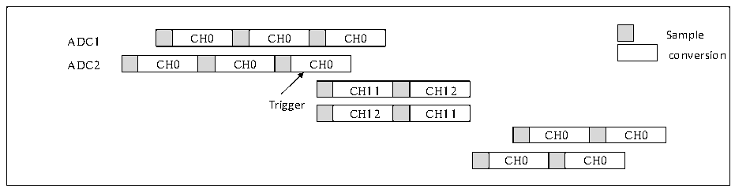

<!-- source-page: 176 -->

[← p.175](0175.md) · [index](../README.md) · [PDF p.176](https://ch32-riscv-ug.github.io/CH32H417/datasheet_zh/CH32H417RM.PDF#page=176) · [p.177 →](0177.md)

<!-- header: CH32H417系列应用手册 https://wch.cn -->
注入转换结束后，交替转换被恢复。  

图11-14 交替转换下触发注入组转换  
 <!-- rendered from the PDF; verify at https://ch32-riscv-ug.github.io/CH32H417/datasheet_zh/CH32H417RM.PDF#page=176 -->

🖼 Text parsed from the figure above

CH0  CH0  CH0  
ADC1 CH0 CH0 CH0 Sample  
conversion  
CH0  CH0  CH0  
CH11  CH12  
Trigger  
CH12  CH11  
CH0  CH0  
CH0  CH0  

注：当ADC的预分频系数为4时，交替转换恢复后采样间隔不再是均匀的7个ADC时钟，改为8个和  
6个时钟周期交替。  

### 11.2.8 DFSDM转换

ADC转换结果可直接传送到具有ΣΔ调制器的数字滤波器（DFSDM）。在这种情况下，ADCx_AUX[31]  
位必须置为1，DMA位必须清除为0。ADC会将规则数据寄存器数据的12个最低有效位传输到DFSDM，  
一旦传输完成，DFSDM将重置EOC标志。  

### 11.2.9 ADC低功耗模式

通过ADCx_CTLR2寄存器ADC_LP位，可配置ADC工作模式。默认为0的情况下，功耗较高，适用  
于 6M 及以上采样率，且只适用于 VDD33A 高于 3V；置 1 的情况下为低功耗模式，功耗较低，适用于 2M  
以下采样率。  

## 11.3 寄存器描述

<!-- p176-table-008 (table-11-5@1) pages 176-177 -->
<table><caption>表11-5 ADC1相关寄存器列表</caption><tr><th>名称</th><th>访问地址</th><th>描述</th><th>复位值</th></tr><tr><td>R32_ADC1_STATR</td><td>0x40012400</td><td>ADC1状态寄存器</td><td>0x00000000</td></tr><tr><td>R32_ADC1_CTLR1</td><td>0x40012404</td><td>ADC1控制寄存器1</td><td>0x00000000</td></tr><tr><td>R32_ADC1_CTLR2</td><td>0x40012408</td><td>ADC1控制寄存器2</td><td>0x000000D0</td></tr><tr><td>R32_ADC1_SAMPTR1</td><td>0x4001240C</td><td>ADC1采样时间配置寄存器1</td><td>0x00000000</td></tr><tr><td>R32_ADC1_SAMPTR2</td><td>0x40012410</td><td>ADC1采样时间配置寄存器2</td><td>0x00000000</td></tr><tr><td>R32_ADC1_IOFR1</td><td>0x40012414</td><td>ADC1注入通道数据偏移寄存器1</td><td>0x00000000</td></tr><tr><td>R32_ADC1_IOFR2</td><td>0x40012418</td><td>ADC1注入通道数据偏移寄存器2</td><td>0x00000000</td></tr><tr><td>R32_ADC1_IOFR3</td><td>0x4001241C</td><td>ADC1注入通道数据偏移寄存器3</td><td>0x00000000</td></tr><tr><td>R32_ADC1_IOFR4</td><td>0x40012420</td><td>ADC1注入通道数据偏移寄存器4</td><td>0x00000000</td></tr><tr><td>R32_ADC1_WDHTR</td><td>0x40012424</td><td>ADC1看门狗高阈值寄存器</td><td>0x00000FFF</td></tr><tr><td>R32_ADC1_WDLTR</td><td>0x40012428</td><td>ADC1看门狗低阈值寄存器</td><td>0x00000000</td></tr><tr><td>R32_ADC1_RSQR1</td><td>0x4001242C</td><td>ADC1规则通道序列寄存器1</td><td>0x00000000</td></tr><tr><td>R32_ADC1_RSQR2</td><td>0x40012430</td><td>ADC1规则通道序列寄存器2</td><td>0x00000000</td></tr><tr><td>R32_ADC1_RSQR3</td><td>0x40012434</td><td>ADC1规则通道序列寄存器3</td><td>0x00000000</td></tr><tr><td>R32_ADC1_ISQR</td><td>0x40012438</td><td>ADC1注入通道序列寄存器</td><td>0x00000000</td></tr><tr><td>R32_ADC1_IDATAR1</td><td>0x4001243C</td><td>ADC1注入数据寄存器1</td><td>0x00000000</td></tr><tr><td>R32_ADC1_IDATAR2</td><td>0x40012440</td><td>ADC1注入数据寄存器2</td><td>0x00000000</td></tr><tr><td>R32_ADC1_IDATAR3</td><td>0x40012444</td><td>ADC1注入数据寄存器3</td><td>0x00000000</td></tr><tr><td>R32_ADC1_IDATAR4</td><td>0x40012448</td><td>ADC1注入数据寄存器4</td><td>0x00000000</td></tr><tr><td>R32_ADC1_RDATAR</td><td>0x4001244C</td><td>ADC1规则数据寄存器</td><td>0x00000000</td></tr><tr><td>R32_ADC1_AUX</td><td>0x40012454</td><td>ADC1采样时间寄存器</td><td>0x00000000</td></tr></table>

<!-- image: p176-draw-image-00001 bbox=[504.72, 786.24, 525.24, 796.68] -->
<!-- footer: V1.7 172 -->
