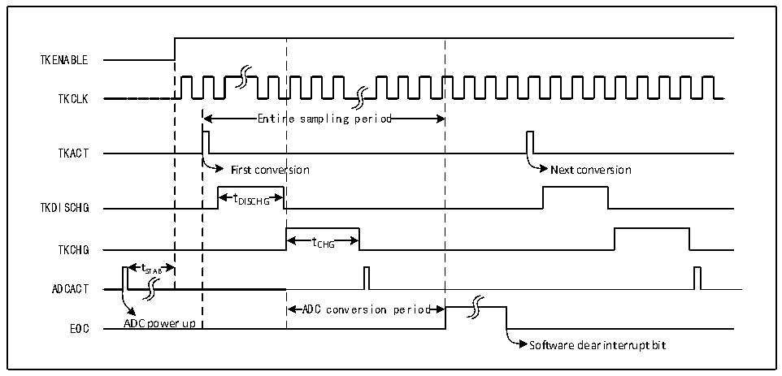

<!-- source-page: 194 -->

[← p.193](0193.md) · [index](../README.md) · [PDF p.194](https://ch32-riscv-ug.github.io/CH32H417/datasheet_zh/CH32H417RM.PDF#page=194) · [p.195 →](0195.md)

<!-- header: CH32H417系列应用手册 https://wch.cn -->

# 第 13 章 触摸按键检测（TKEY）

触摸检测控制（TKEY）单元，借助ADC模块的电压转换功能，通过将电容量转换为电压量进行采  
样，实现触摸按键检测功能。检测通道复用ADC的16个外部通道，通过ADC模块的单次转换模式实  
现触摸按键检测。  

## 13.1 TKEY 功能描述

● TKEY开启  
TKEY检测过程需要ADC模块配合进行，所以使用TKEY功能时，需要保证ADC模块处于上电状态  
（ADON=1），然后将ADC_CTLR1寄存器的TKENABLE位置1，打开TKEY单元功能，且可以通过TKITUNE  
位调整TKEY模块的充电电流。  
TKEY 只支持单次单通道转换模式，将待转换的通道配置到 ADC 模块的规则组序列第一个，软件  
启动转换（写TKEY_ACT_DCG寄存器）。  
注：不进行TKEY转换时，仍然可以保留ADC通道配置转换功能。  

图13-1 TKEY工作时序图  
 <!-- rendered from the PDF; verify at https://ch32-riscv-ug.github.io/CH32H417/datasheet_zh/CH32H417RM.PDF#page=194 -->

🖼 Text parsed from the figure above

TKENABLE  
TKCLK  
Entir  re sampling period  Entir  re sampling period  
TKACT  
First conversion Next conversion  
t DISCHG  tDISCHG  
TKDISCHG DISCHG  
t CHG  tCHG  
TKCHG CHG  
t  tSTAB  
ADCACT  
ADC conversion period  ADC conversion period  
EOC ADC power up  
Software clear interrupt bit  

● 可编程采样时间  
TKEY 单元转换需要先使用若干个 HCLK 时钟周期（tDISCHG）进行放电，然后再通过若干个 HCLK 周  
期（tCHG）对通道进行充电进行电压采样，充电周期数为TKEY_CHGOFFSET值，每个通道可以分别用不  
同的充电周期来调整采样电压。  

## 13.2 TKEY 操作步骤

TKEY检测属于ADC模块下的扩展功能，其工作原理是通过“触摸”和“非触摸”方式让硬件通道  
感知的电容量发生变化，进而通过可设置的充放电周期数将电容量的变化转换为电压的变化，最后通  
过ADC模块转换为数字值。  
采样时，需要将 ADC 配置为单次单通道工作模式，由 TKEY_ACT 寄存器的“写操作”启动一次转  
换，具体流程如下：  
1） 初始化ADC功能，配置ADC模块为单次转换模块，置ACON位为1，唤醒ADC模块。将ADC_CTLR1  
寄存器的TKENABLE位置1，打开TKEY单元。  
2） 设置要转换的通道，将通道号写入ADC规则组序列中第一个转换位置（ADC_RSQR3[4:0]），设置  
L[3:0]为1。  
<!-- image: p194-draw-image-00001 bbox=[504.72, 786.24, 525.24, 796.68] -->
<!-- footer: V1.7 190 -->
