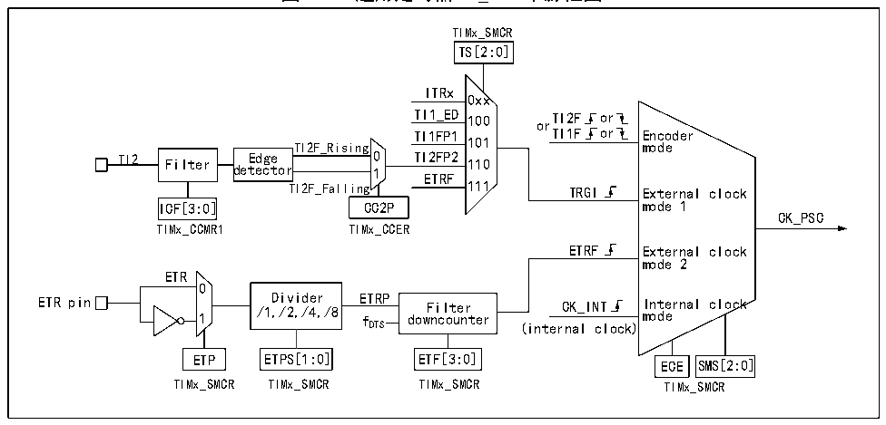

<!-- source-page: 227 -->

[← p.226](0226.md) · [index](../README.md) · [PDF p.227](https://ch32-riscv-ug.github.io/CH32H417/datasheet_zh/CH32H417RM.PDF#page=227) · [p.228 →](0228.md)

<!-- header: CH32H417系列应用手册 https://wch.cn -->
分频、边沿检测等操作，并支持通道间的互触发，还能为核心计数器CNT提供时钟。每个比较捕获通  
道都拥有一组比较捕获寄存器（CHxCVR），支持与主计数器（CNT）进行比较而输出脉冲。  

### 15.2.2 通用定时器和高级定时器的区别

与高级定时器相比，通用定时器缺少以下功能：  
1） 通用定时器缺少对核心计数器的计数周期进行计数的重复计数寄存器。  
2） 通用定时器的比较捕获通道缺少死区产生，没有互补输出。  
3） 通用定时器没有刹车信号机制。  

### 15.2.3 时钟输入

本节论述CK_PSC的来源。此处截取通用定时器的整体结构框图的时钟源部分。  

图15-2 通用定时器CK_PSC来源框图  
 <!-- rendered from the PDF; verify at https://ch32-riscv-ug.github.io/CH32H417/datasheet_zh/CH32H417RM.PDF#page=227 -->

🖼 Text parsed from the figure above

TIMx_SMCR  
TS[2:0]  
ITRx  
0xx  
TI1_ED 100 or TI2F or  
TI1FP1 TI1F or Encoder  
TI2F_Rising 101 mode  
TI2 Filter Edge 0 TI2FP2 110  
detector 1 ETRF  
TI2F_Falling 111 TRGI External clock  
ICF[3:0] CC2P mode 1  
CK_PSC  
TIMx_CCMR1 TIMx_CCER  
ETRF External clock  
mode 2  
ETR  
0  
ETR pin 1 /1, Di /2 v , id /4 e , r /8 E f TRP dow F n i c l o t u e n r ter CK_INT I m n o t d e e rnal clock  
DTS (internal clock)  
ETP ETPS[1:0] ETF[3:0] ECE SMS[2:0]  
TIMx_SMCR TIMx_SMCR TIMx_SMCR TIMx_SMCR  

可选的输入时钟可以分为4类：  
1) 外部时钟引脚（ETR）输入的路线：ETR→ETRP→ETRF；  
2) 内部HB时钟输入路线：CK_INT；  
3) 来自比较捕获通道引脚（TIMx_CHx）的路线：TIMx_CHx→TIx→TIxFPx，此路线也用于编码器模  
式；  
4) 来自内部其他定时器的输入：ITRx。  
通过决定CK_PSC来源的SMS的输入脉冲选择可以将实际的操作分为三类：  
1) 选择内部时钟源（CK_INT）；  
2) 外部时钟源模式1；  
3) 外部时钟源模式2；  
4) 编码器模式。  
上文提到的4种时钟源来源都可通过这4种操作选定。  

#### 15.2.3.1 内部时钟源（CK_INT）

如果将 SMS 域保持为 000b 时启动通用定时器，那么就是选定内部时钟源（CK_INT）为时钟。此  
时CK_INT就是CK_PSC。  

#### 15.2.3.2 外部时钟源模式1

如果将SMS域设置为111b时，就会启用外部时钟源模式1。启用外部时钟源1时，TRGI被选定  
为CK_PSC的来源，值得注意的，用户还需要通过配置TS域来选择TRGI的来源。TS域可选择以下几  
<!-- image: p227-draw-image-00001 bbox=[504.72, 786.24, 525.24, 796.68] -->
<!-- footer: V1.7 223 -->
