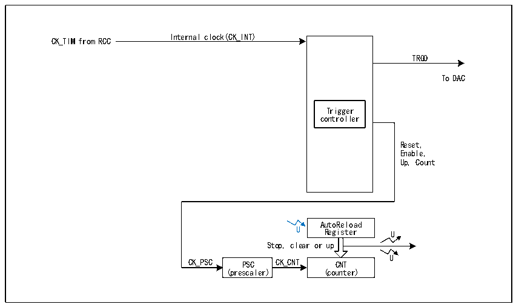

<!-- source-page: 253 -->

[← p.252](0252.md) · [index](../README.md) · [PDF p.253](https://ch32-riscv-ug.github.io/CH32H417/datasheet_zh/CH32H417RM.PDF#page=253) · [p.254 →](0254.md)

<!-- header: CH32H417系列应用手册 https://wch.cn -->

# 第 16 章 基本定时器（BCTM）

基本定时器模块包含两个16位可自动重装的定时器（TIM6和TIM7），用于计数和在更新事件产  
生中断或DMA请求。TIM6和TIM7支持16位可编程预分频器。可以为数模转换（DAC）提供时钟，触  
发DAC的同步电路。基本定时器之间是互相独立的，互不共享任何资源。  

## 16.1 主要特征

基本定时器的主要特征包括：  
● 16位自动重装计数器，支持增计数模式  
● 16位预分频器，分频系数从1～65536之间动态可调  
● 触发DAC同步电路  
● 在更新事件时产生中断或DMA请求  

## 16.2 原理和结构

图16-1 基本定时器的结构框图  
 <!-- rendered from the PDF; verify at https://ch32-riscv-ug.github.io/CH32H417/datasheet_zh/CH32H417RM.PDF#page=253 -->

🖼 Text parsed from the figure above

Internal clock(CK_INT)  
CK_TIM from RCC  
TRGO  
To DAC  
Trigger  
controller  
Reset,  
Enable,  
Up, Count  
AutoReload  
U Register U  
Stop, clear or up  
U  
CK_PSC PSC CK_CNT CNT  
(prescaler) (counter)  

### 16.2.1 概述

如图16-1所示，基本定时器的结构大致可以分为两部分，即输入时钟部分和核心计数器部分。  
基本定时器的时钟来自于 HB 总线时钟（CK_INT）。这些输入的时钟信号经过各种设定的滤波分  
频等操作后成为CK_PSC时钟，输出给核心计数器部分。另外，这些复杂的时钟来源还可以作为TRGO  
输出至DAC外设。  
基本定时器的核心是一个16位计数器（CNT）。CK_PSC经过预分频器（PSC）分频后，成为CK_CNT  
再最终输给CNT，CNT支持增计数模式，并有一个自动重装值寄存器（ATRLR）在每个计数周期结束后  
为CNT重装载初始化值。  

### 16.2.2 基本定时器和通用定时器的区别

与通用定时器相比，基本定时器缺少以下功能：  
1） 基本定时器缺少减计数模式和增减计数模式。  
2） 基本定时器缺少四路独立的比较捕获通道。  
<!-- image: p253-draw-image-00001 bbox=[504.72, 786.24, 525.24, 796.68] -->
<!-- footer: V1.7 249 -->
