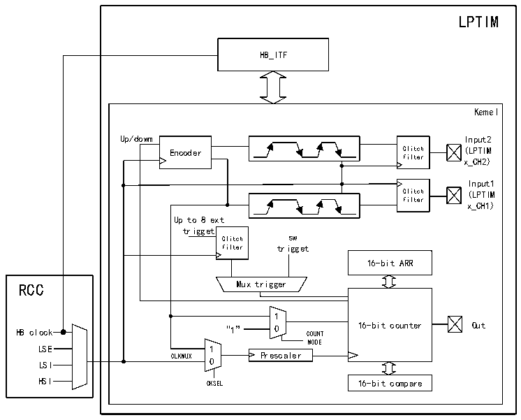

<!-- source-page: 258 -->

[← p.257](0257.md) · [index](../README.md) · [PDF p.258](https://ch32-riscv-ug.github.io/CH32H417/datasheet_zh/CH32H417RM.PDF#page=258) · [p.259 →](0259.md)

<!-- header: CH32H417系列应用手册 https://wch.cn -->

# 第 17 章 低功耗定时器（LPTIM）

<!-- p258-table-001 (table-16-2@1) -->
<table><tr><th style="text-align:left">低功耗定时器模块包含两个16位上行计数的定时器。LPTIM具有多种可选的时钟源，使得</th></tr><tr><td style="text-align:left">LPTIM能在所有电源模式下运行。LPTIM在没有内部时钟源的情况下也能运行，依此可以将LPTIM当</td></tr><tr><td style="text-align:left">作“脉冲计数器”使用。除此之外，LPTIM还能将系统从低功耗模式唤醒，所以LPTIM很适合以极</td></tr><tr><td>低的功耗实现“超时功能”。</td></tr><tr><td></td></tr></table>

## 17.1 主要特征

● 16位上行计数器  
● 3位预分频器，支持8种分频系数（1、2、4、8、16、32、64、128）  
● 可选时钟源  
内部时钟源：LSE、LSI、HSI或HB时钟  
外部时钟源：LPTIM输入上的外部时钟  
● 16位ARR自动重装载寄存器  
● 16位比较寄存器  
● 连续/单触发模式  
● 可选择的软件/硬件输入触发器  
● 可编程数字干扰滤波器  
● 可配置输出PWM波  
● 可配置I/O极性  
● 编码器模式  

## 17.2 LPTIM 功能描述

### 17.2.1 LPTIM框图

图17-1 低功耗定时器框图  
 <!-- rendered from the PDF; verify at https://ch32-riscv-ug.github.io/CH32H417/datasheet_zh/CH32H417RM.PDF#page=258 -->

🖼 Text parsed from the figure above

LPTIM  
HB_ITF  
Kemel  
Up/dowm Input2  
Encoder Glitch (LPTIM  
filter x_CH2)  
Input1  
Glitch (LPTIM  
filter  
x_CH1)  
Up to 8 ext  
trigget  
Glitch sw  
filter trigget  
16-bit ARR  
RCC Mux trigger  
1  
HB clock “1” 0 COUNT 16-bit counter Out  
MODE  
LSE 1  
LSI CLKMUX 0 Prescaler  
HSI CKSEL 16-bit compare  

<!-- image: p258-draw-image-00001 bbox=[504.72, 786.24, 525.24, 796.68] -->
<!-- footer: V1.7 254 -->
