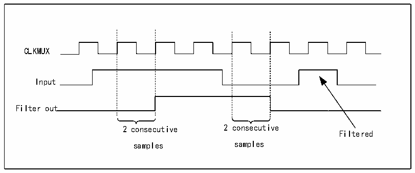

<!-- source-page: 260 -->

[← p.259](0259.md) · [index](../README.md) · [PDF p.260](https://ch32-riscv-ug.github.io/CH32H417/datasheet_zh/CH32H417RM.PDF#page=260) · [p.261 →](0261.md)

<!-- header: CH32H417系列应用手册 https://wch.cn -->

图17-2干扰滤波器时序框图  
 <!-- rendered from the PDF; verify at https://ch32-riscv-ug.github.io/CH32H417/datasheet_zh/CH32H417RM.PDF#page=260 -->

🖼 Text parsed from the figure above

CLKMUX  
Input  
Filter out  
2 consecutive 2 consecutive  
Filtered  
samples samples  

注：在不使用内部时钟信号的时候，数字滤波器的停用必须通过将CKFLT和TRGFLT位清零来实  
现，并使用外部模拟滤波器避免LPTIM外部输入带来的干扰。  

### 17.3.3 预分频器

LPTIM 16位计数器前面要有一个可配置的2n预分频器。由PRESC[2:0]3位字段控制预分频器的  
分频比，表17-3列出了所有可能的分频比。  

<!-- p260-table-001 (table-17-3@1) -->
<table><caption>表17-3 预分频器的分频比</caption><tr><th>PRESC[2:0]</th><th>分频比</th></tr><tr><td>000</td><td>1</td></tr><tr><td>001</td><td>1/2</td></tr><tr><td>010</td><td>1/4</td></tr><tr><td>011</td><td>1/8</td></tr><tr><td>100</td><td>1/16</td></tr><tr><td>101</td><td>1/32</td></tr><tr><td>110</td><td>1/64</td></tr><tr><td>111</td><td>1/128</td></tr></table>

### 17.3.4 触发器多路复用器

LPTIM计数器有两种启动方式，一是通过软件启动，二是在检测到触发输入中一个以上的有效边  
沿后启动。LPTIM触发方式由TRIGEN[1:0]控制，触发源由TRIGSEL[1:0]位控制。  

<!-- p260-table-002 (table-17-4@1) -->
<table><caption>表17-4 触发方式</caption><tr><th>TRIGEN[1:0]</th><th>触发方式</th></tr><tr><td>00</td><td>无效</td></tr><tr><td>01</td><td>上升沿</td></tr><tr><td>10</td><td>下降沿</td></tr><tr><td>11</td><td>双边沿</td></tr></table>

<!-- p260-table-003 (table-17-5@1) pages 260-261 -->
<table><caption>表17-5 触发源</caption><tr><th>TRIGSEL[1:0]</th><th>触发源</th></tr><tr><td>00</td><td>LPTIMx_ETR</td></tr><tr><td>01</td><td>RTC_ALARM</td></tr><tr><td>10</td><td>无效</td></tr><tr><td>11</td><td>无效</td></tr></table>

<!-- image: p260-draw-image-00001 bbox=[504.72, 786.24, 525.24, 796.68] -->
<!-- footer: V1.7 256 -->
