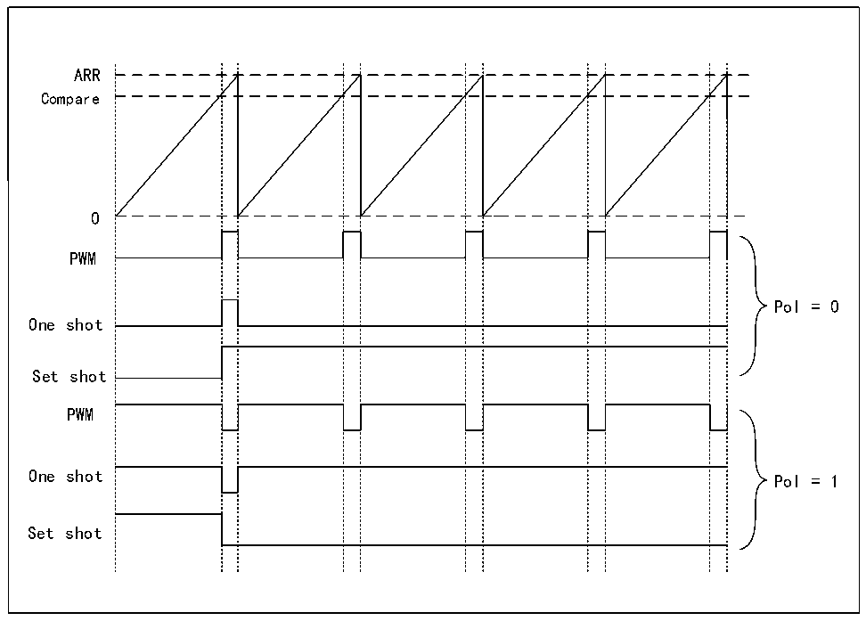

<!-- source-page: 263 -->

[← p.262](0262.md) · [index](../README.md) · [PDF p.263](https://ch32-riscv-ug.github.io/CH32H417/datasheet_zh/CH32H417RM.PDF#page=263) · [p.264 →](0264.md)

<!-- header: CH32H417系列应用手册 https://wch.cn -->

图17-6 生成波形  
 <!-- rendered from the PDF; verify at https://ch32-riscv-ug.github.io/CH32H417/datasheet_zh/CH32H417RM.PDF#page=263 -->

🖼 Text parsed from the figure above

ARR  
Compare  
0  
PWM  
Pol = 0  
One shot  
Set shot  
PWM  
One shot Pol = 1  
Set shot  

### 17.3.8 寄存器更新

LPTIMx_ARR 寄存器和 LPTIMx_CMP 寄存器在 HB 总线写入操作之后立即更新，或者如果计时器已  
经启动，则在当前周期结束时更新。  
PRELOAD位控制LPTIMx_ARR和LPTIMx_CMP寄存器的更新方式：  
当PRELOAD位设置为0时，LPTIMx_ARR和LPTIMx_CMP寄存器将在任何写入访问后立即更新。  
当PRELOAD位设置为1时，如果计时器已经启动，则在当前周期结束时更新LPTIMx_ARR和LPTIMx_CMP  
寄存器。  
LPTIM HB接口和LPTIM逻辑使用不同的时钟，因此在HB写入和这些值可用于计数器比较器之间  
存在一些延迟，在这个延迟期内，必须避免对这些寄存器进行任何额外的写入。  
LPTIMx_ISR 寄存器中的 ARROK 标志和 CMPOK 标志分别指示何时完成对 LPTIMx_ARR 寄存器和  
LPTIMx_CMP寄存器的写入操作。  
在对LPTIMx_ARR寄存器或LPTIMx_CMP寄存器进行写入之后，只有在前一次写入操作完成时，才  
能对同一寄存器执行新的写入操作。  
在设置ARROK标志或CMPOK标志之前的任何连续写入都将导致不可预测的结果。  

### 17.3.9 计数器模式

LPTIM 计数器可用于对 LPTIM_CH1 上的外部事件进行计数，也可用于对内部时钟周期进行计数。  
CKSEL和COUNTMODE位控制哪个源将用于更新计数器。  
如果 LPTIM 被配置为 LPTIM_CH1 上的外部事件进行计数，则可以根据写入 CKPOL[1:0]位的值在  
上升沿，下降沿或双边沿之后更新计数。  
根据CKSEL和COUNTMODE值，可以选择以下计数模式：  
（1） CKSEL=0：LPTIM时钟由内部时钟源计数  
<!-- image: p263-draw-image-00001 bbox=[504.72, 786.24, 525.24, 796.68] -->
<!-- footer: V1.7 259 -->
