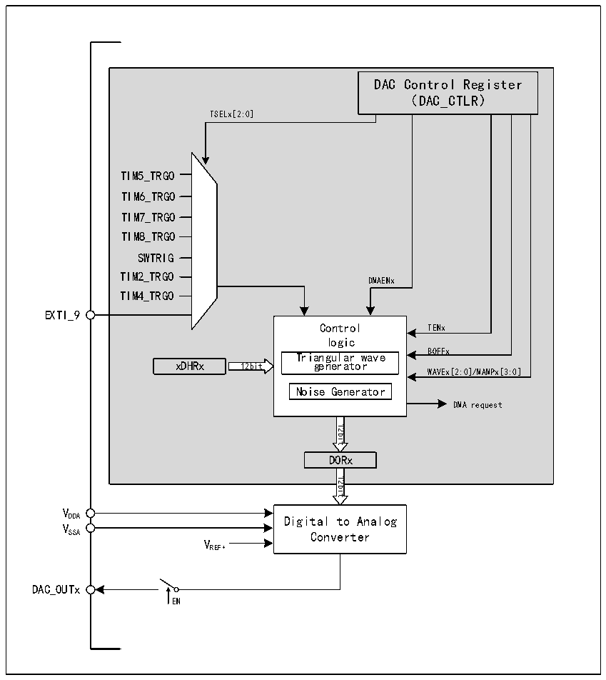

<!-- source-page: 274 -->

[← p.273](0273.md) · [index](../README.md) · [PDF p.274](https://ch32-riscv-ug.github.io/CH32H417/datasheet_zh/CH32H417RM.PDF#page=274) · [p.275 →](0275.md)

<!-- header: CH32H417系列应用手册 https://wch.cn -->

## 18.2 功能描述

### 18.2.1 DAC模块结构

图18-1 DAC模块框图  
 <!-- rendered from the PDF; verify at https://ch32-riscv-ug.github.io/CH32H417/datasheet_zh/CH32H417RM.PDF#page=274 -->

🖼 Text parsed from the figure above

DAC Control Register  
（DAC_CTLR）  
TSELx[2:0]  
TIM5_TRGO  
TIM6_TRGO  
TIM7_TRGO  
TIM8_TRGO  
SWTRIG  
TIM2_TRGO  
DMAENx  
TIM4_TRGO  
EXTI_9  
Control TENx  
logic  
BOFFx  
Triangular wave  
xDHRx 12bit generator  
WAVEx[2:0]/MAMPx[3:0]  
Noise Generator  
DMA request  
12bit  
DORx  
12bit  
VDDA  
Digital to Analog  
VSSA  
Converter  
VREF+  
DAC_OUTx  
EN  

### 18.2.2 DAC通道配置

#### 18.2.2.1 开启DAC功能：

将DAC_CTLR寄存器的ENx位置1，即可打开对DAC通道x的模拟供电。经过一段启动时间，DAC  
通道x即被使能。DAC包含2个模拟输出通道，可同时或分别独立输出。  
注：为了避免寄生的干扰和额外的功耗，DAC通道对应的引脚需提前设置成模拟输入（AIN）模式。  

#### 18.2.2.2 打开输出缓冲：

DAC集成了输出缓冲，可以用来减少输出阻抗，增加驱动能力直接驱动外部负载。每个DAC通道  
输出缓存可以通过设置DAC_CTLR寄存器的BOFFx位来使能或关闭。  

#### 18.2.2.3 数据格式：

单DAC通道模式下，包括8位数据右对齐、12位数据左对齐、12位数据右对齐。  
<!-- image: p274-draw-image-00001 bbox=[504.72, 786.24, 525.24, 796.68] -->
<!-- footer: V1.7 270 -->
