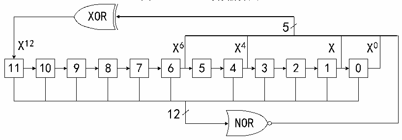

<!-- source-page: 277 -->

[← p.276](0276.md) · [index](../README.md) · [PDF p.277](https://ch32-riscv-ug.github.io/CH32H417/datasheet_zh/CH32H417RM.PDF#page=277) · [p.278 →](0278.md)

<!-- header: CH32H417系列应用手册 https://wch.cn -->
到的LSFR值与DAC_DHRx的数值相加，去掉溢出位之后即被写入DAC_DORx寄存器。如果寄存器LFSR  
值为0x000，则会注入1（防锁定机制）。将WAVEx[1:0]位置00b，可以复位LFSR波形的生成算法。  
注：为了产生噪声，必须使能DAC触发，即设DAC_CTLR寄存器的TENx位为1。  

图18-5 LFSR寄存器算法  
 <!-- rendered from the PDF; verify at https://ch32-riscv-ug.github.io/CH32H417/datasheet_zh/CH32H417RM.PDF#page=277 -->

🖼 Text parsed from the figure above

XOR  
5  
X12 X6 X4 X X0  
<!-- image: p277-draw-image-00010 inside the figure -->
<!-- image: p277-draw-image-00009 inside the figure -->
<!-- image: p277-draw-image-00002 inside the figure -->
<!-- image: p277-draw-image-00003 inside the figure -->
<!-- image: p277-draw-image-00004 inside the figure -->
<!-- image: p277-draw-image-00005 inside the figure -->
<!-- image: p277-draw-image-00006 inside the figure -->
<!-- image: p277-draw-image-00007 inside the figure -->
<!-- image: p277-draw-image-00008 inside the figure -->
<!-- image: p277-draw-image-00011 inside the figure -->
<!-- image: p277-draw-image-00012 inside the figure -->
<!-- image: p277-draw-image-00013 inside the figure -->
11 10 9 8 7 6 5 4 3 2 1 0  
12  
NOR  
<!-- image: p277-draw-image-00014 inside the figure -->

## 18.3 双 DAC 转换

当需要2个DAC同时转换的情况下，为了更加便捷和高效的操作DAC模块，模块集成3个双DAC  
模式下的数据寄存器DAC_RD8BDHR、DAC_LD12BDHR、DAC_RD12BDHR。只需操作其中之一寄存器即可更  
新2个DAC的转换值。  
针对双 DAC 的转换可配合模块的其他寄存器，可实现 11 种不同组合的转换模式，两个通道待转  
换值需写入上述3个双通道数据寄存器之一。  

### 18.3.1 不同触发下使用相同 LFSR

设置TENx置位，TSELx为不同值，WAVEx为0b01，MAMPx为相同的LFSR屏蔽值。当通道1触发  
事件发生时，将通道1数据寄存器DAC_DHR1值加上带相同屏蔽的LFSR1计数值，延迟3个HB时钟后  
送给DAC_DOR1，用于转换，并更新LFSR1；当通道2触发事件发生时，将通道2数据寄存器DAC_DHR2  
值加上带相同屏蔽的LFSR2计数值，延迟3个HB时钟后送给DAC_DOR2，用于转换，并更新LFSR2。  

### 18.3.2 不同触发下使用不同 LFSR

设置TENx置位，TSELx为不同值，WAVEx为0b01，MAMPx为不同的LFSR屏蔽值。当通道1触发  
事件发生时，将通道1数据寄存器DAC_DHR1值加上按MAMP1[3:0］所设屏蔽的LFSR1计数值，延迟3  
个HB时钟后送给DAC_DOR1，用于转换，并更新LFSR1；当通道2触发事件发生时，将通道2数据寄  
存器DAC_DHR2值加上按MAMP2[3:0］所设屏蔽的LFSR2计数值，延迟3个HB时钟后送给DAC_DOR2，  
用于转换，并更新LFSR2。  

### 18.3.3 不同触发下产生相同三角波

设置TENx置位，TSELx为不同值，WAVEx为0b1x，MAMPx设为相同三角波幅值。当通道1触发事  
件发生时，将通道 1 数据寄存器 DAC_DHR1 值加上 MAMPx 所设的相同幅值的三角波计数器值，延迟 3  
个HB时钟后送给DAC_DOR1，用于转换，并更新通道1三角波计数器；当通道2触发事件发生时，将  
通道2数据寄存器DAC_DHR2值加上MAMPx所设的相同幅值的三角波计数器值，延迟3个HB时钟后送  
给DAC_DOR2，用于转换，并更新通道2三角波计数器。  

### 18.3.4 不同触发下产生不同三角波

设置TENx置位，TSELx为不同值，WAVEx为0b1x，MAMPx设为不同的三角波幅值。当通道1触发  
事件发生时，将通道1数据寄存器DAC_DHR1值加上MAMP1所设幅值的三角波计数器值，延迟3个HB  
时钟后送给DAC_DOR1，用于转换，并更新通道1三角波计数器；当通道2触发事件发生时，将通道2  
数据寄存器DAC_DHR2值加上MAMP2所设幅值的三角波计数器值，延迟3个HB时钟后送给DAC_DOR2，  
<!-- image: p277-draw-image-00001 bbox=[504.72, 786.24, 525.24, 796.68] -->
<!-- footer: V1.7 273 -->
