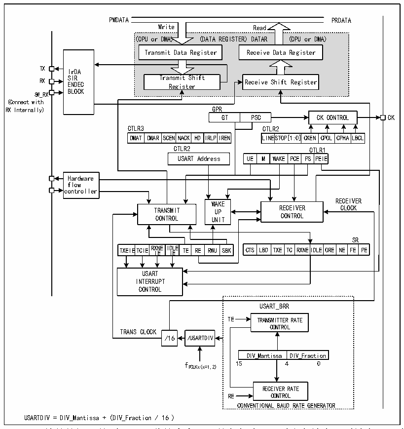

<!-- source-page: 286 -->

[← p.285](0285.md) · [index](../README.md) · [PDF p.286](https://ch32-riscv-ug.github.io/CH32H417/datasheet_zh/CH32H417RM.PDF#page=286) · [p.287 →](0287.md)

<!-- header: CH32H417系列应用手册 https://wch.cn -->

# 第 19 章 通用同步异步收发器（USART）

该模块包含8个通用同步异步收发器（USART1/2/3/4/5/6/7/8）。  

## 19.1 主要特征

● 全双工或半双工的同步或异步通信  
● NRZ数据格式  
● 分数波特率发生器，最高9Mbps  
● 可编程数据长度  
● 可配置的停止位  
● 支持LIN，IrDA编码器，智能卡  
● 支持DMA  
● 多种中断源  
● 支持低功耗模式下唤醒功能  

## 19.2 概述

图19-1 通用同步/异步收发器的结构框图  
 <!-- rendered from the PDF; verify at https://ch32-riscv-ug.github.io/CH32H417/datasheet_zh/CH32H417RM.PDF#page=286 -->

🖼 Text parsed from the figure above

PWDATA PRDATA  
<!-- image: p286-draw-image-00005 inside the figure -->
<!-- image: p286-draw-image-00004 inside the figure -->
Write Read  
(CPU or DMA) (DATA REGISTER) DATAR (CPU or DMA)  
Transmit Data Register  
Transmit Data Register Receive Data Register  
<!-- image: p286-draw-image-00006 inside the figure -->
<!-- image: p286-draw-image-00003 inside the figure -->
TX IrDA  
RX S E I N R DEC Tra R ns eg m i i s t t S er hift Receive Shift Register  
BLOCK  
SW_RX  
(Connect with  
RX Internally) GPR  
GT PSC CK CONTROL CK  
CTLR3 CTLR2  
DMAT  DMAR  SCENNAC  ACK HD  IRLPI  
LINESTO  TOP[1:0]  ]CKEN  CPOL  CPHA  LBCL  
DMAT DMAR SCENNACK HD IRLPIREN LINESTOP[1:0]CKEN CPOL CPHALBCL  
CTLR2 CTLR1  
WAK  KE PCE  PSCT  TPLERI1E  
Hardware  
flow  
<!-- image: p286-draw-image-00002 inside the figure -->
controller  
WWAAKKEE RECEIVER  
TRANSMIT UUPP RECEIVER CLOCK  
CONTROL UUNNIITT CONTROL  
TXEIE  TCIE  RXNEIIE  I I DL E E  TE RE  RWU  
SR  
CTS LBD  TXE  TC  RXNEID  DLE ORE  NE  FE  PE  
USART  
INTERRUPT  
CONTROL  
USART_BRR  
TE TRANSMITTER RATE  
CONTROL  
TRANS CLOCK  
/16 /USARTDIV  
DIV_Mantissa  DIV_Fraction  
f 15 4 0  
PCLKx(x=1,2)  
RECEIVER RATE  
RE CONTROL  
CONVENTIONAL BAUD RATE GENERATOR  
USARTDIV = DIV_Mantissa + (DIV_Fraction / 16 )  

# 当 TE（发送使能位）置位时，发送移位寄存器里的数据在 TX 引脚上输出，时钟在 CK 引脚上输

<!-- image: p286-draw-image-00001 bbox=[504.72, 786.24, 525.24, 796.68] -->
<!-- footer: V1.7 282 -->
