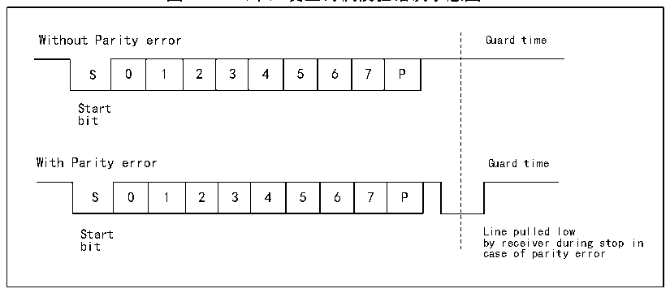

<!-- source-page: 289 -->

[← p.288](0288.md) · [index](../README.md) · [PDF p.289](https://ch32-riscv-ug.github.io/CH32H417/datasheet_zh/CH32H417RM.PDF#page=289) · [p.290 →](0290.md)

<!-- header: CH32H417系列应用手册 https://wch.cn -->
LIN 模式、半双工模式和红外模式，即保证 LINEN、HDSEL 和 IREN 位处于复位状态，但是可以开启  
CLKEN来输出时钟，这些位在控制寄存器2和3（R16_USARTx_CTLR2和R16_USARTx_CTLR3）中。  
为了支持智能卡模式，USART应当被置为8位数据位外加1位校验位，它的停止位建议配置成发  
送和接收都为 1.5 位，智能卡模式是一种单线半双工的协议，它使用 TX 线作为数据通讯，应当被配  
置为开漏输出加上拉。当接收方接收一帧数据检测到奇偶校验错误时，会在停止位时，发出一个NACK  
信号，即在停止位期间主动把TX拉低一个周期，发送方检测到NACK信号后，会产生帧错误，应用程  
序据此可以重发。图17-4展示了正确情况下和发生奇偶校验错误情况下的TX引脚上的波形图。USART  
的TC标志（发送完成标志）可以延迟GT（保护时间）个时钟产生，接收方也不会将自己置的NACK信  
号认成起始位。  

图19-4 （未）发生奇偶校验错误示意图  
 <!-- rendered from the PDF; verify at https://ch32-riscv-ug.github.io/CH32H417/datasheet_zh/CH32H417RM.PDF#page=289 -->

🖼 Text parsed from the figure above

Without Parity error Guard time  
0  1  2  3  4  5  6  7  P  
Start  
bit  
With Parity error Guard time  
0  1  2  3  4  5  6  7  P  
Start Line pulled low  
bit by receiver during stop in  
case of parity error  

在智能卡模式下，CK引脚使能后输出的波形和通讯无关，它仅仅是给智能卡提供时钟的，它的值  
是HB时钟再经过五位可设置的时钟分频（分频值为PSC的两倍，最高62分频）。  

## 19.7 IrDA

USART模块支持控制IrDA红外收发器进行物理层通信。使用IrDA必须清除LINEN、STOP、CLKEN、  
SCEN和HDSEL位。USART模块和SIR物理层（红外收发器）之间使用NRZ（不归零）编码，最高支持  
到115200bps速率。  
IrDA是一个半双工的协议，如果UASRT正在给SIR物理层发数据，那么IrDA解码器将会忽视新  
发来的红外信号，如果 USART 正在接受从 SIR 发来的数据，那么 SIR 不会接受来自 USART 的信号。  
USART 发给 SIR 和 SIR 发给 USART 的电平逻辑是不一样的，SIR 接收逻辑中，高电平为 1，低电平为  
0，但是在SIR发送逻辑中，高电平为0，低电平为1。  

## 19.8 DMA

USART模块支持DMA功能，可以利用DMA实现快速连续收发。当启用DMA时，TXE被置位时，DMA  
就会从设定的内存空间向发送缓冲区写数据。当使用DMA接收时，每次RXNE置位后，DMA就会将接收  
缓冲区里的数据转移到特定的内存空间。  

## 19.9 中断

USART模块支持多种中断源，包括发送数据寄存器空（TXE）、CTS、发送完成（TC）、接收数据  
就绪（RXNE）、数据溢出（ORE）、线路空闲（IDLE）、奇偶校验出错（PE）、断开标志（LBD）、噪  
声（NE）、多缓冲通信的溢出（ORE）和帧错误（FE）等等。  
<!-- image: p289-draw-image-00001 bbox=[504.72, 786.24, 525.24, 796.68] -->
<!-- footer: V1.7 285 -->
