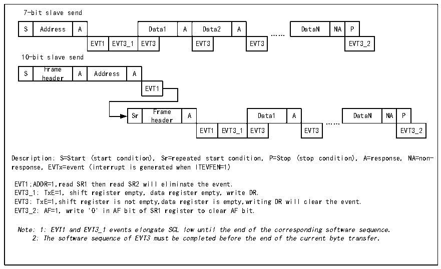
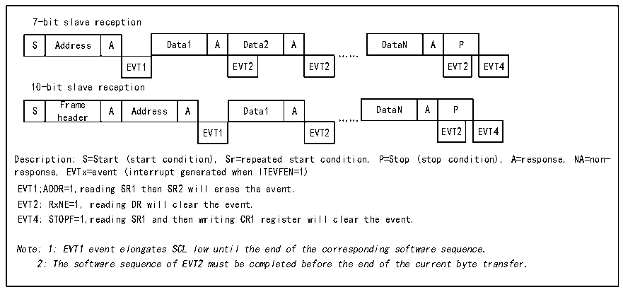

<!-- source-page: 313 -->

[← p.312](0312.md) · [index](../README.md) · [PDF p.313](https://ch32-riscv-ug.github.io/CH32H417/datasheet_zh/CH32H417RM.PDF#page=313) · [p.314 →](0314.md)

<!-- header: CH32H417系列应用手册 https://wch.cn -->

图21-6 从发送器的传送序列图  
 <!-- rendered from the PDF; verify at https://ch32-riscv-ug.github.io/CH32H417/datasheet_zh/CH32H417RM.PDF#page=313 -->

🖼 Text parsed from the figure above

7-bit slave send  
S  Address  A  Data1  A  Data2  A  EVT1  EVT3_1  EVT3  EVT3  EVT3  
DataN  NA  P  EVT3_2  
……  
10-bit slave send  
S  Frame header  A  Address  A  EVT1  
Sr  Frame header  A  Data1  A  EVT1  EVT3_1  EVT3  EVT3  
DataN  NA  P  EVT3_2  
……  
Description: S=Start (start condition), Sr=repeated start condition, P=Stop (stop condition), A=response, NA=non-  
response, EVTx=event (interrupt is generated when ITEVFEN=1)  
EVT1;ADDR=1,read SR1 then read SR2 will eliminate the event.  
EVT3_1: TxE=1, shift register empty, data register empty, write DR.  
EVT3: TxE=1,shift register is not empty,data register is empty,writing DR will clear the event.  
EVT3_2: AF=1, write &#x27;0&#x27; in AF bit of SR1 register to clear AF bit.  
Note: 1: EVT1 and EVT3_1 events elongate SCL low until the end of the corresponding software sequence.  
2: The software sequence of EVT3 must be completed before the end of the current byte transfer.  

从接收模式：  
在 ADDR 被清除后，I2C 模块将 SDA 上的数据通过移位寄存器存进数据寄存器，在每接收到一个  
字节后，I2C模块都会置一个ACK位，并置RxNE位。如果设置了ITEVTEN和ITBUFEN，还会产生一个  
中断。如果 RxNE 被置位，且在接收到新的数据前旧的数据没有被读出，那么 BTF 会被置位。在清除  
BTF 位之前 SCL 会保持低电平。读取状态寄存器 1（R16_I2Cx_STAR1）并读取数据寄存器里的数据会  
清除BTF位。  

图21-7 从接收器的传送序列图  
 <!-- rendered from the PDF; verify at https://ch32-riscv-ug.github.io/CH32H417/datasheet_zh/CH32H417RM.PDF#page=313 -->

🖼 Text parsed from the figure above

7-bit slave reception  
S  Address  A  Data1  A  Data2  A  EVT1  EVT2  EVT2  
DataN  A  P  EVT2  EVT4  
……  
10-bit slave reception  
S  Frame header  A  Address  A  Data1  A  EVT1  EVT2  
DataN  A  P  EVT2  EVT4  
EVT1 EVT2 EVT2 EVT4  
Description: S=Start (start condition), Sr=repeated start condition, P=Stop (stop condition), A=response, NA=non-  
response, EVTx=event (interrupt generated when ITEVFEN=1)  
EVT1;ADDR=1,reading SR1 then SR2 will erase the event.  
EVT2: RxNE=1, reading DR will clear the event.  
EVT4: STOPF=1,reading SR1 and then writing CR1 register will clear the event.  
Note: 1: EVT1 event elongates SCL low until the end of the corresponding software sequence.  
2: The software sequence of EVT2 must be completed before the end of the current byte transfer.  

主设备在传输完最后一个数据字节后，将产生一个停止条件，当I2C模块检测到停止事件时，将  
置STOPF位，如果设置了ITEVFEN位，还会产生一个中断。用户需要读取状态寄存器（R16_I2Cx_STAR1）  
再写控制寄存器（比如复位控制字SWRST）来清除。（见上图中的EVT4）。  
<!-- image: p313-draw-image-00001 bbox=[504.72, 786.24, 525.24, 796.68] -->
<!-- footer: V1.7 309 -->
