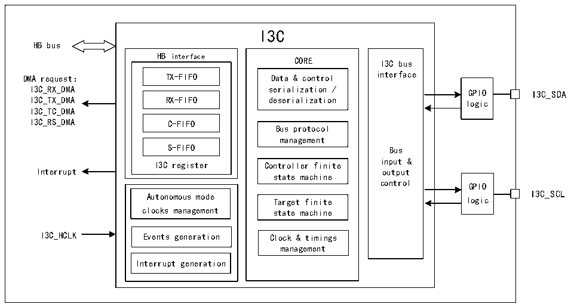

<!-- source-page: 325 -->

[← p.324](0324.md) · [index](../README.md) · [PDF p.325](https://ch32-riscv-ug.github.io/CH32H417/datasheet_zh/CH32H417RM.PDF#page=325) · [p.326 →](0326.md)

<!-- header: CH32H417系列应用手册 https://wch.cn -->

# 第 22 章 I3C 总线（I3C）

I3C 总线是一种双线制串行单端多分支总线，旨在对传统的 I2C 总线进行改进。I3C 接口负责处  
理本设备与连接在I3C总线上的其他设备之间的通信。它本身支持作为主设备和从设备，当作为主设  
备时，能够增强I2C接口的功能，同时保持一定程度的向后兼容性。  

## 22.1 主要特征

● 支持主设备和从设备  
● 支持MIPI I3C规范v1.1  
● 支持多主机功能  
● 支持DMA  
● 带内中断（IBI）功能  
● 内置错误检测和恢复  
● I3C SCL总线时钟最高可达12.5MHz  
● 支持动态分配地址，直接和广播通用命令代码（CCC）和私有读写传输  

## 22.2 概述

图22-1 I3C的结构框图  
 <!-- rendered from the PDF; verify at https://ch32-riscv-ug.github.io/CH32H417/datasheet_zh/CH32H417RM.PDF#page=325 -->

🖼 Text parsed from the figure above

I3C  
HB bus  
HB interface CORE I3C bus  
DMA request： TX-FIFO Data &amp; control interface  
I3C_RX_DMA serialization / GPIO I3C_SDA  
I3C_TX_DMA RX-FIFO deserialization logic  
I3C_TC_DMA  
I3C_RS_DMA C-FIFO  
Bus protocol  
management  
S-FIFO Bus  
input &amp;  
I3C register Controller finite  
Interrupt output  
state machine  
control GPIO  
Autonomous mode Target finite logic I3C_SCL  
clocks management state machine  
I3C_HCLK Events generation Clock &amp; timings  
management  
Interrupt generation  

## 22.3 功能描述

### 22.3.1 I3C外设状态

I3C外设既可以用作I3C主设备，也可以用作I3C从设备。在任何情况下，外设都处于以下状态  
之一：  
● 禁止状态  
操作条件：I3C外设复位（RCC模块中的I3CRST位置1进行I3C复位）后，外设处于禁止状态。  
禁止状态至空闲状态的转换：当软件将R32_I3C_CFGR寄存器EN位置1时，外设在完成内部配置参数  
的校验后，由禁止状态切换至空闲状态。  
<!-- image: p325-draw-image-00001 bbox=[504.72, 786.24, 525.24, 796.68] -->
<!-- footer: V1.7 321 -->
