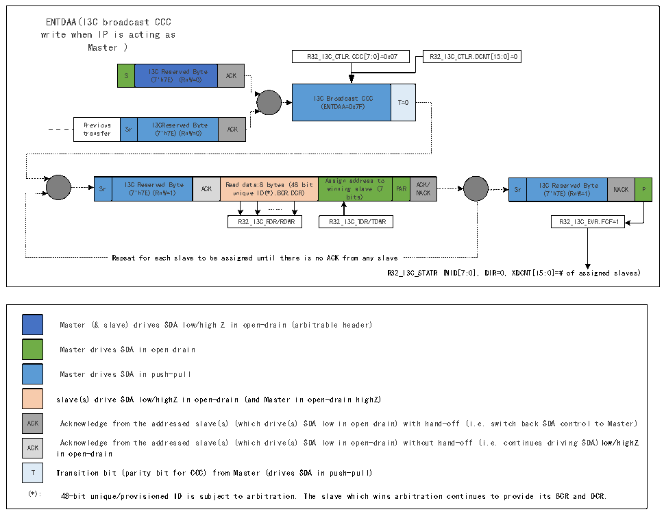

<!-- source-page: 334 -->

[← p.333](0333.md) · [index](../README.md) · [PDF p.334](https://ch32-riscv-ug.github.io/CH32H417/datasheet_zh/CH32H417RM.PDF#page=334) · [p.335 →](0335.md)

<!-- header: CH32H417系列应用手册 https://wch.cn -->

#### 22.3.4.3 I3C广播ENTDAA CCC传输（作为主设备）

图22-3 I3C广播ENTDAA CCC传输（作为主设备）  
 <!-- rendered from the PDF; verify at https://ch32-riscv-ug.github.io/CH32H417/datasheet_zh/CH32H417RM.PDF#page=334 -->

🖼 Text parsed from the figure above

ENTDAA(I3C broadcast CCC  
write when IP is acting as  
Master )  
R32_I3C_CTLR.CCC[7:0]=0x07 R32_I3C_CTLR.DCNT[15:0]=0  
S  I3C Reserved Byte (7&#x27;h7E) (RnW=0)  ACK  
I3C Broadcast CCC (ENTDAA=0x7F)  T=0  
Previous transfer  Sr  I3CReserved Byte (7&#x27;h7E)(RnW=0)  ACK  
Sr  I3C Reserved Byte (7&#x27;h7E)(RnW=1)  ACK  Read data:8 bytes (48 bit unique ID(*),BCR,DCR)  Assign address to winning slave (7 bits)  PAR  ACK/ NACK  
Sr  I3C Reserved Byte (7&#x27;h7E)(RnW=1)  NACK  P  
……  
R32_I3C_RDR/RDWR R32_I3C_TDR/TDWR R32_I3C_EVR.FCF=1  
Repeat for each slave to be assigned until there is no ACK from any slave  
R32_I3C_STATR (MID[7:0], DIR=0, XDCNT[15:0]=# of assigned slaves)  
Master (&amp; slave) drives SDA low/high Z in open-drain (arbitrable header)  
Master drives SDA in open drain  
Master drives SDA in push-pull  
slave(s) drive SDA low/highZ in open-drain (and Master in open-drain highZ)  
ACK Acknowledge from the addressed slave(s) (which drive(s) SDA low in open drain) with hand-off (i.e. switch back SDA control to Master)  
Acknowledge from the addressed slave(s) (which drive(s) SDA low in open-drain) without hand-off (i.e. continues driving SDA)low/highZ  
ACK  
in open-drain  
T Transition bit (parity bit for CCC) from Master (drives SDA in push-pull)  
(*): 48-bit unique/provisioned ID is subject to arbitration. The slave which wins arbitration continues to provide its BCR and DCR.  

#### 22.3.4.4 I3C广播/直接RSTACT CCC传输（作为主设备）

<!-- image: p334-draw-image-00001 bbox=[504.72, 786.24, 525.24, 796.68] -->
<!-- footer: V1.7 330 -->
