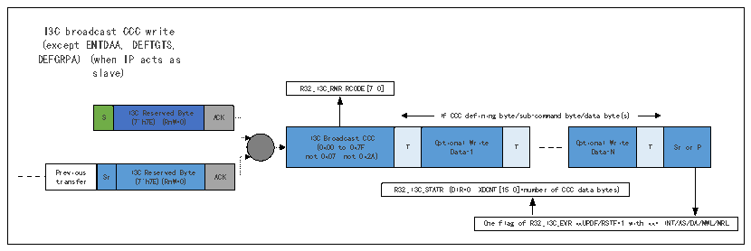

<!-- source-page: 337 -->

[← p.336](0336.md) · [index](../README.md) · [PDF p.337](https://ch32-riscv-ug.github.io/CH32H417/datasheet_zh/CH32H417RM.PDF#page=337) · [p.338 →](0338.md)

<!-- header: CH32H417系列应用手册 https://wch.cn -->

图22-5 I3C CCC消息（作为从设备）  
 <!-- rendered from the PDF; verify at https://ch32-riscv-ug.github.io/CH32H417/datasheet_zh/CH32H417RM.PDF#page=337 -->

🖼 Text parsed from the figure above

I3C broadcast CCC write  
(except ENTDAA, DEFTGTS,  
DEFGRPA) (when IP acts as  
slave)  
R32_I3C_RMR.RCODE[7:0]  
S  I3C Reserved Byte (7&#x27;h7E) (RnW=0)  ACK  
S I ( 3 7 C &#x27; h R 7 e E s ) e r ( v R e n d W = B 0 y ) te ACK If CCC defining byte/sub-command byte/data byte(s)  
I3C Broadcast CCC (0x00 to 0x7F, not 0x07, not 0x2A)  T  Optional Write Data-1  T  
Optional Write Data-N  T  Sr or P  
Previous transfer  Sr  I3C Reserved Byte (7&#x27;h7E)(RnW=0)  ACK  
R32_I3C_STATR (DIR=0, XDCNT[15:0]=number of CCC data bytes)  
One flag of R32_I3C_EVR.xxUPDF/RSTF=1 with xx= INT/AS/DA/MWL/MRL  

<!-- p337-table-005 (table-22-1@1) -->
<table><tr><th style="text-align:left">I3C direct CCC write (when IP acts as slave) R32_I3C_RMR.RCODE[7:0] S I ( 3 7 C &#x27; h R 7 e E s ) e r ( v R e n d W = B 0 y ) te ACK If CCC defining byte/sub-command byte/data byte(s) I ( 3 0 C x n 8 o D 0 i t r t 0 e o c x 9 t 0 A x C ) F C E C , T Optio Da na t l a- W 1 rite T Optio Da na t l a- W N rite T Sr P t r r e a v n i s o f u e s r Sr I ( 3 7 C &#x27; h Re 7E se ) r (R v n ed W= B 0 y ) te ACK If I3C slave address = R32_I3C_DEVR0.DA[6:0] and R32_I3C_DEVR0.DAVAL=1 I3C sl (R a n ve W= 0 Ad ) dress ACK Write Data-1 T Write Data-1 T Sr(*) or P Specific associated action to the CCC, if any R32_I3C O _ n EV e R f .x l x ag UP D of F/ RSTF=1 If Sr with xx= INT/AS/DA/MWL/MRL R32_I3C_STATR (DIR=0, XDCNT[15:0])</th></tr><tr><td style="text-align:left">I3C direct CCC read (when IP acts as slave) R32_I3C_RMR.RCODE[7:0] S I ( 3 7 C &#x27; h R 7 e E s ) e r ( v R e n d W = B 0 y ) te ACK If CCC defining byte/sub-command byte/data byte(s) I ( 3 0 C x n D 8 o 0 i t r e t 0 o c x t 9 0 A x C ) F CC E, T Optio Da na t l a- W 1 rite T Optio Da na t l a- W N rite T Sr P t r r e a v n i s o f u e s r Sr I ( 3 7 C &#x27; h Re 7E se ) r (R v n ed W= B 0 y ) te ACK If R32_I3C_TGTTDR.PRELOAD=1 If I3C slave address = R32_I3C_DEVR0.DA[6:0] and R32_I3C_CTLR.DCNT[15:0]=NR32_I3C_DEVR0.DAVAL=1 I3C s ( l R a n v W e = 1 A ) ddress ACK Read Data-1 T Opti D o a n t a a l - N Read T Sr(*) or P If Sr Retur de ne p d en d d a in ta g u ar p e on p r th ov e i d de i d re f c r t om C CC a r re eg a i d ster R32_I3C_STATR (DIR=1, XDCNT[15:0]) w R i 3 t 2 h _ I x 3 x C = O _ n E I V e N R T f . / x l A x a S g U / P D D o A f F / / M R W S L T / F M = R 1 L</td></tr></table>

<!-- p337-table-006 (table-22-1@1) -->
<table><tr><th>S</th><th style="text-align:left">I3C Reserved Byte (7&#x27;h7E) (RnW=0)</th><th>ACK</th></tr></table>

<!-- p337-table-007 (table-22-1@1) -->
<table><tr><th style="text-align:left">I3C Direct CCC (0x80 to 0xFE, not 0x9A)</th><th>T</th><th style="text-align:left">Optional Write Data-1</th><th>T</th></tr></table>

<!-- p337-table-008 (table-22-1@1) -->
<table><tr><th style="text-align:left">Optional Write Data-N</th><th>T</th><th>Sr</th></tr></table>

<!-- p337-table-009 (table-22-1@1) -->
<table><tr><th style="text-align:left">Previous transfer</th><th>Sr</th><th style="text-align:left">I3C Reserved Byte (7&#x27;h7E)(RnW=0)</th><th>ACK</th></tr></table>

<!-- p337-table-010 (table-22-1@1) -->
<table><tr><th style="text-align:left">I3C slave Address (RnW=0)</th><th>ACK</th><th>Write Data-1</th><th>T</th></tr></table>

<!-- p337-table-011 (table-22-1@1) -->
<table><tr><th>Write Data-1</th><th>T</th><th>Sr(*) or P</th></tr></table>

<!-- p337-table-012 (table-22-1@1) -->
<table><tr><th>S</th><th style="text-align:left">I3C Reserved Byte (7&#x27;h7E) (RnW=0)</th><th>ACK</th></tr></table>

<!-- p337-table-013 (table-22-1@1) -->
<table><tr><th style="text-align:left">I3CDirect CCC (0x80 to 0xFE, not 0x9A)</th><th>T</th><th style="text-align:left">Optional Write Data-1</th><th>T</th></tr></table>

<!-- p337-table-014 (table-22-1@1) -->
<table><tr><th style="text-align:left">Optional Write Data-N</th><th>T</th><th>Sr</th></tr></table>

<!-- p337-table-015 (table-22-1@1) -->
<table><tr><th style="text-align:left">Previous transfer</th><th>Sr</th><th style="text-align:left">I3C Reserved Byte (7&#x27;h7E)(RnW=0)</th><th>ACK</th></tr></table>

<!-- p337-table-016 (table-22-1@1) -->
<table><tr><th style="text-align:left">I3C slave Address (RnW=1)</th><th>ACK</th><th>Read Data-1</th><th>T</th></tr></table>

<!-- p337-table-017 (table-22-1@1) -->
<table><tr><th style="text-align:left">Optional Read Data-N</th><th>T</th><th>Sr(*) or P</th></tr></table>

<!-- p337-table-018 (table-22-1@1) -->
<table><tr><th></th></tr><tr><td></td></tr><tr><td></td></tr><tr><td></td></tr><tr><td>ACK</td></tr><tr><td>ACK</td></tr><tr><td>T</td></tr><tr><td>T</td></tr></table>

Master (&amp; slave) drive(s) SDA low/high Z in open-drain (arbitrable header)  
Master drives SDA in open drain  
Master drives SDA in push-pull  
slave drives SDA in push-pull  
ACK Acknowledge from the addressed slave(s) (which drive(s) SDA low in open drain) with hand-off (ie switch back SDA control to Master)  
ACK Acknowledge from the addressed slave(s) (which drive(s) SDA low in open-drain) without hand-off (ie continues driving SDA)  
T Transition bit (parity bit for write data) from Master (drives SDA in push-pull)  
T Transition bit (end of data for read data) from Master and/ or from slave (drive SDA low/highZ in open-drain)  
Sr(* ): Sr is followed by 7&#x27;h7E+W broadcast address at the end of a direct CCC message  
<!-- image: p337-draw-image-00001 bbox=[504.72, 786.24, 525.24, 796.68] -->
<!-- footer: V1.7 333 -->
