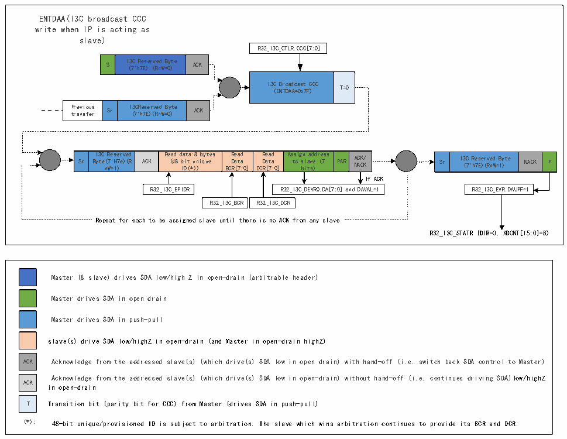

<!-- source-page: 338 -->

[← p.337](0337.md) · [index](../README.md) · [PDF p.338](https://ch32-riscv-ug.github.io/CH32H417/datasheet_zh/CH32H417RM.PDF#page=338) · [p.339 →](0339.md)

<!-- header: CH32H417系列应用手册 https://wch.cn -->

#### 22.3.4.6 I3C广播ENTDAA CCC传输（作为从设备）

图22-6 I3C广播ENTDAA CCC传输（作为从设备）  
 <!-- rendered from the PDF; verify at https://ch32-riscv-ug.github.io/CH32H417/datasheet_zh/CH32H417RM.PDF#page=338 -->

🖼 Text parsed from the figure above

ENTDAA(I3C broadcast CCC  
write when IP is acting as  
slave)  
R32_I3C_CTLR.CCC[7:0]  
S  I3C Reserved Byte (7&#x27;h7E) (RnW=0)  ACK  
I3C Broadcast CCC (ENTDAA=0x7F)  T=0  
Previous transfer  Sr  I3CReserved Byte (7&#x27;h7E)(RnW=0)  ACK  
Sr  I3C Reserved Byte(7&#x27;H7e)(R nW=1)  ACK  Read data:8 bytes (48 bit unique ID(*))  Read Data BCR[7:0]  Read Data DCR[7:0]  Assign address to slave (7 bits)  PAR  ACK/ NACK  
Sr  I3C Reserved Byte (7&#x27;h7E)(RnW=1)  NACK  P  
If ACK  
R32_I3C_EPIDR R32_I3C_DEVR0.DA[7:0] and DAVAL=1 R32_I3C_EVR.DAUPF=1  
R32_I3C_BCR  R32_I3C_DCR  
Repeat for each to be assigned slave until there is no ACK from any slave  
R32_I3C_STATR (DIR=0, XDCNT[15:0]=8)  
Master (&amp; slave) drives SDA low/high Z in open-drain (arbitrable header)  
Master drives SDA in open drain  
Master drives SDA in push-pull  
slave(s) drive SDA low/highZ in open-drain (and Master in open-drain highZ)  
ACK Acknowledge from the addressed slave(s) (which drive(s) SDA low in open drain) with hand-off (i.e. switch back SDA control to Master)  
Acknowledge from the addressed slave(s) (which drive(s) SDA low in open-drain) without hand-off (i.e. continues driving SDA)low/highZ  
ACK  
in open-drain  
T Transition bit (parity bit for CCC) from Master (drives SDA in push-pull)  
(*): 48-bit unique/provisioned ID is subject to arbitration. The slave which wins arbitration continues to provide its BCR and DCR.  

#### 22.3.4.7 I3C广播DEFTGTS CCC传输（作为从设备）

<!-- image: p338-draw-image-00001 bbox=[504.72, 786.24, 525.24, 796.68] -->
<!-- footer: V1.7 334 -->
