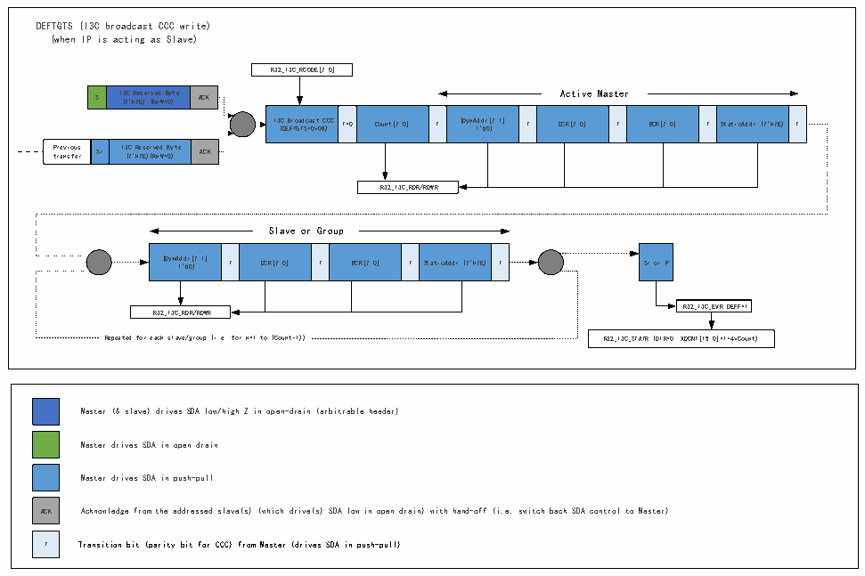
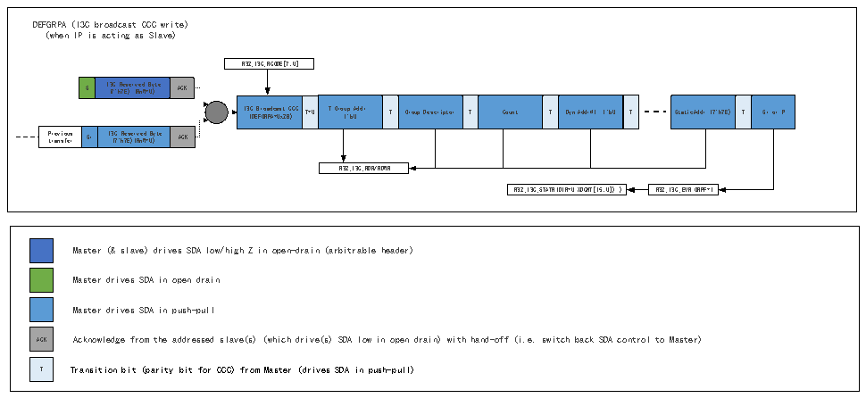

<!-- source-page: 339 -->

[← p.338](0338.md) · [index](../README.md) · [PDF p.339](https://ch32-riscv-ug.github.io/CH32H417/datasheet_zh/CH32H417RM.PDF#page=339) · [p.340 →](0340.md)

<!-- header: CH32H417系列应用手册 https://wch.cn -->

图22-7 I3C广播DEFTGTS CCC传输（作为从设备）  
 <!-- rendered from the PDF; verify at https://ch32-riscv-ug.github.io/CH32H417/datasheet_zh/CH32H417RM.PDF#page=339 -->

🖼 Text parsed from the figure above

DEFTGTS (I3C broadcast CCC write)  
(when IP is acting as Slave)  
R32_I3C_RCODE[7:0]  
S  I3C Reserved Byte (7&#x27;h7E) (RnW=0)  
S I ( 3 7 C &#x27; h R 7 e E s ) e r ( v R e n d W = B 0 y ) te ACK Active Master  
I3C Broadcast CCC (DEFTGTS=0x08)  T=0  Count[7:0]  T  {DynAddr[7:1] ,1&#x27;b0}  T  DCR[7:0]  T  BCR[7:0]  T  StaticAddr (7&#x27;h7E)  T  
Previous transfer  Sr  I3C Reserved Byte (7&#x27;h7E)(RnW=0)  
R32_I3C_RDR/RDWR  
Slave or Group  
{DynAddr[7:1] ,1&#x27;b0}  T DCR[7:0]  T  BCR[7:0]  T  StaticAddr (7&#x27;h7E)  T  
R32_I3C_EVR.DEFF=1  
R32_I3C_RDR/RDWR  
Repeated for each slave/group (i.e. for n=1 to (Count-1)) R32_I3C_STATR (DIR=0, XDCNT[15:0]=1+4xCount)  
Master (&amp; slave) drives SDA low/high Z in open-drain (arbitrable header)  
Master drives SDA in open drain  
Master drives SDA in push-pull  
ACK Acknowledge from the addressed slave(s) (which drive(s) SDA low in open drain) with hand-off (i.e. switch back SDA control to Master)  
T Transition bit (parity bit for CCC) from Master (drives SDA in push-pull)  

#### 22.3.4.8 I3C广播DEFGRPA CCC传输（作为从设备）

图22-8 I3C广播DEFGRPA CCC传输（作为从设备）  
 <!-- rendered from the PDF; verify at https://ch32-riscv-ug.github.io/CH32H417/datasheet_zh/CH32H417RM.PDF#page=339 -->

🖼 Text parsed from the figure above

DEFGRPA (I3C broadcast CCC write)  
(when IP is acting as Slave)  
R32_I3C_RCODE[7:0]  
I3C Reserved Byte (7&#x27;h7E) (RnW=0)  ACK  
T=0  T Group Addr , 1&#x27;b0  T  Group Descriptor  T  Count  T  Dyn Addr#1, 1&#x27;b0 T  
StaticAddr (7&#x27;h7E)  T  Sr or P  
P t r r e a v n i s o f u e s r Sr  r I3 ( C 7 &#x27; R h e 7E se ) r ( v Rn ed W= B 0 y ) te  ACK  
R32_I3C_RDR/RDWR  
R32_I3C_STATR(DIR=0,XDCNT[15:0]) ) R32_I3C_EVR.GRPF=1  
Master (&amp; slave) drives SDA low/high Z in open-drain (arbitrable header)  
Master drives SDA in open drain  
ACK  
Master drives SDA in push-pull  
ACK Acknowledge from the addressed slave(s) (which drive(s) SDA low in open drain) with hand-off (i.e. switch back SDA control to Master)  
T Transition bit (parity bit for CCC) from Master (drives SDA in push-pull)  

#### 22.3.4.9 I3C直接GETSTATUS CCC传输（作为从设备）

当I3C作为从设备时，硬件会在接收到GETSTATUS CCC时，按照格式1（无释义字节或释义字节TGTSTAT  
= 0x00）或格式2（释义字节PRECR = 0x91）返回两个数据字节。  
I3C总线上，以格式1返回的2字节STATUS[15:0]如下：  
STATUS[15:14] = 00（未使用）；  
STATUS[13] = 1（如果自接收到前一个 GETSTATUS CCC 后检测到丢失的起始位）或 0（其他情  
况）；  
<!-- image: p339-draw-image-00001 bbox=[504.72, 786.24, 525.24, 796.68] -->
<!-- footer: V1.7 335 -->
