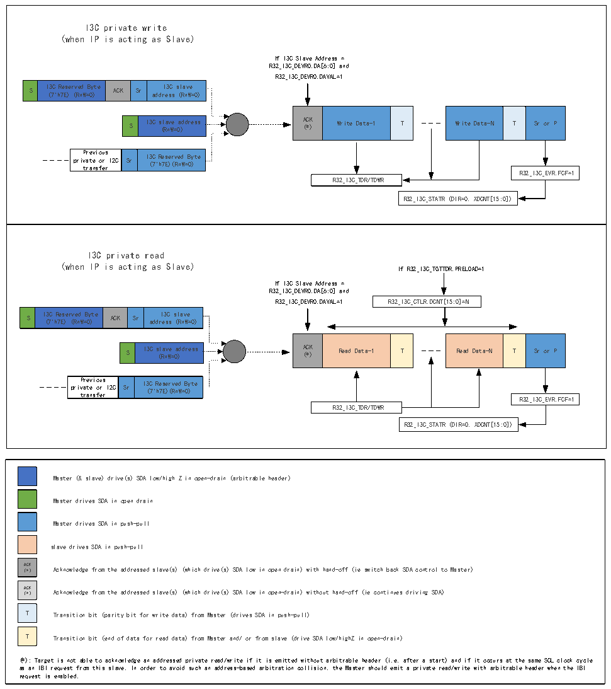

<!-- source-page: 342 -->

[← p.341](0341.md) · [index](../README.md) · [PDF p.342](https://ch32-riscv-ug.github.io/CH32H417/datasheet_zh/CH32H417RM.PDF#page=342) · [p.343 →](0343.md)

<!-- header: CH32H417系列应用手册 https://wch.cn -->

#### 22.3.4.11 I3C私有读/写传输（作为从设备）

图22-10 I3C私有读/写传输（作为从设备）  
 <!-- rendered from the PDF; verify at https://ch32-riscv-ug.github.io/CH32H417/datasheet_zh/CH32H417RM.PDF#page=342 -->

🖼 Text parsed from the figure above

I3C private write (when IP is acting as Slave) If I3C Slave Address = R32_I3C_DEVR0.DA[6:0] and R32_I3C_DEVR0.DAVAL=1 S I ( 3 7 C &#x27; h R 7 e E s ) e r ( v R e n d W = B 0 y ) te ACK Sr add r I e 3 s C s s ( l R a n v W e = 0) S I3C s ( l R a n v W e = 0 a ) ddress A ( C * K ) Write Data-1 T Write Data-N T Sr or P pri P t v r r a e a t v n e i s o f o u e r s r I2C Sr I3 ( C 7 &#x27; R h e 7E s ) e ( r R v n ed W= 0 By ) te R32_I3C_EVR.FCF=1R32_I3C_TDR/TDWR R32_I3C_STATR (DIR=0, XDCNT[15:0])  I3C private read (when IP is acting as Slave) If R32_I3C_TGTTDR.PRELOAD=1 If I3C Slave Address = R32_I3C_DEVR0.DA[6:0] and R32_I3C_DEVR0.DAVAL=1 R32_I3C_CTLR.DCNT[15:0]=N S I ( 3 7 C &#x27; h R 7 e E s ) e r ( v R e n d W = B 0 y ) te ACK Sr add r I e 3 s C s s ( l R a n v W e = 0) S I3C s ( l R a n v W e = 0 a ) ddress A ( C * K ) Read Data-1 T Read Data-N T Sr or P pri P t v r r a e a t v n e i s o f o u e r s r I2C Sr I3 ( C 7 &#x27; R h e 7E s ) e ( r R v n ed W= 0 By ) te R32_I3C_EVR.FCF=1R32_I3C_TDR/TDWR R32_I3C_STATR (DIR=0, XDCNT[15:0])  
I3C Reserved Byte (7&#x27;h7E) (RnW=0)  ACK  Sr  I3C slave address (RnW=0)  
ACK (*)  Write Data-1  T  
Write Data-N  T  Sr or P  
S  I3C slave address (RnW=0)  
Previous private or I2C transfer  Sr  I3C Reserved Byte (7&#x27;h7E)(RnW=0)  
S  I3C Reserved Byte (7&#x27;h7E) (RnW=0)  ACK  Sr  I3C slave address (RnW=0)  
ACK (*)  Read Data-1  T  
Read Data-N  T  Sr or P  
S  I3C slave address (RnW=0)  
Previous private or I2C transfer  Sr  I3C Reserved Byte (7&#x27;h7E)(RnW=0)  
Master (&amp; slave) drive(s) SDA low/high Z in open-drain (arbitrable header)  
Master drives SDA in open drain  
Master drives SDA in push-pull  
slave drives SDA in push-pull  
（ AC * K ） Acknowledge from the addressed slave(s) (which drive(s) SDA low in open drain) with hand-off (ie switch back SDA control to Master)  
（ AC * K ） Acknowledge from the addressed slave(s) (which drive(s) SDA low in open-drain) without hand-off (ie continues driving SDA)  
T Transition bit (parity bit for write data) from Master (drives SDA in push-pull)  
T Transition bit (end of data for read data) from Master and/ or from slave (drive SDA low/highZ in open-drain)  
(*): Target is not able to acknowledge an addressed private read/write if it is emitted without arbitrable header (i.e. after a start) and if it occurs at the same SCL clock cycle  
as an IBI request from this slave. In order to avoid such an address-based arbitration collision, the Master should emit a private read/write with arbitrable header when the IBI  
request is enabled.  

<!-- image: p342-draw-image-00001 bbox=[504.72, 786.24, 525.24, 796.68] -->
<!-- footer: V1.7 338 -->
