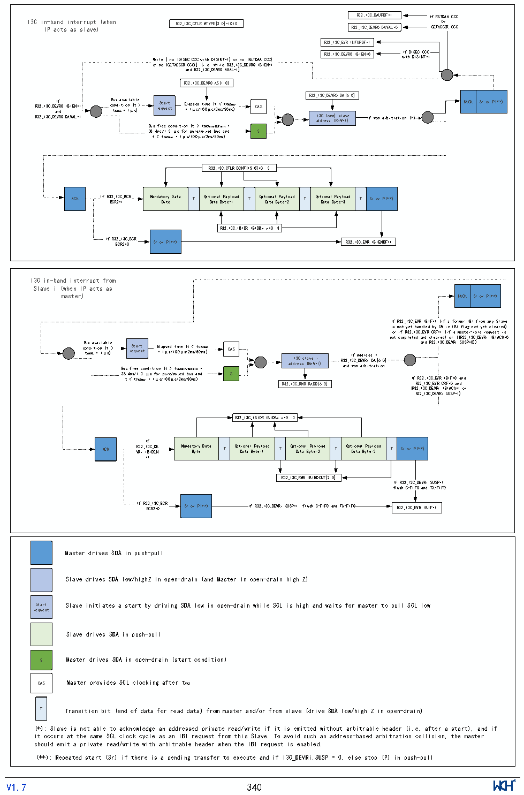

<!-- source-page: 344 -->

[← p.343](0343.md) · [index](../README.md) · [PDF p.344](https://ch32-riscv-ug.github.io/CH32H417/datasheet_zh/CH32H417RM.PDF#page=344) · [p.345 →](0345.md)

<!-- header: CH32H417系列应用手册 https://wch.cn -->

#### 22.3.4.13 I3C IBI传输（作为主设备/从设备）

图22-12 I3C IBI传输（作为主设备/从设备）  
 <!-- rendered from the PDF; verify at https://ch32-riscv-ug.github.io/CH32H417/datasheet_zh/CH32H417RM.PDF#page=344 -->

🖼 Text parsed from the figure above

R32_I3C_DAUPDF=1 If RSTDAA CCC  
I3C in I - P b a a n c d t s i n a t s e r s r l u a p v t e ) ( when R32_I3C_CTLR.MTYPE[3:0]=1010 R32_I3C_DEVR0.DAVAL=0 GETAC O C r CR CCC  
R32_I3C_EVR.INTUPDF=1  
While [ no (DISEC CCC with DISINT=1) or no (RSTDAA CCC) R32_I3C_DEVR0.IBIEN=0 w I i f t h D I D S I E S C I N C T C = C 1  
or no (GETACCCR CCC)] [i.e. while R32_I3C_DEVR0.IBIEN=1  
and R32_I3C_DEVRO.AVAL=1]  
R32_I3C_DEVR0.AS[1:0]  
R32_I3C_DEVR0.DA[6:0]  
R32_I3C_DE a I n V f R d 0 .IBIEN=1 c B o t u n A s V d A i L a t v = i a o i 1 n l μ a ( b s t l ) e &gt; re St qu a e rt st E = l a 1 p μ se s d / 1 t 0 i 0 m μ e s ( / t 2 m &lt; s / t 5 C 0 A m S s ma ) x CAS NACK Sr or P(**)  
R32_I3C_DEVR0.DAVAL=1 a I d 3 d C r e ( s o s w n ( ) R n s W l = a 1 v ) e If won arbitration (*)  
Bus free condition (t &gt; tCASmin/BUFmin =  
38.4ns/1.3 μs for pure/mixed bus and S  
t &lt; tCASmax = 1μs/100μs/2ms/50ms)  
R32_I3C_CTLR.DCNT[15:0]=0..3  
Mandatory Data Byte  T  Opt D i a o t n a a l B y P t a e y - l 1 o a d T  T Opt D i a o t n a a l B y P t a e y - l 2 o ad T  T Opt D i a o t n a a l B y P t a e y - l 3 o ad  T  Sr or P(**)  
R32_I3C_IBIDR.IBIDBx x=0..3  
If R3 B 2 C _ R I 2 3 = C 0 _ BCR. Sr or P(**) R32_I3C_EVR.IBIENDF=1  
I3C in-band interrupt from  
NACK  Sr or P(**)  
Slave i (when IP acts as  
master) NACK Sr or P(**)  
If R32_I3C_EVR.IBIF=1 (if a former IBI from any Slave  
is not yet handled by SW ie IBI flag not yet cleared)  
or if R32_I3C_EVR.CRF=1 (if a master-role request is  
not completed and cleared) or ((R32_I3C_DEVRi.IBIACK=0  
c B o t u A n s V d A i L a t v i = a o i 1 n l μ a ( b t s l ) e &gt; Bus r f e S r t q e u a e e r t s c t onditio E = n l a 1 ( p μ t s e s &gt; d / 1 t t 0 C i 0 A m μ S e mi s n ( / / t B 2 U m F &lt; s m i / n t 5 C 0 = A m S s ma ) x CAS ad d I r 3 e C s s s l ( a R v n e W = i 1 ) R3 a 2 n _ d I I w 3 f C o _ n A D d E a d r V r b R e i i s . t s r D A a = [ t i 6: o 0 n ] and R32_I3C_DEVRi.SUSP=0))  
38.4ns/1.3 μs for pure/mixed bus and S  
If  
R  
32  
_  
I  
3  
C  
_  
EV  
R.  
IB  
IF  
=0  
a  
n d  
t &lt; tCASmax = 1μs/100μs/2ms/50ms)  
R  
32  
_  
I  
3  
C  
_  
EV  
R.  
CR  
F=  
0  
a n  
d  
R32_I3C_RMR.RADD[6:0]  
(R32_I3C_DEVRi.IBIACK=1 or  
R32_I3C_DEVRi.SUSP=1)  
R32_I3C_IBIDR.IBIDBx x=0..3  
Mandatory Data Byte  T  Optional Payload Data Byte-1  T  Optional Payload Data Byte-2  T  Optional Payload Data Byte-3  T  Sr or P(**)  
If  
=1  
If R32_I3C_  If R32_I3C_ flush C-FIF  
R32_I3C_RMR.IBIRDCNT[2:0]  
If R32_I3C_DEVRi.SUSP=1:  
flush C-FIFO and TX-FIFO  
If R3 B 2 C _ R I 2 3 = C 0 _ BCR. Sr or P(**) If R32_I3C_DEVRi.SUSP=1: flush C-FIFO and TX-FIFO R32_I3C_EVR.IBIF=1  
Master drives SDA in push-pull  
Slave drives SDA low/highZ in open-drain (and Master in open-drain high Z)  
Start Slave initiates a start by driving SDA low in open-drain while SCL is high and waits for master to pull SCL low  
request  
Slave drives SDA in push-pull  
S Master drives SDA in open-drain (start condition)  
CAS Master provides SCL clocking after tCAS  
T Transition bit (end of data for read data) from master and/or from slave (drive SDA low/high Z in open-drain)  
(*): Slave is not able to acknowledge an addressed private read/write if it is emitted without arbitrable header (i.e. after a start), and if  
it occurs at the same SCL clock cycle as an IBI request from this Slave. To avoid such an address-based arbitration collision, the master  
should emit a private read/write with arbitrable header when the IBI request is enabled.  
(**): Repeated start (Sr) if there is a pending transfer to execute and if I3C_DEVRi.SUSP = 0, else stop (P) in push-pull  
<!-- image: p344-draw-image-00001 inside the figure -->
<!-- footer: V1.7 340 -->

