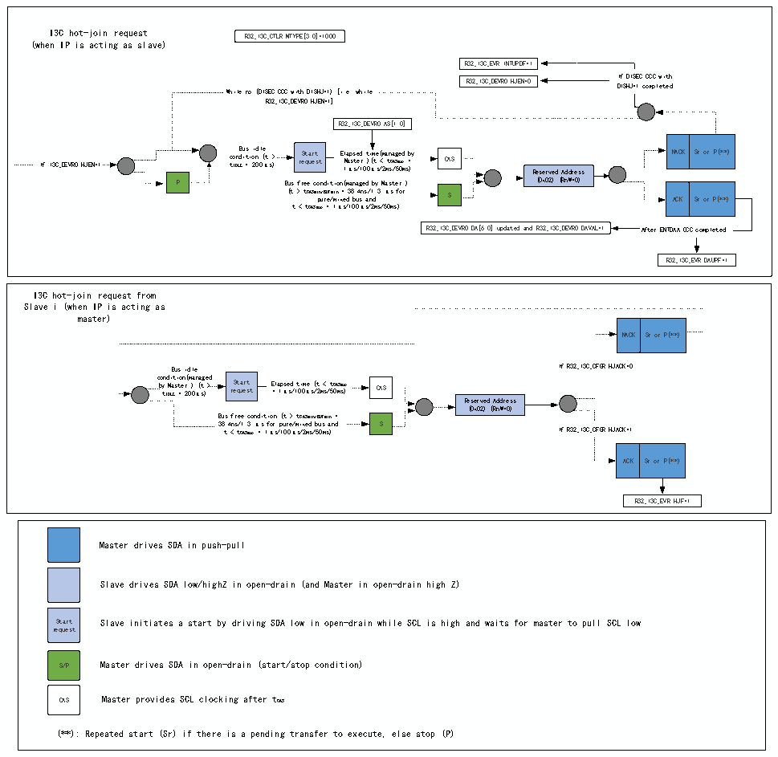

<!-- source-page: 345 -->

[← p.344](0344.md) · [index](../README.md) · [PDF p.345](https://ch32-riscv-ug.github.io/CH32H417/datasheet_zh/CH32H417RM.PDF#page=345) · [p.346 →](0346.md)

<!-- header: CH32H417系列应用手册 https://wch.cn -->
当外设用作主设备时，R32_I3C_IBIDR寄存器用于接收IBI数据有效负载。因此，来自从设备的  
IBI请求不得超过4字节的数据有效负载。如果需要在该带内中断的上下文中交换更多信息，则主设  
备软件必须发出私有读控制字。  

#### 22.3.4.14 I3C热加入请求传输（作为主设备/从设备）

图22-13 I3C热加入请求传输（作为主设备/从设备）  
 <!-- rendered from the PDF; verify at https://ch32-riscv-ug.github.io/CH32H417/datasheet_zh/CH32H417RM.PDF#page=345 -->

🖼 Text parsed from the figure above

I3C hot-join request R32_I3C_CTLR.MTYPE[3:0]=1000  
(when IP is acting as slave)  
R32_I3C_EVR.INTUPDF=1  
If DISEDISHJ=1  EC CCC with 1 completed  
R32_I3C_DEVR0.HJEN=0 I D f I S D H I J= SE 1 C c o CC mp C l w et i e th d  
While no (DISEC CCC with DISHJ=1) [i.e. while  
R32_I3C_DEVR0.HJEN=1]  
R32_I3C_DEVR0.AS[1:0]  
If I3C_DEVR0.HJEN=1 c t o ID n L B d E u i = s t io 2 id 0 n l 0 e ( μ t s &gt; ) re St qu a e rt st El 1 M μ a a p s s s t / e e 1 d r 0 0 t ) i μ ( m t s e / ( &lt; 2 m a m t s n CA a / S g 5 m 0 e a d m x s = ) b y CAS Reserved Address NACK Sr or P(**)  
P Bus free condition(managed by Master ) (0x02) (RnW=0)  
(t &gt; tCASmi p n u /B r U e F / mi m n i x = e d 3 8 b . u 4 s n s a / n 1 d . 3 μs for S ACK Sr or P(**)  
t &lt; tCASmax = 1μs/100μs/2ms/50ms)  
R32_I3C_DEVR0.DA[6:0] updated and R32_I3C_DEVR0.DAVAL=1 After ENTDAA CCC completed  
R32_I3C_EVR.DAUPF=1  
I3C hot-join request from  
Slave i (when IP is acting as  
master)  
NACK  Sr or P(**)  
Bus idle If R32_I3C_C FGR.HJACK=0  
c b o y t n I d D M i L a E t s i = t o e n 2 r ( 0 m ) 0 a μ n ( a s t g ) e &gt; d re St qu a e rt st E = l a 1 p μ se s d / 1 t 0 i 0 m μ e s ( / t 2 m &lt; s / t 5 C 0 A m S s ma ) x CAS  
Reserved Address  
(0x02) (RnW=0)  
Bus free condition (t &gt; tCASmin/BUFmin =  
38.4ns/1.3 μs for pure/mixed bus and S  
t &lt; tCASmax = 1μs/100μs/2ms/50ms) If R32_I3C_CFGR.HJACK=1  
ACK  Sr or P(**)  
R32_I3C_EVR.HJF=1  
Master drives SDA in push-pull  
Slave drives SDA low/highZ in open-drain (and Master in open-drain high Z)  
Start Slave initiates a start by driving SDA low in open-drain while SCL is high and waits for master to pull SCL low  
request  
S/P Master drives SDA in open-drain (start/stop condition)  
CAS Master provides SCL clocking after tCAS  
(**): Repeated start (Sr) if there is a pending transfer to execute, else stop (P)  

<!-- image: p345-draw-image-00001 bbox=[504.72, 786.24, 525.24, 796.68] -->
<!-- footer: V1.7 341 -->
