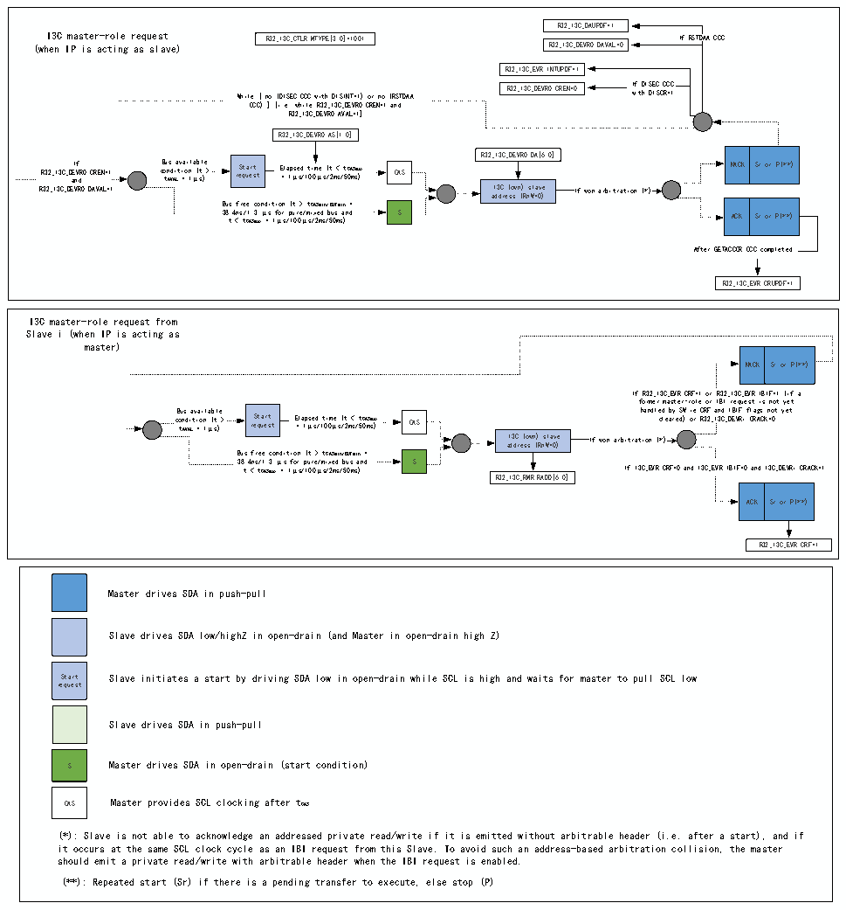

<!-- source-page: 346 -->

[← p.345](0345.md) · [index](../README.md) · [PDF p.346](https://ch32-riscv-ug.github.io/CH32H417/datasheet_zh/CH32H417RM.PDF#page=346) · [p.347 →](0347.md)

<!-- header: CH32H417系列应用手册 https://wch.cn -->

#### 22.3.4.15 I3C主设备角色请求传输（作为主设备/从设备）

图22-14 I3C主设备角色请求传输（作为主设备/从设备）  
 <!-- rendered from the PDF; verify at https://ch32-riscv-ug.github.io/CH32H417/datasheet_zh/CH32H417RM.PDF#page=346 -->

🖼 Text parsed from the figure above

R32_I3C_DAUPDF=1  
I3C master-role request R32_I3C_CTLR.MTYPE[3:0]=1001 If RSTDAA CCC  
(when IP is acting as slave) R32_I3C_DEVR0.DAVAL=0  
R32_I3C_EVR.INTUPDF=1  
While [ no (DISEC CCC with DISINT=1) or no (RSTDAA R32_I3C_DEVR0.CREN=0 I w f i t D h I D S I EC SC R CC =1 C  
CCC) ] [i.e. while R32_I3C_DEVR0.CREN=1 and  
R32_I3C_DEVRO.AVAL=1]  
R32_I3C_DEVR0.AS[1:0]  
NACK  Sr or P(**)  
R32_I3C_DEVR0.DA[6:0]  
R32_I3C_D a E I n f V d R 0.CREN=1 c B o t u A n s V d A i L a t v i = a o i 1 n l μ a ( b t s l ) e &gt; re St qu a e rt st E = l a 1 p μ se s d / 1 t 0 i 0 m μ e s ( / t 2 m &lt; s / t 5 C 0 A m S s ma ) x CAS NACK Sr or P(**)  
R32_I3C_DEVR0.DAVAL=1 a I d 3 d C r e ( s o s w n ( ) R n s W l = a 0 v ) e If won arbitration (*)  
ACK  Sr or P(**)  
Bus free condition (t &gt; tCASmin/BUFmin =  
38 t . 4 &lt; n s t / C 1 A . S 3 ma x μ = s 1 f μ or s / p 1 u 0 r 0 e μ /m s i / x 2 e m d s / b 5 u 0 s m s a ) n d S ACK Sr or P(**)  
After GETACCCR CCC completed  
R32_I3C_EVR.CRUPDF=1  
I3C master-role request from  
Slave i (when IP is acting as  
master)  
NACK  Sr or P(**)  
If R32_I3C_EVR.CRF=1 or R32_I3C_EVR.IBIF=1 (if a  
former master-role or I BI request is not yet  
c B o t u A n s V d A i L a t v i = a o i 1 n l μ a ( b t s l ) e &gt; re St qu a e rt st E = l a 1 p μ se s d / 1 t 0 i 0 m μ e s ( / t 2 m &lt; s / t 5 C 0 A m S s ma ) x CAS handl c e l d ea b r y ed SW ) o i r e R C 3 R 2 F _ I an 3C d _ I DE BI V F Ri . fl CR ag A s CK = no 0 t yet  
a I d 3 d C r e ( s o s w n ( ) R n s W l = a 0 v ) e If won arbitration (*)  
Bus free condition (t &gt; tCASmin/BUFmin =  
38.4ns/1.3 μs for pure/mixed bus and S  
t &lt; tCASmax = 1μs/100μs/2ms/50ms) If I3C_EVR.CRF=0 and I3C_EVR.IBIF=0 and I3C_DEVRi.CRACK=1  
R32_I3C_RMR.RADD[6:0]  
ACK  Sr or P(**)  
R32_I3C_EVR.CRF=1  
Master drives SDA in push-pull  
Slave drives SDA low/highZ in open-drain (and Master in open-drain high Z)  
Start Slave initiates a start by driving SDA low in open-drain while SCL is high and waits for master to pull SCL low  
request  
Slave drives SDA in push-pull  
S Master drives SDA in open-drain (start condition)  
CAS Master provides SCL clocking after tCAS  
(*): Slave is not able to acknowledge an addressed private read/write if it is emitted without arbitrable header (i.e. after a start), and if  
it occurs at the same SCL clock cycle as an IBI request from this Slave. To avoid such an address-based arbitration collision, the master  
should emit a private read/write with arbitrable header when the IBI request is enabled.  
(**): Repeated start (Sr) if there is a pending transfer to execute, else stop (P)  

### 22.3.5 I3C FIFO管理

<!-- p346-table-005 (table-22-2@1) -->
<table><caption>表22-2 I3C FIFO实现</caption><tr><th>FIFO</th><th>内容</th><th>单位</th><th>大小</th><th>用作主设备/从设备（基本原理）</th></tr><tr><td>C-FIFO</td><td>32位控制字</td><td rowspan="2">字</td><td rowspan="2">2</td><td style="text-align:left">主设备（一个帧可基于多个控制字；而用作从设备时则不然）</td></tr><tr><td>S-FIFO</td><td>32位状态字</td><td style="text-align:left">主设备（从设备：仅限寄存器模式下的状态）</td></tr><tr><td>TX-FIFO</td><td>发送的数据</td><td rowspan="2">字节</td><td rowspan="2">8</td><td rowspan="2">主设备和从设备</td></tr><tr><td>RX-FIFO</td><td>接收的数据</td></tr></table>

<!-- image: p346-draw-image-00001 bbox=[504.72, 786.24, 525.24, 796.68] -->
<!-- footer: V1.7 342 -->
