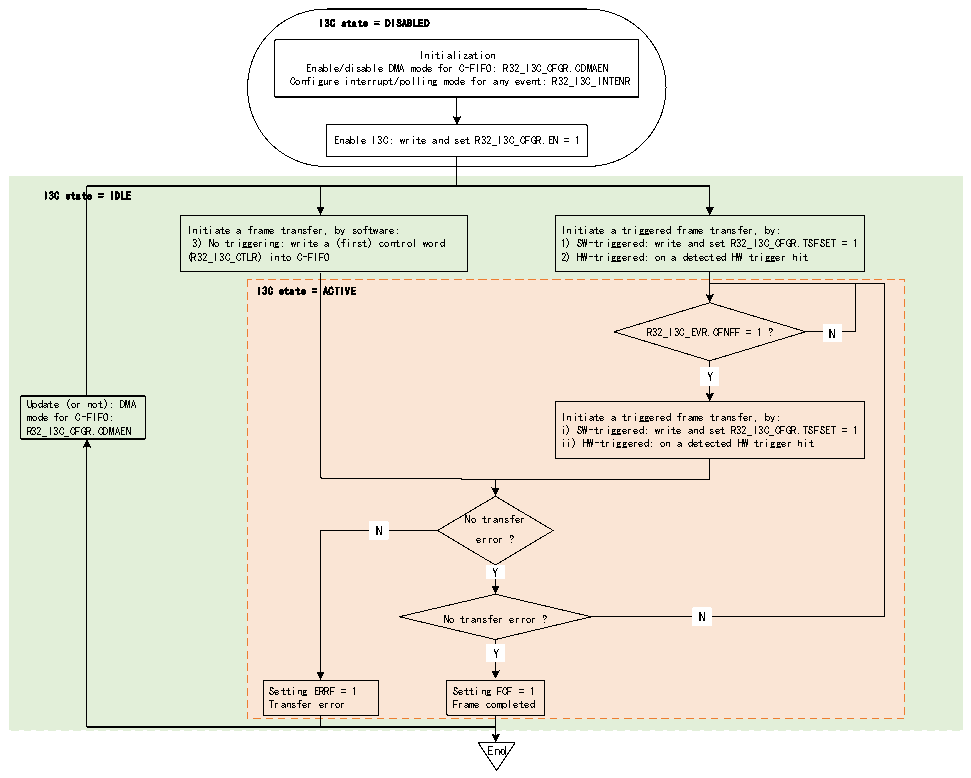

<!-- source-page: 347 -->

[← p.346](0346.md) · [index](../README.md) · [PDF p.347](https://ch32-riscv-ug.github.io/CH32H417/datasheet_zh/CH32H417RM.PDF#page=347) · [p.348 →](0348.md)

<!-- header: CH32H417系列应用手册 https://wch.cn -->

#### 22.3.5.1 C-FIFO管理（作为主设备）

用作主设备时，可以在C-FIFO广播CCC、直接读/写CCC、私有读/写、传统I2C读/写、软件发  
起的错误恢复期间使用。  
图22-15说明了当I3C外设用作主设备时，如何管理C-FIFO以对I3C总线上的控制字进行排队。  

图22-15 C-FIFO管理（作为主设备）  
 <!-- rendered from the PDF; verify at https://ch32-riscv-ug.github.io/CH32H417/datasheet_zh/CH32H417RM.PDF#page=347 -->

🖼 Text parsed from the figure above

I3C state = DISABLED  
Initialization  
Enable/disable DMA mode for C-FIFO: R32_I3C_CFGR.CDMAEN  
Configure interrupt/polling mode for any event: R32_I3C_INTENR  
Enable I3C: write and set R32_I3C_CFGR.EN = 1  
I3C state = IDLE  
Initiate a frame transfer, by software: Initiate a triggered frame transfer, by:  
3) No triggering: write a (first) control word 1) SW-triggered: write and set R32_I3C_CFGR.TSFSET = 1  
(R32_I3C_CTLR) into C-FIFO 2) HW-triggered: on a detected HW trigger hit  
I3C state = ACTIVE  
N  N  
R32_I3C_EVR.CFNFF = 1 ? N  
Y  Y  
Update (or not): DMA  
mode for C-FIFO: Initiate a triggered frame transfer, by:  
R32_I3C_CFGR.CDMAEN i) SW-triggered: write and set R32_I3C_CFGR.TSFSET = 1  
ii) HW-triggered: on a detected HW trigger hit  
No transfer  
N  N  
error ?  
Y  Y  
N  N  
No transfer error ? N  
Y  Y  
Setting ERRF = 1 Setting FCF = 1  
Transfer error Frame completed  
End  

首先，软件必须通过R32_I3C_CFGR寄存器CDMAEN来初始化C-FIFO管理，具体步骤如下：  
● 软件直接按控制字进行写入（当CDMAEN=0时）：  
– 通过轮询模式（设置R32_I3C_INTENR寄存器中的CFNFIE=0）：在向R32_I3C_CTLR寄存器显式写  
入之前，等待硬件请求下一个控制字（R32_I3C_INTENR寄存器中的CFNFF=1）  
– 通过使能的中断通知（当CFNFIE=1时）：  
● 由分配的DMA通道写入（当CDMAEN=1时），以使能相应的I3C外设DMA请求：  
– 根据模块级别的配置，DMA会自动将控制字从其存储器源缓冲区推入/写入R32_I3C_CTLR寄存器，  
直到帧完成（在帧的最后一条消息后，I3C总线上会发出停止位），但发生传输错误时除外。  
● 在任何情况下，只要 C-FIFO 为空并且必须发出新控制字的重复起始位，都会报告 C-FIFO 下溢  
（R32_I3C_EVR 寄存器中的 ERRF=1 且 R32_I3C_STATER 寄存器中的 COVR=1）。如果使能了  
R32_I3C_INTENR寄存器ERRIE位，则会生成中断。  
● 当I3C外设未处于工作状态时，可以修改C-FIFO管理的DMA模式配置。  
● 用作主设备时，如果发生传输错误（R32_I3C_EVR 寄存器中的 ERRF=1），硬件将会自动清空 C-  
FIFO。  

#### 22.3.5.2 TX-FIFO管理（作为主设备）

<!-- image: p347-draw-image-00001 bbox=[504.72, 786.24, 525.24, 796.68] -->
<!-- footer: V1.7 343 -->
