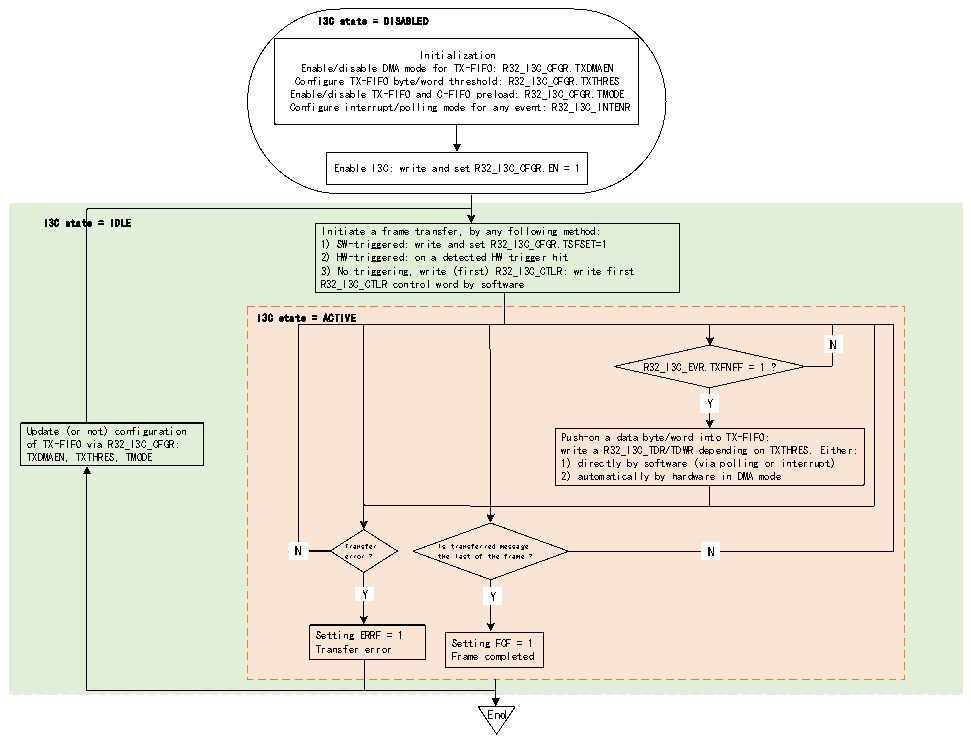

<!-- source-page: 348 -->

[← p.347](0347.md) · [index](../README.md) · [PDF p.348](https://ch32-riscv-ug.github.io/CH32H417/datasheet_zh/CH32H417RM.PDF#page=348) · [p.349 →](0349.md)

<!-- header: CH32H417系列应用手册 https://wch.cn -->
用作主设备时，可以在广播或直接CCC（包括ENTDAA和RSTACT），如果存在释义字节/子命令字  
节或数据字节、私有写、传统I2C写期间使用TX-FIFO  
图22-16说明了当I3C外设用作主设备时，如何管理TX-FIFO以对要在I3C总线上发送的数据字  
节或字进行排队。  

图22-16 TX-FIFO管理（作为主设备）  
 <!-- rendered from the PDF; verify at https://ch32-riscv-ug.github.io/CH32H417/datasheet_zh/CH32H417RM.PDF#page=348 -->

🖼 Text parsed from the figure above

I3C state = DISABLED  
Initialization  
Enable/disable DMA mode for TX-FIFO: R32_I3C_CFGR.TXDMAEN  
Configure TX-FIFO byte/word threshold: R32_I3C_CFGR.TXTHRES  
Enable/disable TX-FIFO and C-FIFO preload: R32_I3C_CFGR.TMODE  
Configure interrupt/polling mode for any event: R32_I3C_INTENR  
Enable I3C: write and set R32_I3C_CFGR.EN = 1  
I3C state = IDLE  
Initiate a frame transfer, by any following method:  
1) SW-triggered: write and set R32_I3C_CFGR.TSFSET=1  
2) HW-triggered: on a detected HW trigger hit  
3) No triggering, write (first) R32_I3C_CTLR: write first  
R32_I3C_CTLR control word by software  
I3C state = ACTIVE  
N  N  
R32_I3C_EVR.TXFNFF = 1 ?  
Y  Y  
Update (or not) configuration Push-on a data byte/word into TX-FIFO:  
of TX-FIFO via R32_I3C_CFGR: write a R32_I3C_TDR/TDWR depending on TXTHRES. Either:  
TXDMAEN, TXTHRES, TMODE 1) directly by software (via polling or interrupt)  
2) automatically by hardware in DMA mode  
N  N  
N Transfer Is transferred message N  
error ? the last of the frame ?  
Y  Y  
Y  Y  
Y Y  
Setting ERRF = 1  
Transfer error Setting FCF = 1  
Frame completed  
End  

首先，必须通过R32_I3C_CFGR寄存器中的以下位域初始化TX-FIFO管理：  
● TXDMAEN：使能/禁止TX-FIFO的DMA模式  
● TXTHRES：将数据字节或字推入TX-FIFO  
● TMODE：使能/禁止TX-FIFO和C-FIFO预装载  
然后，根据R32_I3C_CFGR寄存器TXDMAEN位，有两种方法可以向TX-FIFO写入数据：  
● 软件直接按字节/字写入（当TXDMAEN=0时）：  
– 通过轮询模式（R32_I3C_INTENR寄存器TXFNFIE=0）：在显式写入R32_I3C_TDR或R32_I3C_TDWR  
寄存器之前，等待硬件请求下一个数据字节/字（R32_I3C_INTENR寄存器TXFNFF = 1），具体取决于  
R32_I3C_CGFR寄存器TXTHRES位  
– 通过使能的中断通知（当TXFNFIE = 1时）  
● 由分配的DMA通道写入（当TXDMAEN = 1时），以使能相应的I3C外设DMA请求：  
– 根据 DMA 模块级别的配置，DMA 会自动将数据字节/字从其存储器源缓冲区推入/写入  
R32_I3C_TDR或R32_I3C_TDWR寄存器（具体取决于R32_I3C_CGFR寄存器TXTHRES位），直到帧完成  
（在帧的最后一条消息后，I3C总线上会发出停止位），但发生传输错误时除外。  
I3C消息以起始位或重复起始位开始，以停止位或重复起始位结束。在消息级别，要发送的最后  
一个数据字节/字由R32_I3C_EVR寄存器TXLASTF = 1进行指示。当I3C帧包含多条消息（由重复起  
<!-- image: p348-draw-image-00001 bbox=[504.72, 786.24, 525.24, 796.68] -->
<!-- footer: V1.7 344 -->
