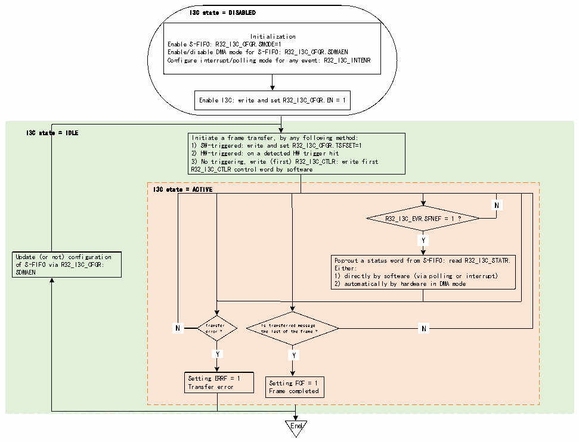

<!-- source-page: 352 -->

[← p.351](0351.md) · [index](../README.md) · [PDF p.352](https://ch32-riscv-ug.github.io/CH32H417/datasheet_zh/CH32H417RM.PDF#page=352) · [p.353 →](0353.md)

<!-- header: CH32H417系列应用手册 https://wch.cn -->

图22-18 S-FIFO管理（作为主设备）  
 <!-- rendered from the PDF; verify at https://ch32-riscv-ug.github.io/CH32H417/datasheet_zh/CH32H417RM.PDF#page=352 -->

🖼 Text parsed from the figure above

I3C state = DISABLED  
Initialization  
Enable S-FIFO: R32_I3C_CFGR.SMODE=1  
Enable/disable DMA mode for S-FIFO: R32_I3C_CFGR.SDMAEN  
Configure interrupt/polling mode for any event: R32_I3C_INTENR  
Enable I3C: write and set R32_I3C_CFGR.EN = 1  
I3C state = IDLE  
Initiate a frame transfer, by any following method:  
1) SW-triggered: write and set R32_I3C_CFGR.TSFSET=1  
2) HW-triggered: on a detected HW trigger hit  
3) No triggering, write (first) R32_I3C_CTLR: write first  
R32_I3C_CTLR control word by software  
I3C state = ACTIVE  
N  N  
R32_I3C_EVR.SFNEF = 1 ?  
Y  Y  
Update (or not) configuration Pop-out a status word from S-FIFO: read R32_I3C_STATR.  
of S-FIFO via R32_I3C_CFGR: Either:  
SDMAEN 1) directly by software (via polling or interrupt)  
2) automatically by hardware in DMA mode  
N  N  
N Transfer Is transferred message N  
error ? the last of the frame ?  
Y  Y  
Y  Y  
Y Y  
Setting ERRF = 1  
Transfer error Setting FCF = 1  
Frame completed  
End  

首先，软件必须通过R32_I3C_CFGR寄存器中的SDMAEN位域（使能/禁止S-FIFO的DMA模式）初  
始化S-FIFO管理。然后，根据SDMAEN位读取S-FIFO：  
● 直接由软件读取（如果SDMAEN=0）：  
–通过轮询模式（R32_I3C_INTENR 寄存器中的 SFNEIE=0）：在显式读取 I3C_STATR 寄存器之前  
等待硬件请求下一个状态字（R32_I3C_INTENR寄存器中的SFNEF=1）  
–通过使能的中断通知（SFNEIE=1）  
● 由分配的DMA通道读取（如果SDMAEN=1），以使能相应的I3C外设DMA请求（i3c_rs_dma）：  
–根据 DMA 模块级别的配置，DMA 会自动从 R32_I3C_STATR 寄存器弹出/读取状态字并将它们写  
入其存储器从设备缓冲区，直到帧完成（在帧的最后一条消息后，I3C总线上会发出停止位），但发  
生传输错误时除外。  
必须读取每一个消息状态，否则当 S-FIFO 已满并且必须写入下一个消息状态时，硬件会将上溢  
错误标志置1（R32_I3C_EVR寄存器中的ERRF=1且R32_I3C_STATER寄存器中的COVR=1）。如果使能  
了相应的中断（R32_I3C_INTENR寄存器中的ERRIE=1），则会生成中断。  
只有在S-FIFO为空时才会报告帧完成（R32_I3C_EVR寄存器中的FCF=1）。  
当I3C外设未处于工作状态时，可以修改S-FIFO管理的配置。  

#### 22.3.5.5 TX-FIFO管理（作为从设备）

用作从设备时，只能在私有读传输期间使用TX-FIFO。  
图22-19说明了当I3C外设用作从设备时，如何管理TX-FIFO以对要在I3C总线上发送的数据字  
节或字进行排队和推入。  
<!-- image: p352-draw-image-00001 bbox=[504.72, 786.24, 525.24, 796.68] -->
<!-- footer: V1.7 348 -->
