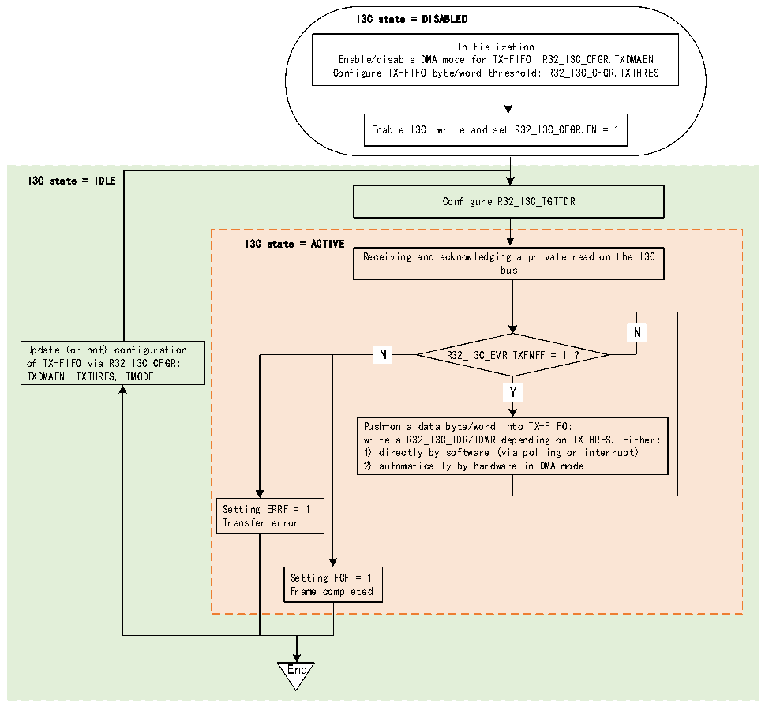

<!-- source-page: 353 -->

[← p.352](0352.md) · [index](../README.md) · [PDF p.353](https://ch32-riscv-ug.github.io/CH32H417/datasheet_zh/CH32H417RM.PDF#page=353) · [p.354 →](0354.md)

<!-- header: CH32H417系列应用手册 https://wch.cn -->

图22-19 TX-FIFO管理（作为从设备）  
 <!-- rendered from the PDF; verify at https://ch32-riscv-ug.github.io/CH32H417/datasheet_zh/CH32H417RM.PDF#page=353 -->

🖼 Text parsed from the figure above

I3C state = DISABLED  
Initialization  
Enable/disable DMA mode for TX-FIFO: R32_I3C_CFGR.TXDMAEN  
Configure TX-FIFO byte/word threshold: R32_I3C_CFGR.TXTHRES  
Enable I3C: write and set R32_I3C_CFGR.EN = 1  
I3C state = IDLE  
Configure R32_I3C_TGTTDR  
I3C state = ACTIVE  
Receiving and acknowledging a private read on the I3C  
bus  
N  N  
N  N  
Update (or not) configuration N R32_I3C_EVR.TXFNFF = 1 ?  
of TX-FIFO via R32_I3C_CFGR:  
TXDMAEN, TXTHRES, TMODE  
Y  Y  
Push-on a data byte/word into TX-FIFO:  
write a R32_I3C_TDR/TDWR depending on TXTHRES. Either:  
1) directly by software (via polling or interrupt)  
2) automatically by hardware in DMA mode  
Setting ERRF = 1  
Transfer error  
Setting FCF = 1  
Frame completed  
End  

首先，软件必须初始化TX-FIFO管理并写入R32_I3C_CFGR中的以下位：  
● TXDMAEN：使能/禁止TX-FIFO的DMA模式  
● TXTHRES：将数据字节或字推入TX-FIFO  
然后，在 I3C 总线上接收私有读传输之前，软件必须配置 I3C 从设备发送配置寄存器  
（R32_I3C_TGTTDR）以向TX-FIFO预装载一定数量的数据字节（在单次访问中写入TGTTDCNT[15:0]和  
PRELOAD=1），从而准备好在I3C总线上发送来自从设备的数据字节：  
● 如果PRELOAD=1且TGTTDCNT[15:0]&gt;TX-FIFO大小，则TX-FIFO会先预装载至FIFO大小。  
● 如果PRELOAD=1且TGTTDCNT[15:0]≤TX-FIFO大小，则TX-FIFO会预装载至TGTTDCNT[15:0]。  
根据TXDMAEN位预装载TX-FIFO：  
● 直接由软件按字节/字预装载（TXDMAEN=0）：  
–通过轮询模式（R32_I3C_INTENR寄存器TXFNFIE=0）：在显式写入R32_I3C_TDR或R32_I3C_TDWR  
寄存器之前等待硬件请求下一个数据字节/字（R32_I3C_INTENR寄存器TXFNFF=1），具体是字节还是  
字取决于R32_I3C_CGFR寄存器中的TXTHRES  
–通过使能的中断通知（如果TXFNFIE=1）  
● 由分配的DMA通道预装载（TXDMAEN=1），以使能相应的I3C外设DMA请求（i3c_tx_dma）：  
<!-- image: p353-draw-image-00001 bbox=[504.72, 786.24, 525.24, 796.68] -->
<!-- footer: V1.7 349 -->
