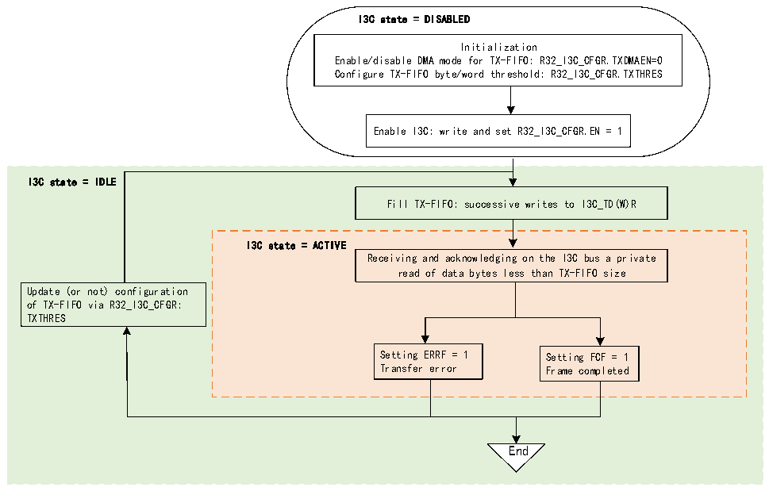

<!-- source-page: 354 -->

[← p.353](0353.md) · [index](../README.md) · [PDF p.354](https://ch32-riscv-ug.github.io/CH32H417/datasheet_zh/CH32H417RM.PDF#page=354) · [p.355 →](0355.md)

<!-- header: CH32H417系列应用手册 https://wch.cn -->
–根据 DMA 模块级别的配置，DMA 会自动将数据字节/字从其存储器源缓冲区推入/写入  
R32_I3C_TDR或R32_I3C_TDWR寄存器（具体取决于TXTHRES），直到传输完成（R32_I3C_EVR寄存器  
FCF=1），但发生传输错误时除外。  
然后，当R32_I3C_TGTTDR寄存器的TGTTDCNT[15:0]中还有其余数据要装载到TX-FIFO以继续私  
有读传输（PRELOAD置1且TGTTDCNT[15:0]&gt;TX-FIFO大小）时，如果主设备尚未完成私有读传输，则  
采用同样的方式进行预装载（直接通过软件或通过分配的DMA通道）：  
–如果TXTHRES=0：当在I3C总线上发送一个字节时，将下一个字节预装载到TX-FIFO  
–如果TXTHRES=1：当在I3C总线上发送四个字节时，将下一个字预装载到TX-FIFO。  
当从设备或主设备先终止数据字节传输时，私有读传输完成（R32_I3C_EVR寄存器中的FCF=1）。  
传输完成后，软件可以：  
● 读取R32_I3C_STATR寄存器中的XDCNT[15:0]：发送的有效数据字节数  
● 读取R32_I3C_TGTTDR寄存器中的TGTTDCNT[15:0]：I3C总线上待装载和发送的剩余字节数  
● 清空 TX-FIFO：是否通过写操作将 R32_I3C_CFGR 寄存器中的 TXFLUSH 置 1 并继续进行另一  
次私有读传输，取决于用户应用  
如果TX-FIFO为空并且必须在I3C总线上发送数据字节，则会报告TX-FIFO下溢（R32_I3C_EVR  
寄存器 ERRF=1 且 R32_I3C_STATER 寄存器 DOVR=1）。如果使能了相应的中断（R32_I3C_EVR 寄存器  
ERRIE=1），则会生成中断。  
当I3C外设未处于工作状态时，可以修改TX-FIFO管理的配置。  
如果字节数小于TX-FIFO大小，可以选择不使用R32_I3C_TGTTDR  
除了使用 R32_I3C_TGTTDR 寄存器之外，如图 22-20 所示，当不使用 DMA（TDMAEN=0）时，如果  
I3C 总线上要读取的数据字节数小于 TX-FIFO 大小，软件可通过连续写入 R32_I3C_TDR 或  
R32_I3C_TDWR（具体取决于TXTHRES），直接使用自身直接读取的字节数来准备并填充TX-FIFO。  

图22-20 如果读取的字节数小于TX-FIFO大小，则不使用I3C_TGTTDR 而通过软件管理TX-FIFO  
 <!-- rendered from the PDF; verify at https://ch32-riscv-ug.github.io/CH32H417/datasheet_zh/CH32H417RM.PDF#page=354 -->

（作为从设备）  

🖼 Text parsed from the figure above

I3C state = DISABLED  
Initialization  
Enable/disable DMA mode for TX-FIFO: R32_I3C_CFGR.TXDMAEN=0  
Configure TX-FIFO byte/word threshold: R32_I3C_CFGR.TXTHRES  
Enable I3C: write and set R32_I3C_CFGR.EN = 1  
I3C state = IDLE  
Fill TX-FIFO: successive writes to I3C_TD(W)R  
I3C state = ACTIVE  
Receiving and acknowledging on the I3C bus a private  
read of data bytes less than TX-FIFO size  
Update (or not) configuration  
of TX-FIFO via R32_I3C_CFGR:  
TXTHRES  
Setting ERRF = 1 Setting FCF = 1  
Transfer error Frame completed  
End  

#### 22.3.5.6 RX-FIFO管理（作为从设备）

<!-- image: p354-draw-image-00001 bbox=[504.72, 786.24, 525.24, 796.68] -->
<!-- footer: V1.7 350 -->
