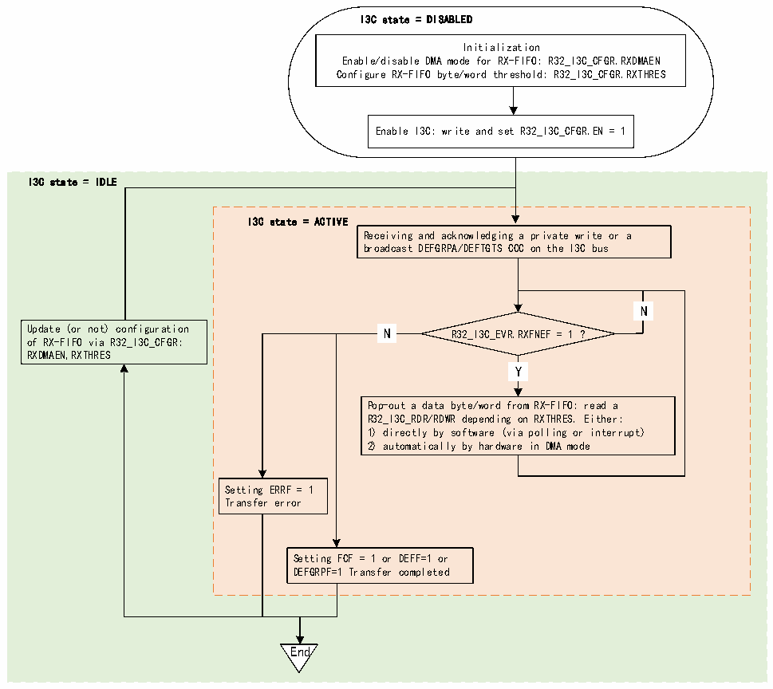

<!-- source-page: 355 -->

[← p.354](0354.md) · [index](../README.md) · [PDF p.355](https://ch32-riscv-ug.github.io/CH32H417/datasheet_zh/CH32H417RM.PDF#page=355) · [p.356 →](0356.md)

<!-- header: CH32H417系列应用手册 https://wch.cn -->
用作从设备时，可以在广播DEFTGTS CCC、广播DEFGRPA CCC、私有写的已接收和确认的传输期  
间使用RX-FIFO：  
图22-21说明了当I3C外设用作从设备时，如何管理RX-FIFO以对从I3C总线接收到的数据字节  
/字进行排队和弹出。  

图22-21 RX-FIFO管理（作为从设备）  
 <!-- rendered from the PDF; verify at https://ch32-riscv-ug.github.io/CH32H417/datasheet_zh/CH32H417RM.PDF#page=355 -->

🖼 Text parsed from the figure above

I3C state = DISABLED  
Initialization  
Enable/disable DMA mode for RX-FIFO: R32_I3C_CFGR.RXDMAEN  
Configure RX-FIFO byte/word threshold: R32_I3C_CFGR.RXTHRES  
Enable I3C: write and set R32_I3C_CFGR.EN = 1  
I3C state = IDLE  
I3C state = ACTIVE  
Receiving and acknowledging a private write or a  
broadcast DEFGRPA/DEFTGTS CCC on the I3C bus  
N  N  
N  N  
Update (or not) configuration N R32_I3C_EVR.RXFNEF = 1 ?  
of RX-FIFO via R32_I3C_CFGR:  
RXDMAEN,RXTHRES  
Y  Y  
Pop-out a data byte/word from RX-FIFO: read a  
R32_I3C_RDR/RDWR depending on RXTHRES. Either:  
1) directly by software (via polling or interrupt)  
2) automatically by hardware in DMA mode  
Setting ERRF = 1  
Transfer error  
Setting FCF = 1 or DEFF=1 or  
DEFGRPF=1 Transfer completed  
End  

首先，软件必须通过以下R32_I3C_CFGR寄存器位域初始化RX-FIFO管理：  
● RXDMAEN：使能/禁止RX-FIFO的DMA模式；  
● RXTHRES：从RX-FIFO弹出数据字节或字；  
然后，根据RXDMAEN位读取RX-FIFO：  
● 直接由软件按字节/字读取（如果RXDMAEN=0）：  
–通过轮询模式（R32_I3C_INTENR 寄存器中的 RXFNEIE=0）：在显式读取 R32_I3C_RDR 或  
R32_I3C_RDWR寄存器之前等待硬件请求下一个数据字节/字（R32_I3C_INTENR寄存器中的RXFNEF=1），  
具体是字节还是字取决于R32_I3C_CGFR寄存器中的RXTHRES  
–通过使能的中断通知（如果RXFNEIE=1）  
● 由分配的 DMA 通道读取（如果 RXDMAEN=1），以使能相应的 I3C 外设 DMA 请求（I3C_RX_DMA）：  
–根据DMA模块级别的配置，DMA会自动从R32_I3C_RDR或R32_I3C_RDWR寄存器弹出/读取数据  
字节/字（具体取决于RXTHRES），并将它们写入其存储器从设备缓冲区，直到传输完成（R32_I3C_EVR  
寄存器中的FCF=1（私有写）、GRPF=1（DEFGRPA CCC）或DEFF=1（DEFTGTS CCC）），但发生传输错  
<!-- image: p355-draw-image-00001 bbox=[504.72, 786.24, 525.24, 796.68] -->
<!-- footer: V1.7 351 -->
