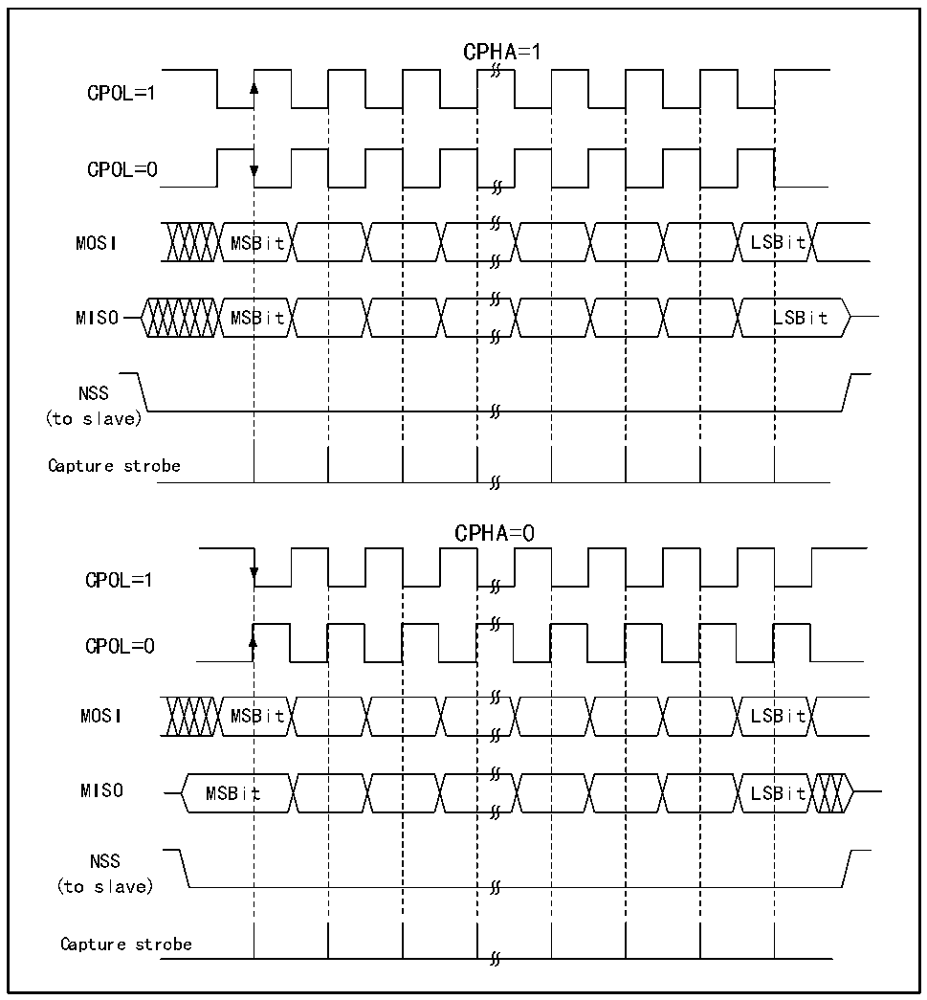

<!-- source-page: 394 -->

[← p.393](0393.md) · [index](../README.md) · [PDF p.394](https://ch32-riscv-ug.github.io/CH32H417/datasheet_zh/CH32H417RM.PDF#page=394) · [p.395 →](0395.md)

<!-- header: CH32H417系列应用手册 https://wch.cn -->

图23-2 SPI模式  
 <!-- rendered from the PDF; verify at https://ch32-riscv-ug.github.io/CH32H417/datasheet_zh/CH32H417RM.PDF#page=394 -->

🖼 Text parsed from the figure above

CPHA=1  
CPOL=1  
CPOL=0  
MOSI MSBit LSBit  
MISO MSBit LSBit  
NSS  
(to slave)  
Capture strobe  
CPHA=0  
CPOL=1  
CPOL=0  
MOSI MSBit LSBit  
MISO MSBit LSBit  
NSS  
(to slave)  
Capture strobe  

主机和设备需要设置为相同的SPI模式，在配置SPI模式前，需要清除SPE位。DEF位可以决定  
SP的单个数据长度是8位还是16位。LSBFIRST可以控制单个数据字是高位在前还是低位在前。  

### 23.2.2 主模式

在SPI模块工作在主模式时，由SCK产生串行时钟。配置成主模式进行以下步骤：  
配置控制寄存器的BR[2:0]域来确定时钟；  
配置CPOL和CPHA位来确定SPI模式；  
配置DEF确定数据字长；  
配置LSBFIRST确定帧格式；  
配置NSS引脚，比如置SSOE位让硬件去置NSS。也可以置SSM位并把SSI位置高；  
置MSTR位和SPE位，需要保证NSS此时已经是高。  
需要发送数据时只需要向数据寄存器写要发送的数据就行了。SPI会从发送缓冲区并行地把数据  
送到移位寄存器，然后按照 LSBFIRST 的设置将数据从移位寄存器发出去，当数据已经到了移位寄存  
<!-- image: p394-draw-image-00001 bbox=[504.72, 786.24, 525.24, 796.68] -->
<!-- footer: V1.7 390 -->
