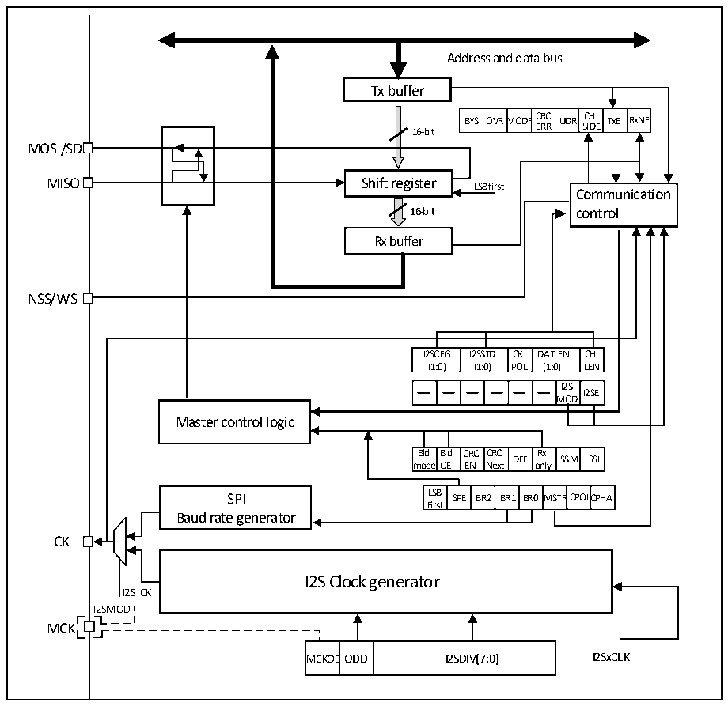

<!-- source-page: 397 -->

[← p.396](0396.md) · [index](../README.md) · [PDF p.397](https://ch32-riscv-ug.github.io/CH32H417/datasheet_zh/CH32H417RM.PDF#page=397) · [p.398 →](0398.md)

<!-- header: CH32H417系列应用手册 https://wch.cn -->

## 23.3 I2S 功能描述

### 23.3.1 I2S概述

图23-3 I2S结构框图  
 <!-- rendered from the PDF; verify at https://ch32-riscv-ug.github.io/CH32H417/datasheet_zh/CH32H417RM.PDF#page=397 -->

🖼 Text parsed from the figure above

Address and data bus  
Tx buffer  
BYS  OVRM  MODF  FCRCERR  UDR  CHSIDE  TxE  RxNE  
16-bit  
MOSI/SD  
MISO Shift register LSB first  
Communication  
16-bit control  
Rx buffer  
NSS/WS  
I2SCFG (1:0)  I2SSTD (1:0)  CKPOL  DATLEN (1:0)  CHLEN  
I2SMOD  I2SE  
OD  
Master control logic  
Bidi mode  Bidi OE  CRCEN  CRCNext  DFF  Rx only  SSM  SSI  
LSBFirst  SPE  BR2  BR1  BR0  MSTR  CPOLC  CPHA  
SPI LSB SPE BR2 BR1 BR0MSTRCPOLCPHA  
Baud rate generator  
CK  
I2S Clock generator  
I2S_CK  
I2SMOD  
MCK  
MCKOE  ODD  I2SDIV[7:0]  

通过将寄存器I2SCFGR的I2SMOD位置位，使能I2S功能。此时，可以把SPI模块用作I2S音频  
接口。I2S与SPI共用3个引脚：  
- SD：串行数据（映射至MOSI引脚），用来发送和接收2路时分复用通道的数据；
- WS：字选（映射至NSS引脚），主模式下作为数据控制信号输出，从模式下作为输入；
- CK：串行时钟（映射至SCK引脚），主模式下作为时钟信号输出，从模式下作为输入。
在某些外部音频设备需要主时钟时，可以另有一个附加引脚输出时钟：  
- MCK：主时钟（独立映射），在I2S配置为主模式，寄存器I2SPR的MCKOE位为1时，作为输
出额外的时钟信号引脚使用。输出时钟信号的频率预先设置为 256×Fs，其中 Fs 是音频信号的采样  
频率。  
设置成主模式时，I2S使用自身的时钟发生器来产生通信用的时钟信号。这个时钟发生器也是主  
时钟输出的时钟源。I2S模式下有2个额外的寄存器，一个是与时钟发生器配置相关的寄存器I2SPR，  
另一个是I2S通用配置寄存器I2SCFGR（可设置音频标准、从/主模式、数据格式、数据包帧、时钟极  
性等参数）。在I2S模式下不使用寄存器CTLR1和所有的CRCR寄存器。同样，I2S模式下也不使用寄  
<!-- image: p397-draw-image-00001 bbox=[504.72, 786.24, 525.24, 796.68] -->
<!-- footer: V1.7 393 -->
