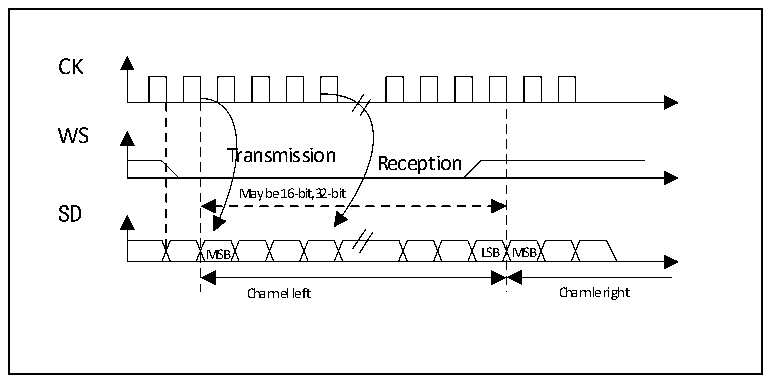

<!-- source-page: 398 -->

[← p.397](0397.md) · [index](../README.md) · [PDF p.398](https://ch32-riscv-ug.github.io/CH32H417/datasheet_zh/CH32H417RM.PDF#page=398) · [p.399 →](0399.md)

<!-- header: CH32H417系列应用手册 https://wch.cn -->
存器CTLR2的SSOE位，和寄存器STATR的MODF位和CRCERR位。I2S使用与SPI相同的寄存器DATAR  
用作16位宽模式数据传输。  

### 23.3.2 支持的音频协议

三线总线支持 2 个声道上音频数据的时分复用：左声道和右声道，但是只有一个 16 位寄存器用  
作发送或接收。因此，软件必须在对数据寄存器写入数据时，根据当前传输中的声道写入相应的数据；  
同样，在读取寄存器数据时，通过检查寄存器STATR的CHSIDE位来判断接收到的数据属于哪个声道。  
左声道总是先于右声道发送数据（CHSIDE位在PCM协议下无意义）。有四种可用的数据和包帧组合。  
可以通过以下四种数据格式发送数据：  
- 16位数据打包进16位帧
- 16位数据打包进32位帧
- 24位数据打包进32位帧
- 32位数据打包进32位帧
在使用16位数据扩展到32位帧时，前16位（MSB）是有意义的数据，后16位（LSB）被强制为  
0，该操作不需要软件干预，也不需要有DMA请求（仅需要一次读或写操作）。24位和32位数据帧需  
要CPU对寄存器DATAR进行2次读或写操作，在使用DMA时，需要2次DMA传输。对于24位数据，  
扩展到32位后，最低8位由硬件置0。对于所有的数据格式和通讯标准，总是先发送最高位（MSB）。  
I2S接口支持四种音频标准，可以通过设置寄存器I2SCFGR的I2SSTD[1:0]位和PCMSYNC位来选择。  

#### 23.3.2.1 I2S飞利浦标准

在此标准下，引脚WS用来指示正在发送的数据属于哪个声道。在发送第一位数据（MSB）前1个  
时钟周期，该引脚即为有效。发送方在时钟信号（CK）的下降沿改变数据，接收方在上升沿读取数据。  
WS信号也在时钟信号的下降沿变化。  

图23-4 飞利浦协议波形（16/32全精度，CPOL=0）  
 <!-- rendered from the PDF; verify at https://ch32-riscv-ug.github.io/CH32H417/datasheet_zh/CH32H417RM.PDF#page=398 -->

🖼 Text parsed from the figure above

CK  
WS  
Transmission  
Reception  
May be 16-bit,32-bit  
SD  
MSB LSB MSB  
Channel left Channle right  

<!-- image: p398-draw-image-00001 bbox=[504.72, 786.24, 525.24, 796.68] -->
<!-- footer: V1.7 394 -->
