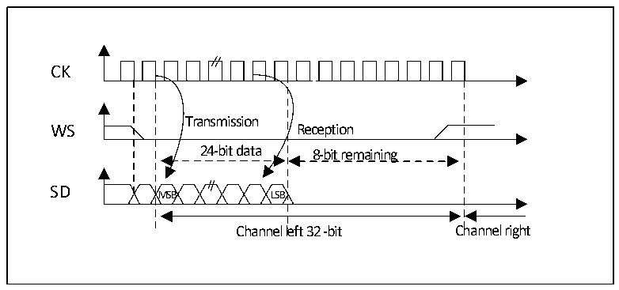
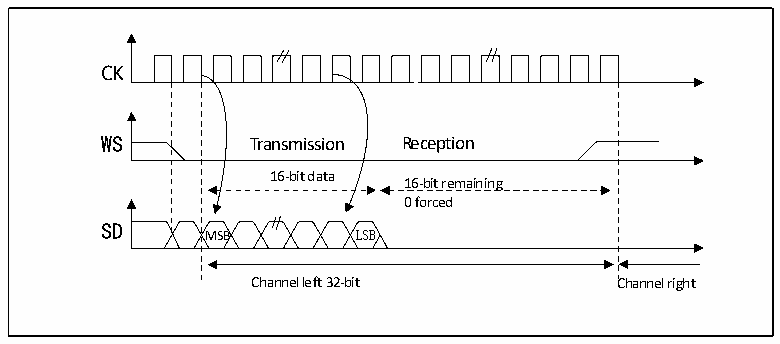

<!-- source-page: 399 -->

[← p.398](0398.md) · [index](../README.md) · [PDF p.399](https://ch32-riscv-ug.github.io/CH32H417/datasheet_zh/CH32H417RM.PDF#page=399) · [p.400 →](0400.md)

<!-- header: CH32H417系列应用手册 https://wch.cn -->

图23-5 飞利浦协议波形（24位帧，CPOL=0）  
 <!-- rendered from the PDF; verify at https://ch32-riscv-ug.github.io/CH32H417/datasheet_zh/CH32H417RM.PDF#page=399 -->

🖼 Text parsed from the figure above

Transmission  Reception  24-bit data MSB LSB  8-bit remaining  
CK  
SD  
Channel left 32 -bit Channel right  

此模式需要对寄存器 SPI_DATAR 进行 2 次读或写操作。在发送模式下：如果需要发送 0x8EAA33  
（24位）：  
First write to Data register Second write to Data register  
0x8EAA 0x33XX  
Only the 8 MSB are sent to complete the 24 bits  
8 LSB bit have no meaning and could be  
anything  
在接收模式下：如果接收0x8EAA33：  
First read from Data register Second read from Data register  
0x8EAA 0x3300  
Only the 8MSB are right  
The 8 LSB will always be 00  

图23-6 飞利浦协议标准波形（16位扩展至32位包帧，CPOL=0）  
 <!-- rendered from the PDF; verify at https://ch32-riscv-ug.github.io/CH32H417/datasheet_zh/CH32H417RM.PDF#page=399 -->

🖼 Text parsed from the figure above

Transmission  Reception  16-bit data MSB LSB  16-bit remaining 0 forced B  
CK  
SD  
Channel left 32-bit Channel right  

在I2S配置阶段，如果选择将16位数据扩展到32位声道帧，只需要访问一次寄存器DATAR用来  
扩展到 32 位的低 16 位被硬件置为 0x0000。如果待传输或接收的数据是 0x76A3（扩展到 32 位是  
0x76A30000），只需要操作一次DATAR。在发送时需要将MSB写入寄存器DATAR；标志位TXE为1表  
<!-- image: p399-draw-image-00001 bbox=[504.72, 786.24, 525.24, 796.68] -->
<!-- footer: V1.7 395 -->
