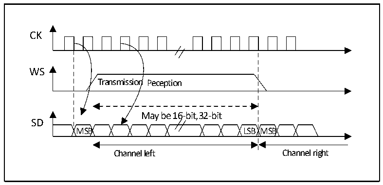
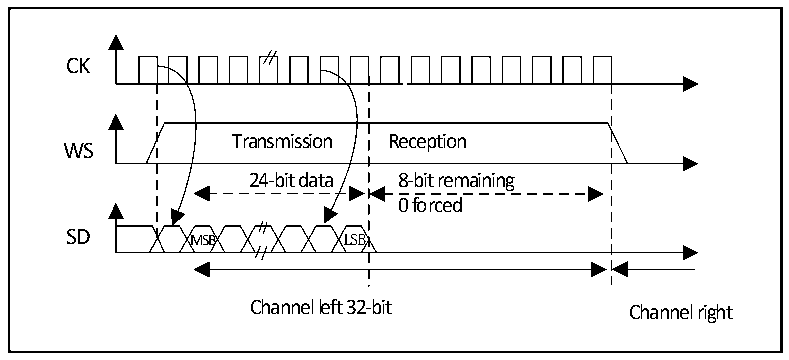

<!-- source-page: 400 -->

[← p.399](0399.md) · [index](../README.md) · [PDF p.400](https://ch32-riscv-ug.github.io/CH32H417/datasheet_zh/CH32H417RM.PDF#page=400) · [p.401 →](0401.md)

<!-- header: CH32H417系列应用手册 https://wch.cn -->
示可以写入新的数据，如果允许了相应的中断，则可以产生中断。发送是由硬件完成的，即使还未发  
送出后16位的0x0000，也会设置TXE并产生相应的中断。接收时，每次收到高16位半字（MSB）后，  
标志位 RXNE 置 1，如果允许了相应的中断，则可以产生中断。这样，在 2 次读和写之间有更多的时  
间，可以防止下溢或上溢的情况发生。  

#### 23.3.2.2 MSB对齐标准

在此标准下，WS信号和第一个数据位，即最高位（MSB）同时产生。  

图23-7 MSB对齐16位或32位全精度（CPOL = 0）  
 <!-- rendered from the PDF; verify at https://ch32-riscv-ug.github.io/CH32H417/datasheet_zh/CH32H417RM.PDF#page=400 -->

🖼 Text parsed from the figure above

CK  
Transmission Peception  
WS  
May be 16-bit,32-bit  
SD  
MSB LSB MSB  
Channel left Channel right  

发送方在时钟信号的下降沿改变数据；接收方是在上升沿读取数据。  

图23-8 MSB对齐24位数据，CPOL = 0  
 <!-- rendered from the PDF; verify at https://ch32-riscv-ug.github.io/CH32H417/datasheet_zh/CH32H417RM.PDF#page=400 -->

🖼 Text parsed from the figure above

CK  
Transmission Reception  
WS  
24-bit data 8-bit remaining  
0 forced  
SD MSB LSB  
Channel left 32-bit Channel right  

<!-- image: p400-draw-image-00001 bbox=[504.72, 786.24, 525.24, 796.68] -->
<!-- footer: V1.7 396 -->
