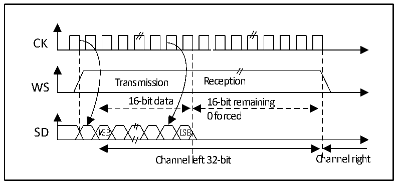
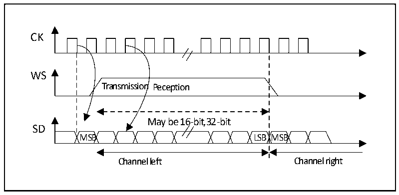
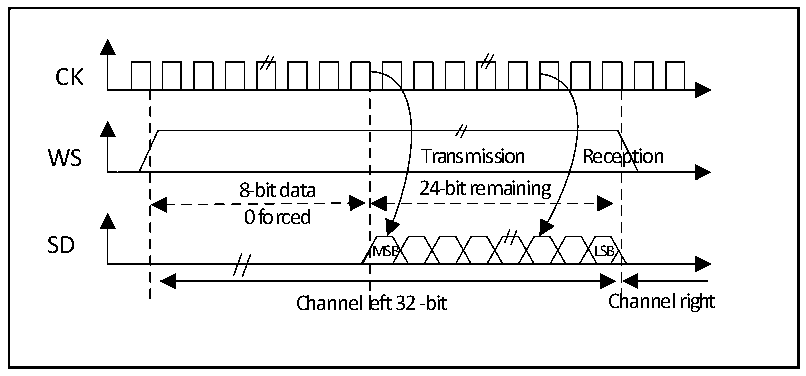

<!-- source-page: 401 -->

[← p.400](0400.md) · [index](../README.md) · [PDF p.401](https://ch32-riscv-ug.github.io/CH32H417/datasheet_zh/CH32H417RM.PDF#page=401) · [p.402 →](0402.md)

<!-- header: CH32H417系列应用手册 https://wch.cn -->

图23-9 MSB对齐16位数据扩展到32位包帧，CPOL = 0  
 <!-- rendered from the PDF; verify at https://ch32-riscv-ug.github.io/CH32H417/datasheet_zh/CH32H417RM.PDF#page=401 -->

🖼 Text parsed from the figure above

CK  
Transmission Reception  
WS  
16-bit data 16-bit remaining  
0 forced  
SD MSB LSB  
Channel left 32-bit Channel right  

#### 23.3.2.3 LSB对齐标准

此标准与MSB对齐标准类似（在16位或32位全精度帧格式下无区别）。  

图23-10 LSB对齐16或 32位全精度，CPOL = 0  
 <!-- rendered from the PDF; verify at https://ch32-riscv-ug.github.io/CH32H417/datasheet_zh/CH32H417RM.PDF#page=401 -->

🖼 Text parsed from the figure above

CK  
WS  
Transmission Peception  
May be 16-bit,32-bit  
SD  
MSB LSB MSB  
Channel left Channel right  

图23-11 LSB对齐24位数据，CPOL = 0  
 <!-- rendered from the PDF; verify at https://ch32-riscv-ug.github.io/CH32H417/datasheet_zh/CH32H417RM.PDF#page=401 -->

🖼 Text parsed from the figure above

CK  
WS Transmission Reception  
8-bit data 24-bit remaining  
0 forced  
SD  
MSB LSB  
Channel left 32 -bit Channel right  

在发送模式下如果要发送数据0x3478AE，需要通过软件或DMA对寄存器DATAR进行2次写操作。  
<!-- image: p401-draw-image-00001 bbox=[504.72, 786.24, 525.24, 796.68] -->
<!-- footer: V1.7 397 -->
