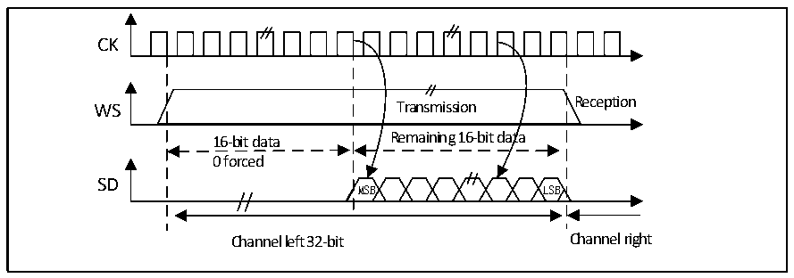

<!-- source-page: 402 -->

[← p.401](0401.md) · [index](../README.md) · [PDF p.402](https://ch32-riscv-ug.github.io/CH32H417/datasheet_zh/CH32H417RM.PDF#page=402) · [p.403 →](0403.md)

<!-- header: CH32H417系列应用手册 https://wch.cn -->
TEX=&#x27;1 &#x27; when the data register is written TEX=&#x27;1 &#x27; when the data register is written  
for the first time for the second time  
0xXX34 0x78AE  
Only the lower 8 bits in the halfword have meaning, the higher 8 bits are forced to  
be set to 0x00  
在接收模式下如果要接收数据 0x3478AE，需要在 2 个连续的 RXNE 事件发生时，分别对寄存器  
DATAR进行1次读操作。  
RXNE=&#x27;1&#x27; when the data register is read out RXNE=&#x27;1&#x27; when the data register is read out  
for the first time for the second time  
0xXX34 0x78AE  
Only the lower 8 bits in the halfword have meaning, the higher 8 bits are forced to  
be set to 0x00  

图23-12 LSB对齐16位数据扩展到32位包帧， CPOL = 0  
 <!-- rendered from the PDF; verify at https://ch32-riscv-ug.github.io/CH32H417/datasheet_zh/CH32H417RM.PDF#page=402 -->

🖼 Text parsed from the figure above

CK  
WS Transmission Reception  
16-bit data Remaining 16-bit data  
0 forced  
SD  
MSB LSB  
Channel left 32-bit Channel right  

在I2S配置阶段，如果选择将16位数据扩展到32声道帧，只需要访问一次寄存器DATAR。此时，  
扩展到32位后的高半字（16位MSB）被硬件置为0x0000。  
如果待传输或接收的数据是0x76A3（扩展到32位是0x000076A3），只需要操作一次DATAR，在  
发送时，如果TXE为1，用户需要写入待发送的数据（即0x76A3）。用来扩展到32位的0x0000部分  
由硬件首先发送出去，一旦有效数据开始从 SD 引脚送出，即发生下一次 TXE 事件。在接收时，一旦  
接收到有效数据（而不是0x0000部分），即发生RXNE事件。这样，在2次读和写之间有更多的时间，  
可以防止下溢或上溢的情况发生。  

#### 23.3.2.4 PCM标准

在PCM标准下，不存在声道选择的信息。PCM标准有2种可用的帧结构，短帧或长帧，可以通过  
设置寄存器I2SCFGR的PCMSYNC位来选择。  
<!-- image: p402-draw-image-00001 bbox=[504.72, 786.24, 525.24, 796.68] -->
<!-- footer: V1.7 398 -->
