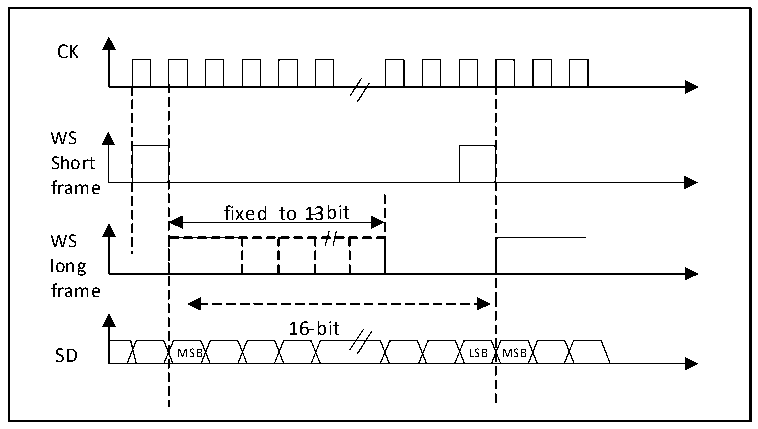
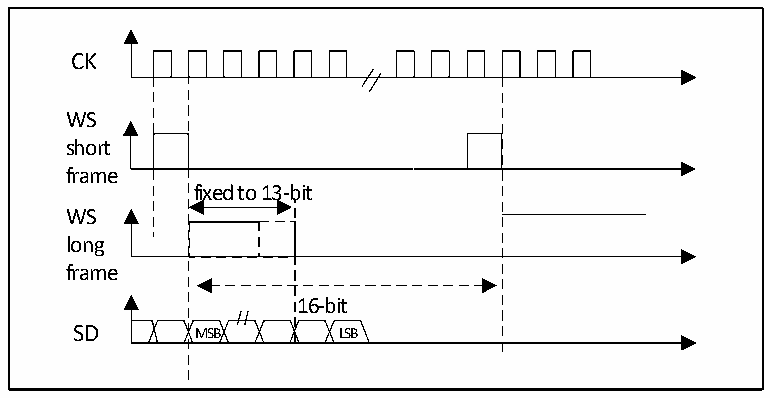

<!-- source-page: 403 -->

[← p.402](0402.md) · [index](../README.md) · [PDF p.403](https://ch32-riscv-ug.github.io/CH32H417/datasheet_zh/CH32H417RM.PDF#page=403) · [p.404 →](0404.md)

<!-- header: CH32H417系列应用手册 https://wch.cn -->

图23-13 PCM标准波形（16位）  
 <!-- rendered from the PDF; verify at https://ch32-riscv-ug.github.io/CH32H417/datasheet_zh/CH32H417RM.PDF#page=403 -->

🖼 Text parsed from the figure above

CK  
fixed to 1-3bit  16-bit MSB LSB  
WS  
Short  
frame  
WS  
long  
frame  

对于长帧，主模式下，用来同步的 WS 信号有效的时间固定为 13 位。对于短帧，用来同步的 WS  
信号长度只有1位。  

图23-14 PCM标准波形（16位）  
 <!-- rendered from the PDF; verify at https://ch32-riscv-ug.github.io/CH32H417/datasheet_zh/CH32H417RM.PDF#page=403 -->

🖼 Text parsed from the figure above

CK  
WS  
short  
frame  
fixed to 13-bit  
WS  
long  
frame  
16-bit  
SD MSB LSB  

无论哪种模式（主或从）、哪种同步方式（短帧或长帧），连续的2帧数据之间和2个同步信号  
之间的时间差，（即使是从模式）需要通过设置I2SCFGR寄存器的DATLEN位和CHLEN位来确定。  

### 23.3.3 时钟发生器

I2S的比特率即确定了在I2S数据线上的数据流和I2S的时钟信号频率。I2S比特率 = 每个声道  
的比特数×声道数目×音频采样频率。  
对于一个具有左右声道和16位音频信号，I2S比特率计算如下：  
I2S比特率 = 16 × 2 × Fs  
如果包长为32位，I2S比特率计算如下：  
I2S比特率 = 32 × 2 × Fs  
<!-- image: p403-draw-image-00001 bbox=[504.72, 786.24, 525.24, 796.68] -->
<!-- footer: V1.7 399 -->
