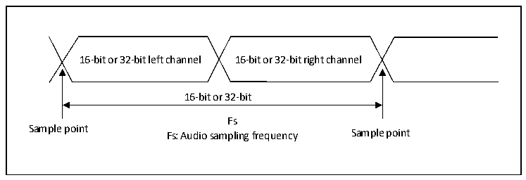
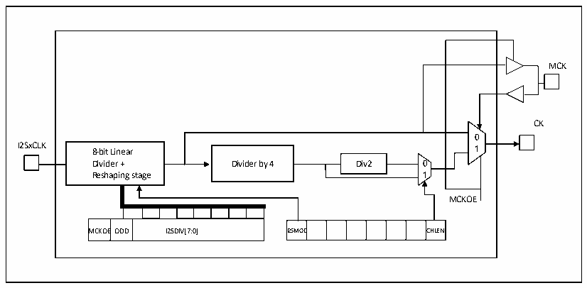

<!-- source-page: 404 -->

[← p.403](0403.md) · [index](../README.md) · [PDF p.404](https://ch32-riscv-ug.github.io/CH32H417/datasheet_zh/CH32H417RM.PDF#page=404) · [p.405 →](0405.md)

<!-- header: CH32H417系列应用手册 https://wch.cn -->

图23-15 音频采样频率定义  
 <!-- rendered from the PDF; verify at https://ch32-riscv-ug.github.io/CH32H417/datasheet_zh/CH32H417RM.PDF#page=404 -->

🖼 Text parsed from the figure above

16-bit or 32-bit left channel 16-bit or 32-bit right channel  
16-bit or 32-bit  
Fs  
Sample point Fs: Audio sampling frequency Sample point  

在主模式下，为了获得需要的音频频率，需要正确地对线性分频器进行设置。  

图23-16 I2S时钟发生器结构  
 <!-- rendered from the PDF; verify at https://ch32-riscv-ug.github.io/CH32H417/datasheet_zh/CH32H417RM.PDF#page=404 -->

🖼 Text parsed from the figure above

MCK  
CK  
0  
I2SxCLK 8-bit Linear 1  
Divider + Dividecr by 4 Dicv2 0  
Reshaping stage 1  
MCKOE  
MCKOE  EODD  I2SDIV[7:0]  
I2SMOD  D  CHLEN  
MCKOEODD I2SDIV[7:0] I2SMOD CHLEN  

图中 I2SxCLK 的时钟源是系统时钟（即驱动 HB 时钟的 HSI、HSE 或 PLL）。I2SxCLK 可以来自  
SYSCLK，或PLL3 VCO（2xPLL3CLK）时钟，可以通过RCC_CFGR2寄存器的I2S2SRC和I2S3SRC位选择。  
音频的采样频率可以是96kHz、48kHz、44.1kHz、32kHz、22.05kHz、16kHz、11.025kHz或8kHz（或  
任何此范围内的数值）。为了获得需要的频率，需按照以下公式设置线性分频器：  
当需要生成主时钟时（寄存器SPI_I2SPR的MCKOE位为1）：  
声道的帧长为16位时， Fs = I2SxCLK / [（16*2） * （（2*I2SDIV） + ODD）*8]  
声道的帧长为32位时， Fs = I2SxCLK / [（32*2） * （（2*I2SDIV） + ODD）*4]  
当关闭主时钟时（MCKOE位为’0’）：  
声道的帧长为16位时， Fs = I2SxCLK / [（16*2） * （（2*I2SDIV） + ODD）]  
声道的帧长为32位时， Fs = I2SxCLK / [（32*2） * （（2*I2SDIV） + ODD）]  

### 23.3.4 I2S主模式

设置I2S工作在主模式，串行时钟由引脚CK输出，字选信号由引脚WS产生。可以通过设置寄存  
器I2SPR的MCKOE位来选择输出或不输出主时钟（MCK）。  

#### 23.3.4.1 配置流程

● 设置寄存器I2SPR的I2SDIV[7:0]定义与音频采样频率相符的串行时钟波特率。同时也要定  
义寄存器I2SPR的ODD位。  
● 设置CKPOL位定义通信时钟在空闲时的电平状态。如果需要向外部的DAC/ADC音频器件提供  
主时钟MCK，需寄存器I2SPR的MCKOE位置为。  
<!-- image: p404-draw-image-00001 bbox=[504.72, 786.24, 525.24, 796.68] -->
<!-- footer: V1.7 400 -->
