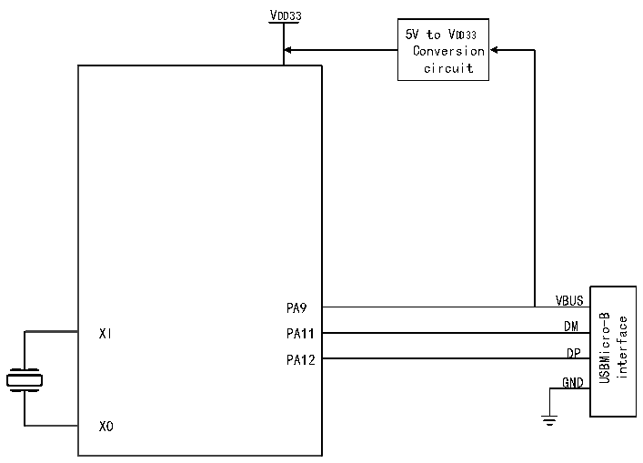

<!-- source-page: 447 -->

[← p.446](0446.md) · [index](../README.md) · [PDF p.447](https://ch32-riscv-ug.github.io/CH32H417/datasheet_zh/CH32H417RM.PDF#page=447) · [p.448 →](0448.md)

<!-- header: CH32H417系列应用手册 https://wch.cn -->
B 设备在开始会话根据 OTG 状态寄存器 R32_USB_OTG_SR 的 RB_SR_SESS_VLD 来确保 VBUS 的电平  
低于VSESS_VLD,min，若该位为0，则可开始新的会话。若该位为1，则可将OTG控制寄存器R32_USB_OTG_CR  
的RB_CR_DISCHAR_VBUS位置1进行放电，使得VBUS小于会话阈值电平。  
作为B类设备时，需从VBUS取电，则外部需一个转换电路，如图26-1所示。  

图26-1 OTG B类设备连接图  
 <!-- rendered from the PDF; verify at https://ch32-riscv-ug.github.io/CH32H417/datasheet_zh/CH32H417RM.PDF#page=447 -->

🖼 Text parsed from the figure above

VDD33  
5V to VDD33  
Conversion  
circuit  
VBUS  
PA9  
VBUSDM  DMDP  
USBMicro-B interface  
XI  
PA11  
PA12  
GND  
XO  

作为 USB 设备所必要的 USB 总线上拉电阻可以由软件随时设置是否启用，当 USB 控制寄存器  
R8_USB_CTRL中的RB_UC_DEV_PU_EN置1时，控制器根据RB_UD_LOW_SPEED的速度设置，在内部为USB  
总线的DP/DM引脚连接上拉电阻，并启用USB设备功能。  
当检测到USB总线复位、USB总线挂起或唤醒事件，或当USB成功处理完数据发送或数据接收后，  
USB协议处理器都将设置相应的中断标志，如果中断使能打开，还会产生相应的中断请求。应用程序  
可以直接查询或在 USB 中断服务程序中查询并分析中断标志寄存器 R8_USB_INT_FG，根据  
RB_UIF_BUS_RST和RB_UIF_SUSPEND进行相应的处理；并且，如果RB_UIF_TRANSFER有效，那么还需  
要继续分析 USB 中断状态寄存器 R8_USB_INT_ST，根据当前端点号 MASK_UIS_ENDP 和当前事务令牌  
PID 标识 MASK_UIS_TOKEN 进行相应的处理。如果事先设定了各个端点的 OUT 事务的同步触发位  
RB_UEP_R_TOG，那么可以通过RB_U_TOG_OK或RB_UIS_TOG_OK判断当前所接收到的数据包的同步触发  
位是否与该端点的同步触发位匹配，如果数据同步，则数据有效；如果数据不同步，则数据应该被丢  
弃。每次处理完USB发送或接收中断后，都应该正确修改相应端点的同步触发位，用于下次所发送的  
数据包或下次所接收的数据包是否同步检测；另外，设置RB_UEP_T_AUTO_TOG或RB_UEP_R_AUTO_TOG  
可以实现在发送成功或接收成功后自动翻转相应的同步触发位。  
各个端点准备发送的数据在各自的缓冲区中，准备发送的数据长度是独立设定在R8_UEPn_T_LEN  
中；各个端点接收到的数据在各自的缓冲区中，但是接收到的数据长度都在 USB 接收长度寄存器  
R8_USB_RX_LEN中，可以在USB接收中断时根据当前端点号区分。  

<!-- p447-table-002 (table-26-3@1) pages 447-448 -->
<table><caption>表26-3 设备相关寄存器列表</caption><tr><th>名称</th><th>访问地址</th><th>描述</th><th>复位值</th></tr><tr><td>R8_UDEV_CTRL</td><td>0x40023401</td><td>USB设备物理端口控制寄存器</td><td>0xX0</td></tr><tr><td>R8_UEP4_1_MOD</td><td>0x4002340C</td><td style="text-align:left">端点1（9）/4（8/12）模式控制寄存器</td><td>0x00</td></tr><tr><td>R8_UEP2_3_MOD</td><td>0x4002340D</td><td style="text-align:left">端点2（10）/3（11）模式控制寄存器</td><td>0x00</td></tr><tr><td>R8_UEP5_6_MOD</td><td>0x4002340E</td><td style="text-align:left">端点5（13）/6（14）模式控制寄存器</td><td>0x00</td></tr><tr><td>R8_UEP7_MOD</td><td>0x4002340F</td><td>端点7（15）模式控制寄存器</td><td>0x00</td></tr><tr><td>R32_UEP0_DMA</td><td>0x40023410</td><td>端点0缓冲区起始地址</td><td>0xXXXXXXXX</td></tr><tr><td>R32_UEP1_DMA</td><td>0x40023414</td><td>端点1（9）缓冲区起始地址</td><td>0xXXXXXXXX</td></tr><tr><td>R32_UEP2_DMA</td><td>0x40023418</td><td>端点2（10）缓冲区起始地址</td><td>0xXXXXXXXX</td></tr><tr><td>R32_UEP3_DMA</td><td>0x4002341C</td><td>端点3（11）缓冲区起始地址</td><td>0xXXXXXXXX</td></tr><tr><td>R32_UEP4_DMA</td><td>0x40023420</td><td>端点4（8/12）缓冲区起始地址</td><td>0xXXXXXXXX</td></tr><tr><td>R32_UEP5_DMA</td><td>0x40023424</td><td>端点5（13）缓冲区起始地址</td><td>0xXXXXXXXX</td></tr><tr><td>R32_UEP6_DMA</td><td>0x40023428</td><td>端点6（14）缓冲区起始地址</td><td>0xXXXXXXXX</td></tr><tr><td>R32_UEP7_DMA</td><td>0x4002342C</td><td>端点7（15）缓冲区起始地址</td><td>0xXXXXXXXX</td></tr><tr><td>R8_UEP0_T_LEN</td><td>0x40023430</td><td>端点0发送长度寄存器</td><td>0xXX</td></tr><tr><td>R8_UEP0_TX_CTRL</td><td>0x40023432</td><td>端点0发送控制寄存器</td><td>0x00</td></tr><tr><td>R8_UEP0_RX_CTRL</td><td>0x40023433</td><td>端点0接收控制寄存器</td><td>0x00</td></tr><tr><td>R8_UEP1_T_LEN</td><td>0x40023434</td><td>端点1（9）发送长度寄存器</td><td>0xXX</td></tr><tr><td>R8_UEP1_TX_CTRL</td><td>0x40023436</td><td>端点1（9）发送控制寄存器</td><td>0x00</td></tr><tr><td>R8_UEP1_RX_CTRL</td><td>0x40023437</td><td>端点1（9）接收控制寄存器</td><td>0x00</td></tr><tr><td>R8_UEP2_T_LEN</td><td>0x40023438</td><td>端点2（10）发送长度寄存器</td><td>0xXX</td></tr><tr><td>R8_UEP2_TX_CTRL</td><td>0x4002343A</td><td>端点2（10）发送控制寄存器</td><td>0x00</td></tr><tr><td>R8_UEP2_RX_CTRL</td><td>0x4002343B</td><td>端点2（10）接收控制寄存器</td><td>0x00</td></tr><tr><td>R16_UEP3_T_LEN</td><td>0x4002343C</td><td>端点3（11）发送长度寄存器</td><td>0xXX</td></tr><tr><td>R8_UEP3_TX_CTRL</td><td>0x4002343E</td><td>端点3（11）发送控制寄存器</td><td>0x00</td></tr><tr><td>R8_UEP3_RX_CTRL</td><td>0x4002343F</td><td>端点3（11）接收控制寄存器</td><td>0x00</td></tr><tr><td>R8_UEP4_T_LEN</td><td>0x40023440</td><td>端点4（8/12）发送长度寄存器</td><td>0xXX</td></tr><tr><td>R8_UEP4_TX_CTRL</td><td>0x40023442</td><td>端点4（8/12）发送控制寄存器</td><td>0x00</td></tr><tr><td>R8_UEP4_RX_CTRL</td><td>0x40023443</td><td>端点4（8/12）接收控制寄存器</td><td>0x00</td></tr><tr><td>R8_UEP5_T_LEN</td><td>0x40023444</td><td>端点5（13）发送长度寄存器</td><td>0xXX</td></tr><tr><td>R8_UEP5_TX_CTRL</td><td>0x40023446</td><td>端点5（13）发送控制寄存器</td><td>0x00</td></tr><tr><td>R8_UEP5_RX_CTRL</td><td>0x40023447</td><td>端点5（13）接收控制寄存器</td><td>0x00</td></tr><tr><td>R8_UEP6_T_LEN</td><td>0x40023448</td><td>端点6（14）发送长度寄存器</td><td>0xXX</td></tr><tr><td>R8_UEP6_TX_CTRL</td><td>0x4002344A</td><td>端点6（14）发送控制寄存器</td><td>0x00</td></tr><tr><td>R8_UEP6_RX_CTRL</td><td>0x4002344B</td><td>端点6（14）接收控制寄存器</td><td>0x00</td></tr><tr><td>R8_UEP7_T_LEN</td><td>0x4002344C</td><td>端点7（15）发送长度寄存器</td><td>0xXX</td></tr><tr><td>R8_UEP7_TX_CTRL</td><td>0x4002344E</td><td>端点7（15）发送控制寄存器</td><td>0x00</td></tr><tr><td>R8_UEP7_RX_CTRL</td><td>0x4002344F</td><td>端点7（15）接收控制寄存器</td><td>0x00</td></tr></table>

<!-- image: p447-draw-image-00001 bbox=[504.72, 786.24, 525.24, 796.68] -->
<!-- footer: V1.7 443 -->
