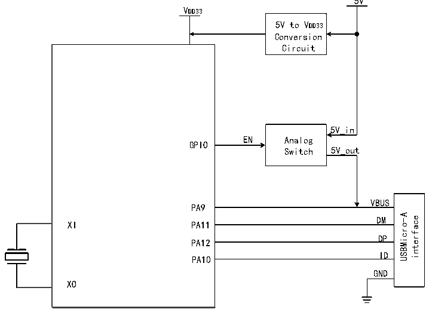

<!-- source-page: 453 -->

[← p.452](0452.md) · [index](../README.md) · [PDF p.453](https://ch32-riscv-ug.github.io/CH32H417/datasheet_zh/CH32H417RM.PDF#page=453) · [p.454 →](0454.md)

<!-- header: CH32H417系列应用手册 https://wch.cn -->

图26-2 OTG 的A类设备连接  
 <!-- rendered from the PDF; verify at https://ch32-riscv-ug.github.io/CH32H417/datasheet_zh/CH32H417RM.PDF#page=453 -->

🖼 Text parsed from the figure above

5V  
VDD33  
5V to VDD33  
Conversion  
Circuit  
5V_in  
EN Analog  
GPIO  
Switch 5V_out  
VBUS  
PA9  
VBUSDM  DMDP  DPID  
USBMicro-A interface  
XI  
PA11  
PA12  
PA10  
GND  
XO  

主机端点发起的每一个USB事务，在处理结束后总是自动设置RB_UIF_TRANSFER中断标志。应用  
程序可以直接查询或在USB中断服务程序中查询并分析中断标志寄存器R8_USB_INT_FG，根据各中断  
标志分别进行相应的处理；并且，如果RB_UIF_TRANSFER有效，那么还需要继续分析USB中断状态寄  
存器R8_USB_INT_ST，根据当前USB传输事务的应答PID标识MASK_UIS_H_RES进行相应的处理。  
如果事先设定了主机接收端点的 IN 事务的同步触发位（RB_UH_R_TOG），那么可以通过  
RB_U_TOG_OK 或 RB_UIS_TOG_OK 判断当前所接收到的数据包的同步触发位是否与主机接收端点的同  
步触发位匹配，如果数据同步，则数据有效；如果数据不同步，则数据应该被丢弃。每次处理完USB  
发送或接收中断后，都应该正确修改相应主机端点的同步触发位，用于同步下次所发送的数据包和检  
测下次所接收的数据包是否同步；另外，通过设置 RB_UH_T_AUTO_TOG 和 RB_UH_R_AUTO_TOG 可以实  
现在发送成功或接收成功后自动翻转相应的同步触发位。  
USB主机令牌设置寄存器R8_UH_EP_PID用于设置被操作的目标设备的端点号和本次USB传输事  
务的令牌PID包标识。SETUP令牌和OUT令牌所对应的数据由主机发送端点提供，准备发送的数据  
在R32_UH_TX_DMA缓冲区中，准备发送的数据长度设置在R16_UH_TX_LEN中；IN令牌所对应数据由  
目标设备返回给主机接收端点，接收到数据存放R32_UH_RX_DMA缓冲区中，接收到的数据长度存放  
在R16_USB_RX_LEN中，主机端点可接收的最大包长度需要提前写入到R16_UH_RX_MAX_LEN寄存器  
中。  

<!-- p453-table-002 (table-26-5@1) -->
<table><caption>表26-5 主机相关寄存器列表</caption><tr><th>名称</th><th>访问地址</th><th>描述</th><th>复位值</th></tr><tr><td>R8_UHOST_CTRL</td><td>0x40023401</td><td>USB主机物理端口控制寄存器</td><td>0xX0</td></tr><tr><td>R32_UH_EP_MOD</td><td>0x4002340D</td><td>USB主机端点模式控制寄存器</td><td>0x00000000</td></tr><tr><td>R32_UH_RX_DMA</td><td>0x40023418</td><td>USB主机接收缓冲区起始地址</td><td>X</td></tr><tr><td>R32_UH_TX_DMA</td><td>0x4002341C</td><td>USB主机发送缓冲区起始地址</td><td>X</td></tr><tr><td>R16_UH_SETUP</td><td>0x40023436</td><td>USB主机辅助设置寄存器</td><td>0x0000</td></tr><tr><td>R8_UH_EP_PID</td><td>0x40023438</td><td>USB主机令牌设置寄存器</td><td>0x00</td></tr><tr><td>R8_UH_RX_CTRL</td><td>0x4002343B</td><td>USB主机接收端点控制寄存器</td><td>0x00</td></tr><tr><td>R16_UH_TX_LEN</td><td>0x4002343C</td><td>USB主机发送长度寄存器</td><td>X</td></tr><tr><td>R8_UH_TX_CTRL</td><td>0x4002343E</td><td>USB主机发送端点控制寄存器</td><td>0x00</td></tr></table>

<!-- image: p453-draw-image-00001 bbox=[504.72, 786.24, 525.24, 796.68] -->
<!-- footer: V1.7 449 -->
