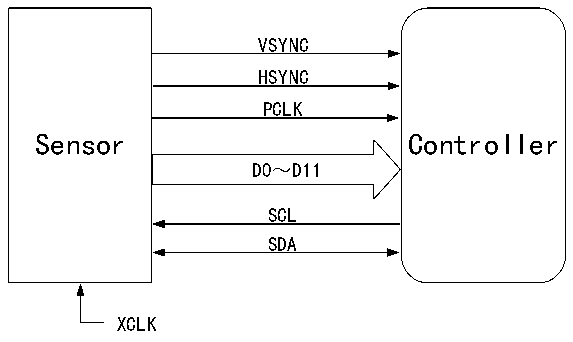

<!-- source-page: 526 -->

[← p.525](0525.md) · [index](../README.md) · [PDF p.526](https://ch32-riscv-ug.github.io/CH32H417/datasheet_zh/CH32H417RM.PDF#page=526) · [p.527 →](0527.md)

<!-- header: CH32H417系列应用手册 https://wch.cn -->

# 第 29 章 数字图像接口（DVP）

数字图像接口DVP（Digital Video Port）用来连接摄像头模块获取图像数据流。提供了8/10/12  
位并行接口方式通讯，支持最高 150MHz 像素时钟输入频率。支持按原始的行、帧格式组织的图像数  
据，如YUV、RGB等，也支持如JPEG格式的压缩图像数据，能够接收外部8位、10位、12位的摄像  
头模块输出的高速并行数据流。接收时，主要依靠VSYNC和HSYNC信号同步。支持图像裁剪功能。  

## 29.1 主要特性

● 可配置8/10/12位数据宽度模式  
● 支持YUV、RGB格式数据  
● 支持JPEG压缩格式数据  
● 内置FIFO，支持DMA传输  
● 支持双缓冲接收  
● 支持裁剪功能  
● 支持连续模式和快照模式  

## 29.2 功能描述

### 29.2.1 与传感器相连

图29-1 DVP接口连接  
 <!-- rendered from the PDF; verify at https://ch32-riscv-ug.github.io/CH32H417/datasheet_zh/CH32H417RM.PDF#page=526 -->

🖼 Text parsed from the figure above

VSYNC  
HSYNC  
PCLK  
Sensor Controller  
D0～D11  
SCL  
SDA  
XCLK  

● PLCK（Pixel clk）：像素时钟，每个时钟对应一个像素数据（非压缩数据）。外部DVP接口传  
感器输出的HCLK时钟最大支持150MHz。  
● HSYNC（horizonal synchronization）：行同步信号。  
● VSYNC（vertical synchronization）：帧同步信号。  
● DATA：像素数据或压缩数据，位宽支持8/10/12位。  
● XCLK：Sensor的参考时钟，可以由微控制器提供或外部提供，一般使用晶振。  
● I2C接口：用来配置sensor的寄存器，可通过控制的普通GPIO口模拟I2C时序通讯，亦可使用  
硬件I2C接口操作。  

<!-- p526-table-001 (table-29-1@1) -->
<table><caption>表29-1 DVP引脚</caption><tr><th>名称</th><th>信号类型描述</th></tr><tr><td>PLCK</td><td>像素时钟输入</td></tr><tr><td>DATA[11:0]</td><td>像素数据输入</td></tr><tr><td>VSYNC</td><td>帧同步信号输入</td></tr><tr><td>HSYNC</td><td>行同步信号输入</td></tr></table>

<!-- image: p526-draw-image-00001 bbox=[504.72, 786.24, 525.24, 796.68] -->
<!-- footer: V1.7 522 -->
